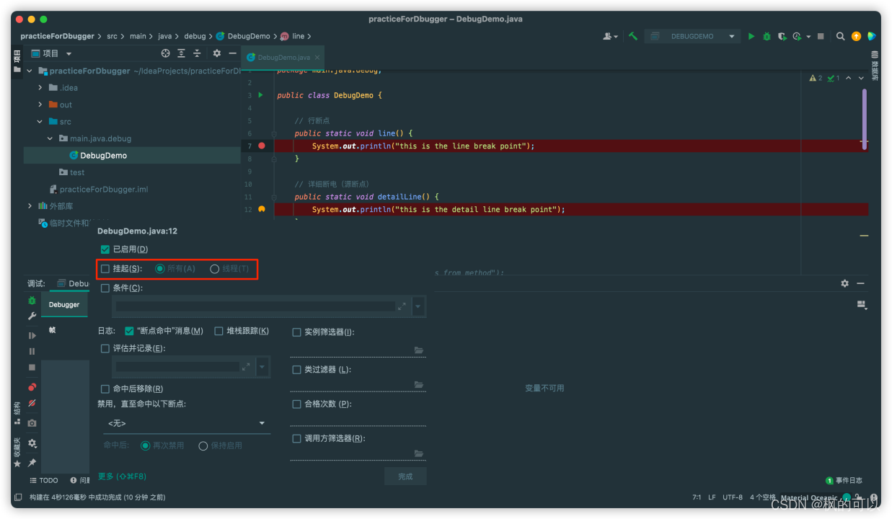
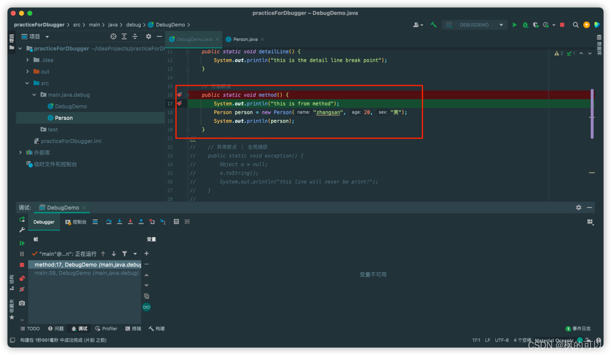

### 一.断点分类

#### 1.行断点

断点打在方法中，遇到断点的时候会停下来；

#### 2.详细断点

shift+左键

1.已启用（enable）
2.挂起（suspend）：这个如果勾选的话，你会发现这个断点的颜色就会变成红色，和行断点的颜色相同。
suspend中有两个选项，一个是all，一个是Thread。前者勾选之后表示只要运行到这个地方就会停。后者是在多线程调试的时候使用的。表示只有在当前线程的时候会停，别的线程不会停。
3.条件（condition）：这个是高阶停止条件，诸如满足if啥啥条件时才会停，这个就是高阶的调试时会用到。

#### 3.方法断点

在方法进入和return时都会停止，可以打在接口上，实现类也会停止。

#### 4.异常断点

可以在左下角view breakpoints中添加

#### 5.字段断点

检测整个生命周期值的变化，即值发生变化时会停止。

### 二.相关操作

#### 1、强行停止return

#### 2、相关按钮

drop frame回到调用方法，相当于方法栈，出栈的感觉；