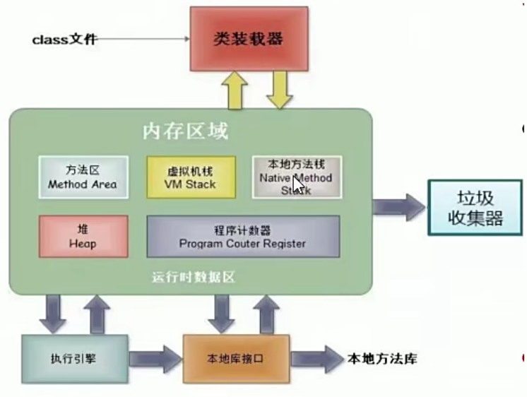
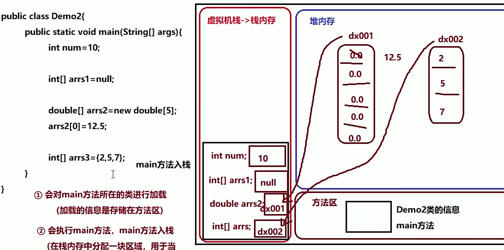
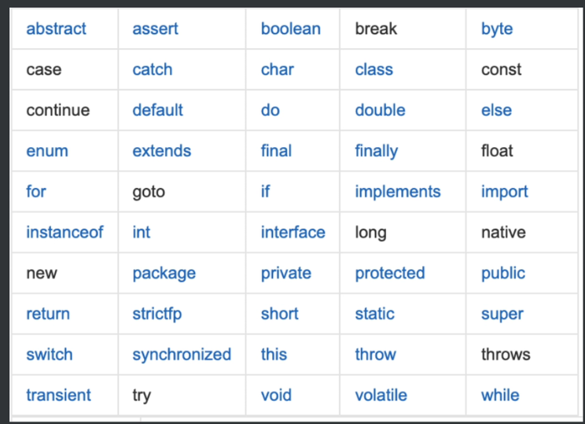

## JAVA02 HelloWorld

### 1.Java语言的优点

- 完全面向对象：支持封装、继承、多态；
- 支持分布式：支持Internet应用的开发
- 健壮型：Java的
- 安全：
- 跨平台性： 平台---->操作系统（windows/linux/mac...）
  - 由jvm(java virtual machine)实现的.jvm主要运行java程序的！java虚拟机，虚拟出来的计算机。
  - JRE(Java Runtime Environment) Java提供的一些基础类库
    - Java程序运行需要运行环境的，==JRE包含JVM==
  - JDK(Java development kit) Java开发工具包
    - 如果要开发程序，需要安装JDK，==jdk包含JRE和JVM==

​		

#### ==进阶==

##### 内存划分



1虚拟机栈：

2方法区：

3堆内存：


##### 例子 e.g.




a.局部变量空间开辟都在栈空间

b.基本数据类型的值，都在占内存中存储

c.所有引用数据类型的值，栈内存中存储的是地址


### 2.Hello World

#### Java开发三步骤：

- 编写源程序
- 编译源程序 根据源程序生成字节码文件 jvm实际运行的是字节码文件；
- 运行


注意事项：

- 大小写敏感
- 必须英文输入

```java
public class HelloWorld{
	public static void main(String[] args){
		System.out.println("HelloWorld");
	}
}

编译： javac HelloWorld.java
    或者 javac -encoding gbk HelloWorld.j
运行： java HelloWo
```


源文件名和类型：

*一个java文件里，是否可以声明多个类

1. 类名不能一致
2. 一个java文件内只允许有一个public
3. 被public修饰的类的类名和文件名保持一致

==注意==

* 编译完成后，会生成与class类相同数量的class文件
* 运行时，想运行那个就运行那个
* main类可以在任意类里，不一定要在public类里；


#### 注释

```java
		单行注释
			语法：  // 注释内容
			特点：只对本行//后的内容起到注释作用
			应用场合：对局部代码的解释
			
		多行注释
			语法： /*   多行解释内容  */
			特点： 在范围内的内容，都是注释
			应用场合：对局部代码的解释
			
		文档注释
			语法：/**   文档注释内容  */
			特点：包含多行注释的功能，多一个-->用于产生帮助文档
			应用场合：对整个类、整个方法的注释
            
			生成帮助文档：javadoc -d abc 【-author -version】 源文件名.java
```


### 3.常量、标识符、变量


#### 常量

概念：在程序执行的过程中，其值不可以发生改变的量 

分类：

自定义常量：final 关键字

字面值常量（数据类型）：

​	整数：1 2 3 。。。

​	小数常量：1.5 1.4

​	字符(字符常量)： 'a'  '1'  '马'

​	字符串(字符串常量)： "fsdafdsa" ，==可以是null值==

​	布尔常量：true false

​	空常量：null（可以复制给引用数据类型）   ""--->空串


#### 标识符

在程序开发过程中，需要自己创建大量的标识符

必须遵守标识符的命名规则：

​	a.字母、数字、符号组成

​	b.符号只有两个$和_

​	c.不能用关键字

​	d.数字不能开头，区分大小写


标识符的命名规范:

1. 见名知意

2. 类名和接口名

   每个单词首字母都大写， XxxxYyyZz

3. 变量名和方法名

   从第二个单词开始，首字母大写 形式xxxYyyZzz

4. 包名

   美国各单词都小写，xxx.yyy.zzz

5. 常量名

   所有单词都大写

#### 关键字




### 4 封装、继承、多态

#### 封装

优点：安全、保护隐私

##### 4.1 属性的封装

1.对需要封装的属性设置访问权限

2.对外提供两个方法（对属性的操作 -> set、get）


##### 4.2 权限修饰符

public              本类、本包、其他包

缺省的               本类、本包

protected           

private             本类

==对类的权限修饰只能是public和缺省的==


#### 继承


#### 多态
