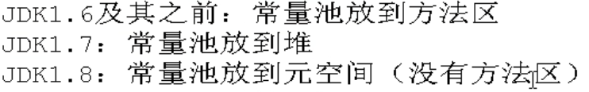
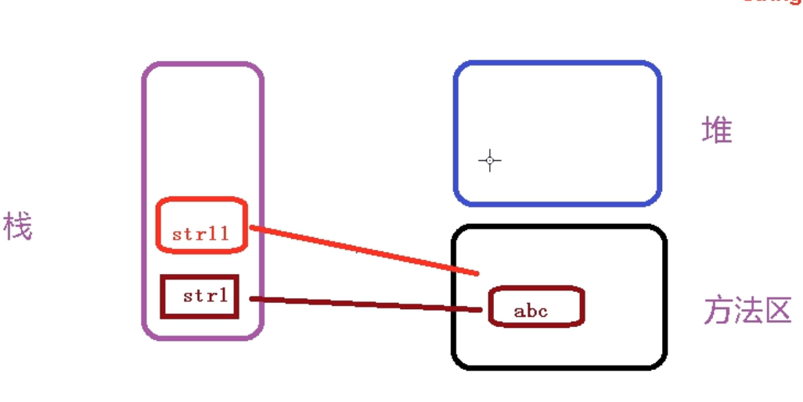
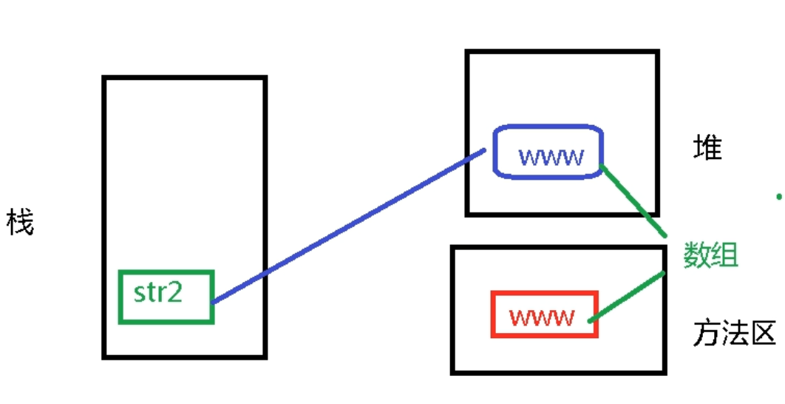
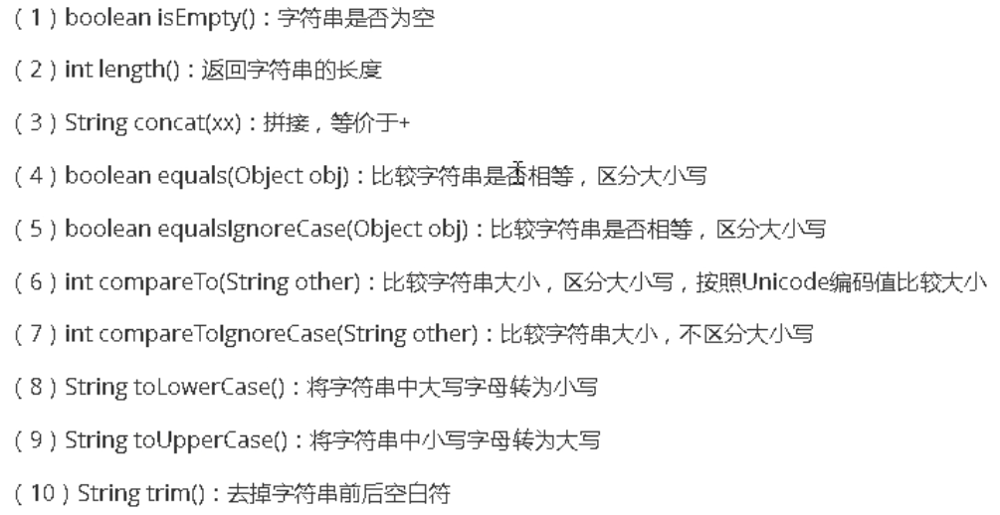
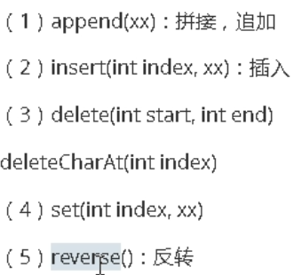

### 1.数据类型

java是一个强类型的语言


#### 分类：

##### 基本数据类型(4类8个)

==整型数据(4个)：==

1. byte	1个字节	-128 - 127
2. short   2个字节     -2^15 ~2^15-1
3. int(默认类型)     4个字节     -2^31 ~2^31-1
4. long    8个字节    -2^63 ~2^63-1 

​	超过long，用BigInteger（常用类），过大的整数赋值给long时，要在数字后加L不然默认int报错。

​	**128short放不下，-127用1000 0000表示


==浮点型数据(2个):==

​	float	单精度	4个字节

​	double	双精度	8个字节

​		浮点型默认为double，小数赋值给float时，需要在数值后加F


==字符型数据：==

​	char：	gbk两个字节，utf-8是三个字节

​	a 97

​	A 65

==布尔型数据：==

​	boolean：	1个字节


##### 引用数据类型

==字符串数据：==

​	String	


### 2.变量

概念：程序执行过程中，其值可以发生改变

使用：

a. 开辟空间

​	数据类型 变量名；//变量声明

​	注意：

​		数据类型可以使任意数据类型

​		变量名是 自定义的


b. 赋值(将数据存储在开辟的空间内)

​	变量名=数据； //初始化


c. 没有初始化不能使用


#### 转义字符

\

\n 换行

\t 制表位(tab)

\b 删除格

\\\ 普通斜杠


### 3.基本数据类型转换

	byte -> short -> int ->long -> float -> double 
			char  -> int
			boolean

#### 自动转换(小->大)

byte b =10；

int i = b；


#### 强制转化(大->小)不建议使用，有风险(数据丢失)

​		int i=10;
​		byte b=i;//有语法错误
​		正确的语法：较小的数据类型 变量名=(较小的数据类型)大数据类型值;
​			byte b=(byte)i;


### 4.字符串

`java.lang.String` 类代表字符串。Java程序中所有的字符串文字（例如`"abc"` ）都可以被看作是实现此类的实例。字符串是常量；它们的值在创建之后不能更改。字符串缓冲区支持可变的字符串。因为 String 对象是不可变的，所以可以共享。

1.不能被继承，final声明；

2.不可变对象，一旦修改，产生新的对象；

3.String中只有


#### jvm结构




#### 创建String的方式

1.String str1 =  "abc";




2.String str2 = new String("www");




#### 常用方法




String copyValueOf(char[] c);

String copyValueOf(char[] c,offset,count);


##### == 和 equals

经试验，==并不是判断的toString方法，而是直接对比两个对象的地址值。

重写了equals，此外，equalsIgnoreCase不区分大小写。


##### 常用方法

contains(str):是否包含字符串

indexOf(str):查找字符位置

lastIndexOf(str):查找最后一个字符位置

subString(int beginIndex):截取字符串

subString(int beginIndex,int endIndex):截取后字符串，不包含endIndex

charAt(int index):返回index位置的字符

toCharArray：

boolean startsWith(str):

boolean endsWith(str):


split分割盘符需要////,得到的结果是//，经过java在变成 /


##### 字符串拼接

1、常量+常量：结果在常量池

2、常量与变量/变量与变量 ： 结果在堆中

3、调用intern()方法：结果在常量池

==concat()==

concat()拼接，结果在堆里。

**第一种拼接方式，JVM会优化成定义一个字符串；而后面则会先生成StringBuilder然后进行拼接。**

```java
	@Test
	public void test06(){
		String s1 = "hello";
		String s2 = "world";
		String s3 = "helloworld";
		
		String s4 = (s1 + "world").intern();//把拼接的结果放到常量池中
		String s5 = (s1 + s2).intern();
		
		System.out.println(s3 == s4);//true
		System.out.println(s3 == s5);//true
	}
	
	@Test
	public void test05(){
		final String s1 = "hello";
		final String s2 = "world";
		String s3 = "helloworld";
		
		String s4 = s1 + "world";//s4字符串内容也helloworld，s1是常量，"world"常量，常量+ 常量 结果在常量池中
		String s5 = s1 + s2;//s5字符串内容也helloworld，s1和s2都是常量，常量+ 常量 结果在常量池中
		String s6 = "hello" + "world";//常量+ 常量 结果在常量池中，因为编译期间就可以确定结果
		
		System.out.println(s3 == s4);//true
		System.out.println(s3 == s5);//true
		System.out.println(s3 == s6);//true
	}
	
	@Test
	public void test04(){
		String s1 = "hello";
		String s2 = "world";
		String s3 = "helloworld";
		
		String s4 = s1 + "world";//s4字符串内容也helloworld，s1是变量，"world"常量，变量 + 常量的结果在堆中
		String s5 = s1 + s2;//s5字符串内容也helloworld，s1和s2都是变量，变量 + 变量的结果在堆中
		String s6 = "hello" + "world";//常量+ 常量 结果在常量池中，因为编译期间就可以确定结果
		
		System.out.println(s3 == s4);//false
		System.out.println(s3 == s5);//false
		System.out.println(s3 == s6);//true
	}
```


##### 替换

String replace(xx,xx):不支持正则

String replaceFirst(正则，替换内容) ：第一个匹配部分

String replaceAll(正则，替换内容)：全部替换

```java
String str = "aafdfd-fff-aw-fdsaf";
    
str。replaceAll("-","");
```


##### 拆分

String[] split(正则)


##### 正则匹配

^[验证规则]{验证次数}$


`[abc]`：`a`、`b` 或 `c`（简单类）

`[^abc]`：任何字符，除了 `a`、`b` 或 `c`（否定）

`[a-zA-Z]`：`a` 到 `z` 或 `A` 到 `Z`，两头的字母包括在内（范围）

###### 预定义字符类

`.`：任何字符（与[行结束符](#lt)可能匹配也可能不匹配）

`\d`：数字：`[0-9]`

`\D`：非数字： `[^0-9]`

`\s`：空白字符：`[ \t\n\x0B\f\r]`

`\S`：非空白字符：`[^\s]`

`\w`：单词字符：`[a-zA-Z_0-9]`

`\W`：非单词字符：`[^\w]`

###### 边界匹配器

`^`：行的开头

`$`：行的结尾

###### Greedy 数量词

*X*`?`：*X*，一次或一次也没有

*X*`*`：*X*，零次或多次

*X*`+`：*X*，一次或多次

*X*`{`*n*`}`：*X*，恰好 *n* 次

*X*`{`*n*`,}`：*X*，至少 *n* 次

*X*`{`*n*`,`*m*`}`：*X*，至少 *n* 次，但是不超过 *m* 次

###### Logical 运算符

*XY*：*X* 后跟 *Y*

*X*`|`*Y*：*X* 或 *Y*

`(`*X*`)`：X，作为捕获组


#### 可变字符串

##### StringBuilder

线程不安全

拼接时，StringBuilder则是使用数组来完成拼接的操作，不需要开辟额外的空间


##### StringBuffer

线程安全


方法一致：



