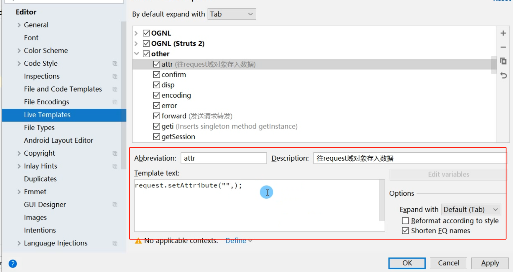

### 快捷键

智能提示	Alt+回车

使用块环绕	ctrl+alt+T

当前光标下一行插入空行	Shift+回车

当前光标上一行插入空行	Ctrl+Alt+回车

快速构造器  Alt + Insert

for循环	fori

foreach	iter

### 创建自定义快捷键提示

Setting--->Live Templates---->一般配置在other选项下，或者新添加自定义组别

