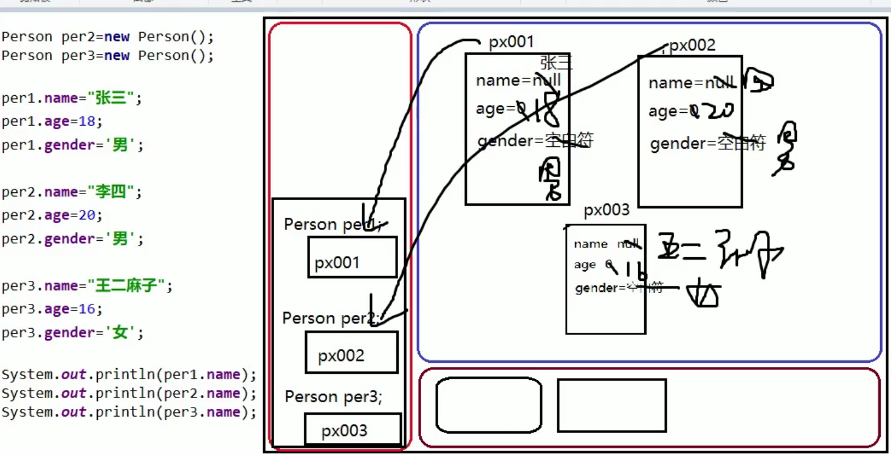
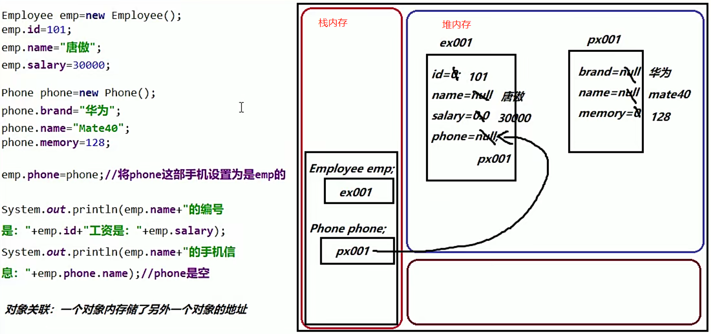

## 面向对象

面向对象(OOP)是一种编程思想



<div align = "center">new对象的内存使用</div>


#### 面向过程与面向对象

面向过程

​	怎么做


面向对象

​	交给谁来做


#### 类和对象：

类

具有相同特整合相同行为的对象的集合


对象：

类的实例  


#### 对象创建和使用

1.new 类名(); 实例化一个对象

2.对象的属性访问

1. 赋值

   对象名.属性 = 值；

2. 取值

​	对象.属性


### 类的五大成员

#### 成员变量

##### 分类

###### 1.实例变量（变量属于对象）

```java
[修饰符] 数据类型 变量名 = [值];

//如果没设值，实例化时，默认值为数据类型的默认值
```

==1.1成员变量和局部变量==

​	a. 范围不一样，成员变量在类体中，这也导致了作用范围不一样；

​	b. 成员变量在堆内存里，局部变量在栈内存中？

​	c. 局部变量用完就销毁；


对象关联：




###### 2.类变量(变量属于类--->static)


#### 成员方法

方法也叫函数，是一个独立功能的定义，是一个类中最基本的功能单元。

==封装成方法，==

```java
pclass Person{
    String name;
    int age;
    char genser;
    
    public void say{
        System.out.println("我的名字为："+name);
        //name变量前默认为this.;调用的是本方法的属性;
    }
}
```


##### 方法语法

```java
[修饰符] 返回值类型 方法名([形参列表]){
    方法体
}
```

方法形式

- 无参无返回值
- 有参无返回值
- 无参有返回值
- 有参有返回值

 ==方法里面不能嵌套方法==


##### 实例方法的调用

1.在本类中可以直接调用，因为会默认使用==this==关键字。

```java
public class DemoTool{
    public double max(double a, double b){
        return a>b?a:b;
    }
    
    public double max3(double a,double b, double c){
        double max = max(a,b);
        //默认为 this.max(a,b);
        return max(max,c);
    }
    
}
```

2.在其他·类中必须通过对象去调用；


#### [构造方法](JAVA12 构造方法.md)


#### [初始化快](JAVA15 final、初始化块.md)


#### 内部类
