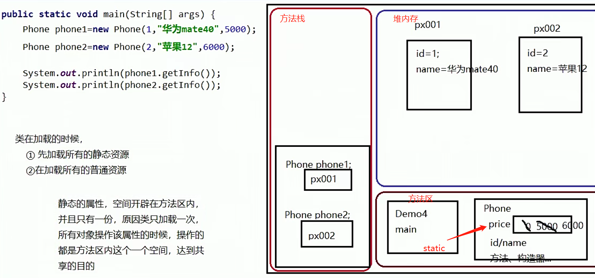

## 构造器

构造对象，用于实例化，又称为构造方法；

### 语法

```java
修饰符 类名（形参列表）{
    代码块
}
```

1. 没有返回值（void 也没有）
2. 方法名必须和类名一样


### this关键字

含义：当前对象(不是当前类)

==由于java的成员变量和局部变量可以重名；为什么允许重名，是由于成员变量和局部变量存储的区域不同。==


#### 1.this.内容

局部变量和成员变量重名，this.变量 来表示成员变量


#### 2.this()

调用本类的其他构造器，==必须在构造器的第一行==；


### static关键字(类加载)

静态导入： import static xxx.xxx.*;1

#### 类加载的时机

> 1.在第一次使用这个类的时候，先加载，后使用;类只加载一次，在没有卸载之前不会再加载；
>
> 2.先加载所有的静态资源，再加载所有的普通资源；


#### 修饰成员变量

类变量是在实例变量前加static；

==一般使用 类名.静态属性==


静态变量(类变量)的存储位置




#### 修饰成员方法

类方法：属于类

==加载时，先加载静态方法；静态方法只能使用类变量和类属性，？局部变量？==


## JavaBean

javaBean --> 实体类(带有属性)


