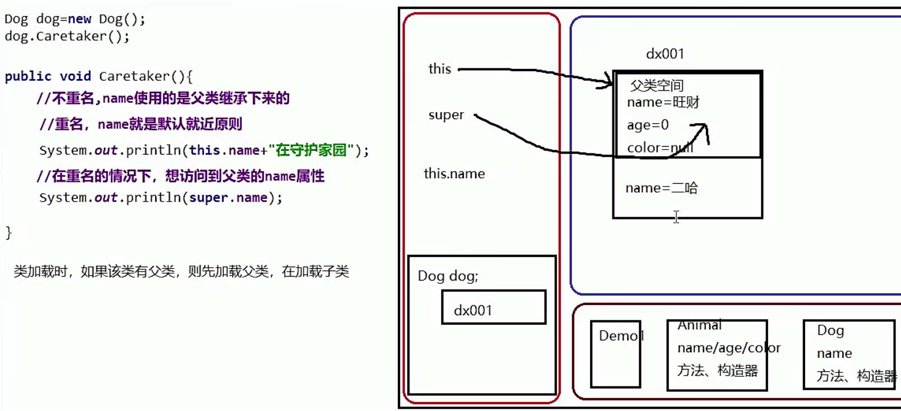
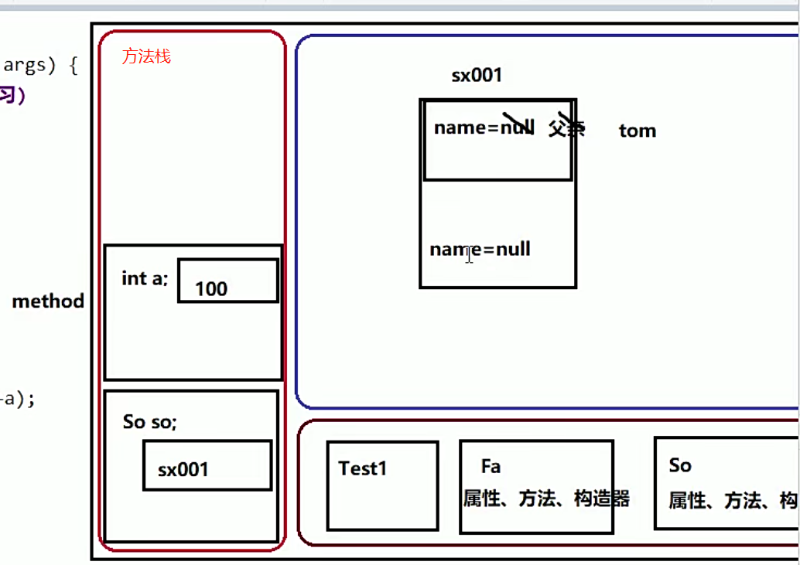

## 继承

提高复用性

> 特点：单继承（每个子类只能有一个父类）


语法

```java
class Sub extends Super{
    
}
```


### 继承变量

1,。父类中所有的成员变量都会被子类继承下去，但不能直接访问父类的私有；

2， 如果出现子类和父类的变量出现重名，用this访问子类的变量，用super访问父类；

3， 子类、父类、父类的父类均有同一个变量，无法访问父类的父类的变量；




4.本类通过super来调用父类重复方法，其他类没办法直接调用


### 重写的条件

a. 必须是父子类

b. 方法名相同

c. 形参列表必须相同

==以下两个强制要求，会报错==

d. 和返回值有关：

> 基本数据类型返回值类型要一致
>
> 对于引用类型，子类要小于等于父类;

e. 权限修饰符有关

​	子类的要大于等于父类的


==静态方法不允许被重写==


### ==继承的应用==

#### 1.this 调用属性

this.成员变量调用谁，看类型；

this的类型是谁，就看在那个类中；

#### 2.this调用方法

this.成员方法调用的是谁的，看实际对象；


### 继承之构造器

1. 子类无法继承父类的构造器；
2. 构造器的作用是初始化成员变量的 

类加载时，先加载父类再加载子类；构造器的首行都默认存在super()调用父类无参，

==所以芙蕾必须存在无参构造器，否则默认报错==

#### 例题·

```java

public class Test1{
    public static void main(String[] args){
        So so = new So("So");
        /*
        输出为 null-----100
        this.method 调用的是子类方法，
        但由于父类空间比子类空间优先加载，
        所以在初始化时，子类空间还未赋值
        */
        
    }
}

class Fa{
    private String name = "父亲";  //tom
    
    public Fa(String name){
        this.nmae = name;
        method(100);
    }
    
    public void method(int a){
        System.out.println(name + "-----"+a);
    }
    
}

class So extends Fa{
    private String name = "儿子";
    
    public So(String name){
        super(name);
    }
    
    public void method(int a){
        System.out.println(name + "-----"+a);
    }
    
}
    
```

#### 内存图




