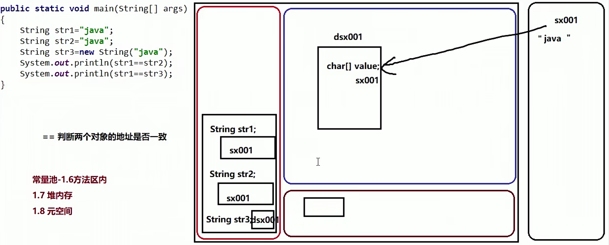

## 多态

定义：同一行为，具有多个不同表现形式(重载和重写)

> #### ==前提== 父类引用指向子类对象
>
> 1. 父子类或者实现接口
> 2. 必须有重写
> 3. 父类的引用指向子类对象


#### 注意：   

1.使用了多态，无法使用子类独有的方法；

==使用多态，同名属性会调用父类属性==


### 用途

1.多态参数

```java
public static void method(Person per){
    per.eat();
}
//可以传入所有声明为Person的子类
```


2.多态数组

```java
Person per = new Person[2];
per[0] = new Employee();
per[1] = new S
```


## 父子之间类型转换

1.自动转换(向上转型-多态的体现) 


2.强制转换(向下转型) 

```java
子类类型 名字 = (子类类型)对象名;

方法：
    对象 instanceof 类型
    //判断前面对象是否属于后面类型
    
```


## native关键字 

C语言实现，修饰方法 


## Object

默认为类的父类，所有类的根类

### 方法

#### toString

```java
public String toString() {
    return getClass().getName() + "@" + Integer.toHexString(hashCode());
}
```


#### getClass

返回对象运行时类型


#### hashCode()

通过hash算法，对对象计算得到int值


#### finalize()

java垃圾回收机制(==不是回收代码，类似于toString，执行回收时的操作==)

##### 1.什么对象是垃圾？

没有引用的对象

##### 2.什么时候会被垃圾回收机制回收？

不定时回收

System.gc：通知垃圾回收


#### equals()

String存放位置的示意图



String重写了equals方法。
