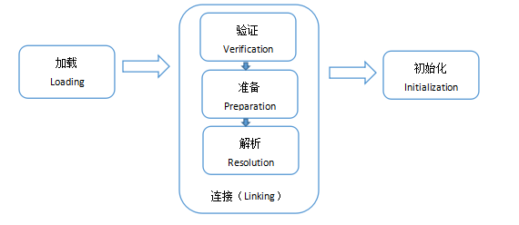

# 注解

注释：不参与编译和运行，对代码解释

注解：参与编译和运行


### 注解的形式

@注解名[(参数)]


### 类型

#### 文档注释内注解：

@author name

@version 

....


#### 普通注解

添加在方法上方

##### @OVerride 重载

功能： 检测当前方法是否满足重写

源码：

```java
//该注解作用位置
@Target(ElementType.METHOD)
//作用范围
@Retention(RetentionPolicy.SOURCE)
public @interface Override {
}
```


##### @Deprecated 过时


##### @SuppressWarnings 抑制警告


# 类的加载

当程序主动使用某个类时，如果该类还未被加载到内存中，系统会通过**加载、连接、初始化**三个步骤来对该类进行初始化，如果没有意外，JVM将会连续完成这三个步骤，所以有时也把这三个步骤统称为类加载。

类的加载又分为三个阶段：

（1）加载：load

就是指将类型的class字节码数据读入内存

（2）连接：link

①验证：校验合法性等

②准备：准备对应的内存（方法区），创建Class对象，为类变量赋默认值，为静态常量赋初始值。

③解析：把字节码中的符号引用替换为对应的直接地址引用

（3）初始化：initialize（类初始化）即执行<clinit>类初始化方法，大多数情况下，类的加载就完成了类的初始化，有些情况下，会延迟类的初始化。




1、==哪些操作会导致类的初始化？==

（1）运行主方法所在的类，要先完成类初始化，再执行main方法

（2）第一次使用某个类型就是在new它的对象，此时这个类没有初始化的话，先完成类初始化再做实例初始化

（3）调用某个类的静态成员（类变量和类方法），此时这个类没有初始化的话，先完成类初始化

（4）子类初始化时，发现它的父类还没有初始化的话，那么先初始化父类

（5）通过反射操作某个类时，如果这个类没有初始化，也会导致该类先初始化

> 类初始化执行的是<clinit>()，该方法由（1）类变量的显式赋值代码（2）静态代码块中的代码构成


### 类加载器

#### 类加载器分类

##### 1.虚拟机自带

1. 引导类加载器；

- 加载rt.jar 包里面的内容

  

2. 扩展类加载

- 负责加载jre/lib/ext


3. 应用类加载器

- 加载项目的classpath下的类 --Application ClassLoader


##### 2.自定义类加载


#### 双亲委派模式

下一级的类加载器，如果接到任务时，会先搜索是否加载过，如果没有，会先把任务往上传，如果都没有加载过，一直到根加载器，如果根加载器在它负责的路径下没有找到，会往回传，如果一路回传到最后一级都没有找到，那么会报ClassNotFoundException或NoClassDefError，如果在某一级找到了，就直接返回Class对象。


# 反射   

> ==问题引出为什么要有反射==
>
> 如何根据porperties文件中配置信息，来创建一个类并且调用方法

1.根据配置文件re.porperties指定信息，创建Cat对象，并调用方法；

classfullpath = com.hspedu.Cat

method = hi;


2.Cat 类；

```java
public class Cat{
    private String name = "招财猫"；
    public void hi(){
        System.out.println(name + "miaomiaomiao1");
    }
}
```

3.使用Reflection：

```java
public class ReflectionQuestion{
    public static void main(String[] args){
        //传统创建方式：
        Cat cat = new Cat();
        cat.hi();
        
        //1.使用properties类，可以读写配置文件
        Properties properties = new Properties();
        properties.load(new FileInputStream("src\\re.properties"));
        String classfullpath = properties.get("classfullpath").toString();
        String methodName = properties.get("method").toStirng();
        
        //2.传统的new对象方式不同；
        
        //3.使用反射类
       	//(1)加载类，返回Class类型对象
        Class cls = Class.forName(classfullpath);
        //(2)通过clas得到对象实例；
        Object o = cls.newInstance;
        //(3)通过cls来得到加载的类的方法对象
        Method method1 = cls.getMethod(methodName);
        //(4)通过方法对象来实现调用方法
        method1.invoke(o)；
        
    }
}
```


### 获取Class对象的四种方式

如果我们动态获取到这些信息，我们需要依靠 Class 对象。Class 类对象将一个类的方法、变量等信息告诉运行的程序。Java 提供了四种方式获取 Class 对象:

**1.知道具体类的情况下可以使用：**

```
Class alunbarClass = TargetObject.class;
```

但是我们一般是不知道具体类的，基本都是通过遍历包下面的类来获取 Class 对象，通过此方式获取 Class 对象不会进行初始化

**2.通过 `Class.forName()`传入类的路径获取：**

```
Class alunbarClass1 = Class.forName("cn.javaguide.TargetObject");
```

**3.通过对象实例`instance.getClass()`获取：**

```
TargetObject o = new TargetObject();
Class alunbarClass2 = o.getClass();
```

**4.通过类加载器`ClassLoader.loadClass()`传入类路径获取:**

```
Class clazz = ClassLoader.loadClass("cn.javaguide.TargetObject");
```

通过类加载器获取 Class 对象不会进行初始化，意味着不进行包括初始化等一些列步骤，静态块和静态对象不会得到执行。


#### Pratice

```java
package com.ActionTest;

import java.lang.reflect.InvocationTargetException;
import java.lang.reflect.Method;

/**
 * @Author Mmmmjp
 * @Date 28/12/2021
 **/
public class ReflectionTest {
    public static void main(String[] args) throws ClassNotFoundException, NoSuchMethodException, InvocationTargetException, IllegalAccessException, InstantiationException {
        Class cls = Class.forName("com.ActionTest.DOg");
        Object dogObject = cls.newInstance();

        Method methods = cls.getMethod("bark");
        methods.invoke(dogObject);
    }
}

```

