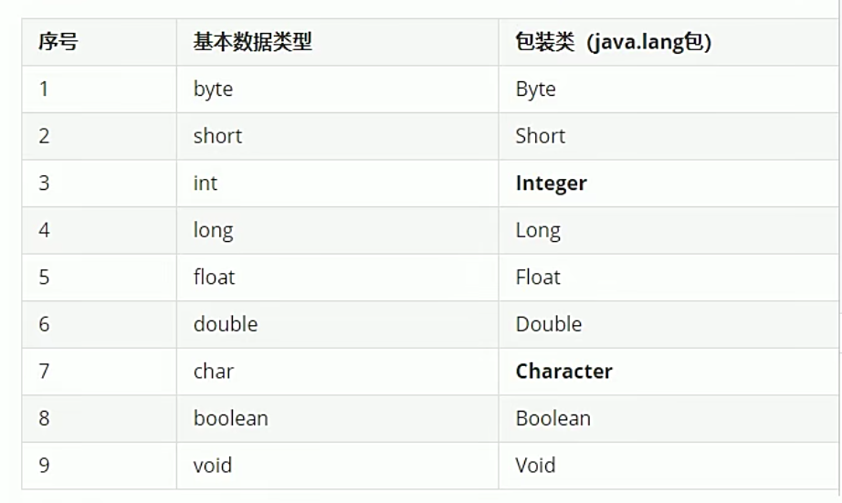
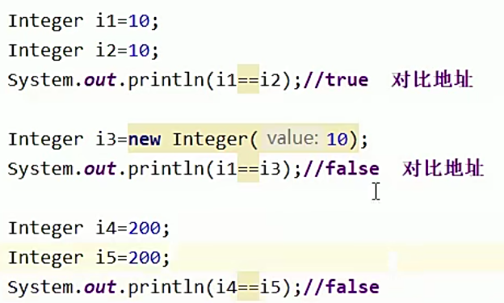
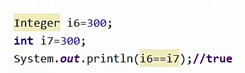

## 单元测试Junit

一个类型中，可以创建多个程序的入口

#### 前提

1.必须使用在公有的类以及公有的方法上

2.需要导包(将第三方产品的源码导入)

@Test 要求：项目中没有Test方法

@Before  测试前先运行Before

@After  Test之后运行

@BeforeClass 在所有的Test之前运行一次

​	==方法必须是静态的==

@AfterClass 在所有的Test之后运行一次

​	==方法必须是静态的==

缺点：

1、默认不能手动输入

2、学IO流的时候，相对路径有自己特点

3、不能够线程启动

## 包装类

对基本数据类型的包装；

基本数据类型效率高，但有一部分内容是针对面向对象设计！

e.g. 泛型不运行存储基本数据类型

前几个数值型的父类是Number，其他是Object

### 使用

#### 装箱：

​	基本数据类型-->包装类类型

​	手动装箱：

​		构造器：Byte b = new Byte("10");

​	

​	自动装箱:

​		byte b1 = 10;

​		Byte b4 = b1;

#### 拆箱

​	包装类类型-->基本数据类型

​	

手动拆箱：

byte b5 = b2.byteValue();

自动拆箱：

byte b5 = b2

### 包装类常用方法

将字符串转为基本数据类型

1.用构造方法然后自动拆箱

2.包装类方法：Integer.parseInt(String s)

#### 例题：

1.

i1和i2会默认调用Integer里面创建好的数组对象，数值范围为-128~127；

但i3是自己创建对象。

i6会自动拆箱
