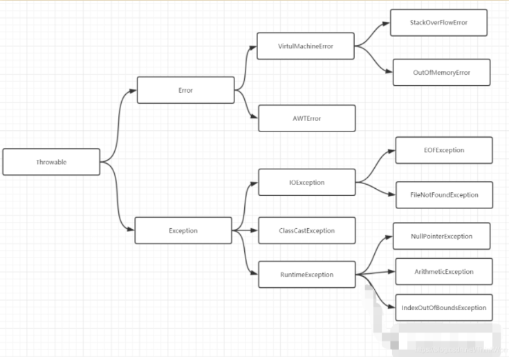
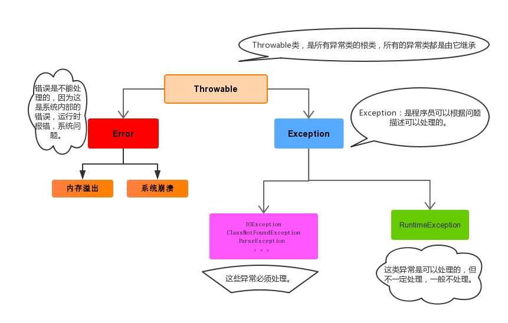

## Java异常机制





Throwable 是 Java 语言中所有错误与异常的超类。

Throwable 包含两个子类：Error（错误）和 Exception（异常），它们通常用于指示发生了异常情况。

Throwable 包含了其线程创建时线程执行堆栈的快照，它提供了 printStackTrace() 等接口用于获取堆栈跟踪数据等信息。


### 异常处理方式

1.遇见错误就终止程序运行

2.程序编写代码处理

常用方法：

getMessage():得到异常基本内容

printStackTrace()：得到异常详细信息


### 异常 Exception

#### 运行时异常

运行时异常，在编译阶段无法感知代码是否会出现问题。

Java 编译器不会检查它。也就是说，当程序中可能出现这类异常时，倘若既"没有通过throws声明抛出它"，也"没有用try-catch语句捕获它"，还是会编译通过。比如NullPointerException空指针异常、ArrayIndexOutBoundException数组下标越界异常、ClassCastException类型转换异常、ArithmeticExecption算术异常。==还能编译，但无法运行。==

#### 编译时异常

编译时异常是明确会出现的异常，编译阶段就需要处理。  

**特点**: Java 编译器会检查它。如果程序中出现此类异常，比如 ClassNotFoundException（没有找到指定的类异常），IOException（IO流异常），要么通过throws进行声明抛出，要么通过try-catch进行捕获处理，否则不能通过编译。在程序中，通常不会自定义该类异常，而是直接使用系统提供的异常类。**该异常我们必须手动在代码里添加捕获语句来处理该异常**。


### 错误 Error

Error 类及其子类。程序中无法处理的错误，表示运行应用程序中出现了严重的错误。最常见的就是OutOfMemoryError。


### 受检异常与非受检异常

Java 的所有异常可以分为受检异常（checked exception）和非受检异常（unchecked exception）。

##### 受检异常

编译器要求必须处理的异常。正确的程序在运行过程中，经常容易出现的、符合预期的异常情况。一旦发生此类异常，就必须采用某种方式进行处理。**除 RuntimeException 及其子类外，其他的 Exception 异常都属于受检异常**。编译器会检查此类异常，也就是说当编译器检查到应用中的某处可能会此类异常时，将会提示你处理本异常——要么使用try-catch捕获，要么使用方法签名中用 throws 关键字抛出，否则编译不通过。

##### 非受检异常

编译器不会进行检查并且不要求必须处理的异常，也就说当程序中出现此类异常时，即使我们没有try-catch捕获它，也没有使用throws抛出该异常，编译也会正常通过。**该类异常包括运行时异常（RuntimeException极其子类）和错误（Error）。**


### Java异常关键字

• **try** – 用于监听。将要被监听的代码(可能抛出异常的代码)放在try语句块之内，当try语句块内发生异常时，异常就被抛出。 

• **catch** – 用于捕获异常。catch用来捕获try语句块中发生的异常。 

• **finally** – finally语句块总是会被执行。它主要用于回收在try块里打开的物理资源(如数据库连接、网络连接和磁盘文件)。只有finally块，执行完成之后，才会回来执行try或者catch块中的return或者throw语句，如果finally中使用了return或者throw等终止方法的语句，则就不会跳回执行，直接停止。 


• **throw** – 用于封装抛出具体异常。 

throw**用在方法内**，用来抛出一个异常对象，将这个异常对象传递到调用者处，并**结束**当前方法的执行。

```java
throw new NullPointerException("要访问的arr数组不存在");
```


• **throws** – 用在方法签名中，用于声明该方法可能抛出的异常。

```java
public static void add() throws Exception{
    System.out.println("fsadfasd");
}
```


### 常见异常处理方式

#### 直接抛出异常

通常，应该捕获那些知道如何处理的异常，将不知道如何处理的异常继续传递下去。传递异常可以在方法签名处使用 **throws** 关键字声明可能会抛出的异常。

```java
private static void readFile(String filePath) throws IOException {
    File file = new File(filePath);
    String result;
    BufferedReader reader = new BufferedReader(new FileReader(file));
    while((result = reader.readLine())!=null) {
        System.out.println(result);
    }
    reader.close();
}
```

#### 封装异常再抛出

有时我们会从 catch 中抛出一个异常，目的是为了改变异常的类型。多用于在多系统集成时，当某个子系统故障，异常类型可能有多种，可以用统一的异常类型向外暴露，不需暴露太多内部异常细节。

```java
private static void readFile(String filePath) throws MyException {    
    try {
        // code
    } catch (IOException e) {
        MyException ex = new MyException("read file failed.");
        ex.initCause(e);
        throw ex;
    }
}
```

#### 捕获异常

在一个 try-catch 语句块中可以捕获多个异常类型，并对不同类型的异常做出不同的处理

```java
private static void readFile(String filePath) {
    try {
        // code
    } catch (FileNotFoundException e) {
        // handle FileNotFoundException
    } catch (IOException e){
        // handle IOException
    }
}
```

同一个 catch 也可以捕获多种类型异常，用 | 隔开

```java
private static void readFile(String filePath) {
    try {
        // code
    } catch (FileNotFoundException | UnknownHostException e) {
        // handle FileNotFoundException or UnknownHostException
    } catch (IOException e){
        // handle IOException
    }
}
```

#### 自定义异常

习惯上，定义一个异常类应包含两个构造函数，一个无参构造函数和一个带有详细描述信息的构造函数（Throwable 的 toString 方法会打印这些详细信息，调试时很有用）

```java
public class MyException extends Exception {
    public MyException(){ }
    public MyException(String msg){
        super(msg);
    }
    // ...
}
```


## Java异常常见面试题

### 1. Error 和 Exception 区别是什么？

Error 类型的错误通常为虚拟机相关错误，如系统崩溃，内存不足，堆栈溢出等，编译器不会对这类错误进行检测，JAVA 应用程序也不应对这类错误进行捕获，一旦这类错误发生，通常应用程序会被终止，仅靠应用程序本身无法恢复；

Exception 类的错误是可以在应用程序中进行捕获并处理的，通常遇到这种错误，应对其进行处理，使应用程序可以继续正常运行。


### 2. throw 和 throws 的区别是什么？

Java 中的异常处理除了包括捕获异常和处理异常之外，还包括声明异常和拋出异常，可以通过 throws 关键字在方法上声明该方法要拋出的异常，或者在方法内部通过 throw 拋出异常对象。

**throws 关键字和 throw 关键字在使用上的几点区别如下**：

- throw 关键字用在方法内部，只能用于抛出一种异常，用来抛出方法或代码块中的异常，受查异常和非受查异常都可以被抛出。
- throws 关键字用在方法声明上，可以抛出多个异常，用来标识该方法可能抛出的异常列表。一个方法用 throws 标识了可能抛出的异常列表，调用该方法的方法中必须包含可处理异常的代码，否则也要在方法签名中用 throws 关键字声明相应的异常。


### 4.猜结果

#### 形式一：从try回来

```java
public class TestReturn {
	public static void main(String[] args) {
		int result = test("12");
		System.out.println(result);
	}

	public static int test(String str){
		try{
			Integer.parseInt(str);
			return 1;
		}catch(NumberFormatException e){
			return -1;
		}finally{
			System.out.println("test结束");
		}
	}
}
//test结束 1
```


#### 形式二：从catch回来

```java
public class TestReturn {
	public static void main(String[] args) {
		int result = test("a");
		System.out.println(result);
	}

	public static int test(String str){
		try{
			Integer.parseInt(str);
			return 1;
		}catch(NumberFormatException e){
			return -1;
		}finally{
			System.out.println("test结束");
		}
	}
}
////test结束 -1
```


#### 形式三：从finally回来

```java
public class TestReturn {
	public static void main(String[] args) {
		int result = test("a");
		System.out.println(result);
	}

	public static int test(String str){
		try{
			Integer.parseInt(str);
			return 1;
		}catch(NumberFormatException e){
			return -1;
		}finally{
            System.out.println("test结束");
			return 0;
		}
	}
}
//test结束 0
```

