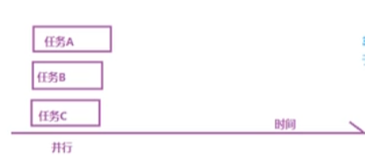
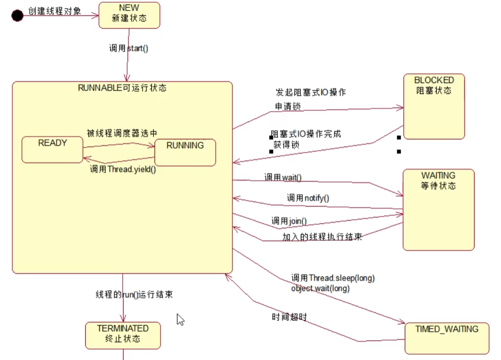
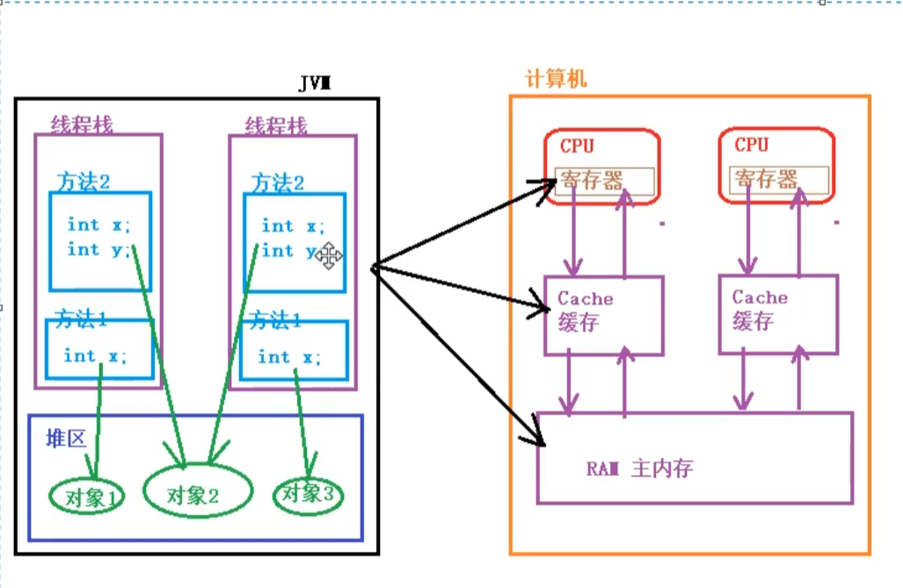
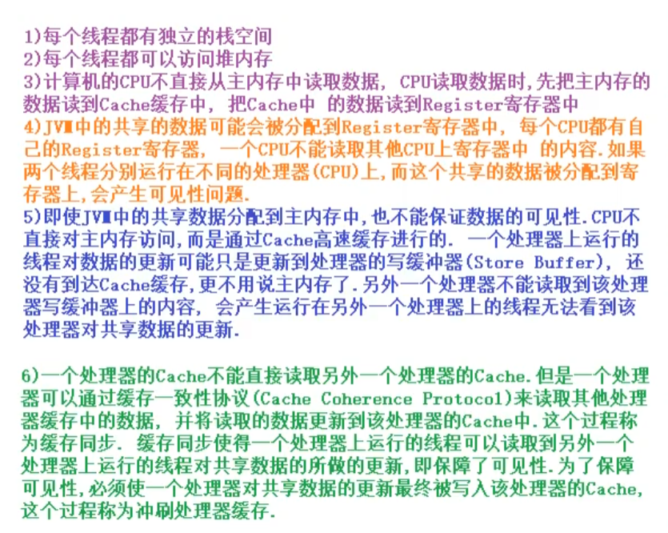
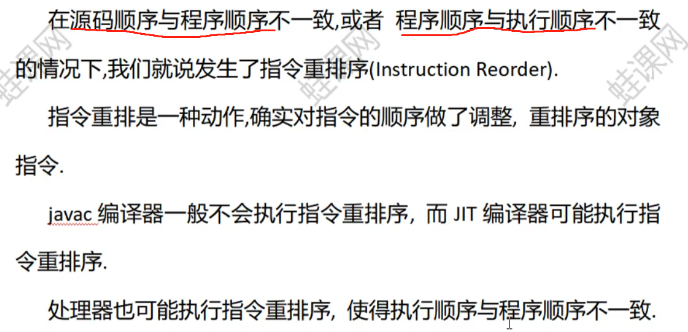
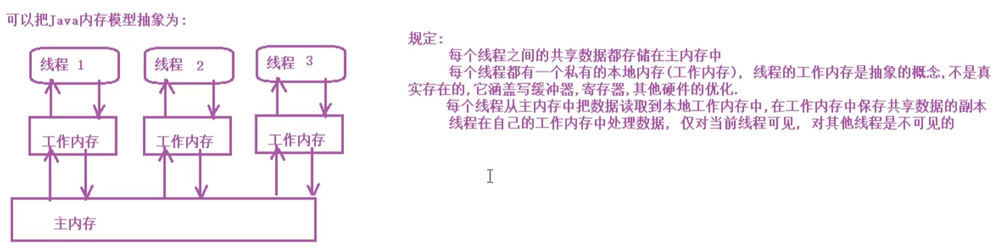

## 多线程

### 简介

串行：依次执行

并发：多个人一起操作同一个资源


并行：多个操作同时执行（理想状态下的并发）




多进程：执行程序的一次执行过程，==是系统资源分配的单位==。

多线程：一个进程含有若干个线程，==线程是CPU调度和执行的单位==。

##### 多线程优势与劣势

优势：

1.提高吞吐率，并发执行；

2.提高响应率

3.提高CPU资源利用率

劣势：

1.安全问题，共享数据没有正确并发访问控制，会产生问题；

2.线程活性问题，资源稀缺导致线程一直处于非Runnable；

​	a.死锁；b.锁死；c.活锁；d.饥饿；

3.上下文切换，线程之间切换需要资源开销

4.可靠性，可能有一个线程导致cpu终止。


##### 五大状态



在JAVA中，可以getState()获取线程状态；


### 实现线程的三种方法

1.继承Thread类

2.实现Runnable接口

3.实现Callable接口


#### 一.继承Thread 类

继承Thread类，重写run方法

```java
public class TestThread extends Thread {
    public void run(){
        for (int i = 0; i < 100; i++) {
            System.out.println("我在看"+i+"代码");
        }
    }

    public static void main(String[] args) {
		//因为jvm加载的时候TestThread这个类就在该包下，所以可以直接在static时实例化。
        TestThread testThread = new TestThread();
		
        //用start方法来启动线程，真正实现了多线程运行，这时无需等待run方法体代码执行完毕而直接继续执行下面的代码
        testThread.start();
        /*
        	start方法调用顺序不一定是线程启动顺序;
        	
        */
        

        for (int i = 0; i < 100; i++) {
            System.out.println("我在学习"+i+"多线程");
        }
    }

}
```


#### 二.实现接口类Runnable

```java
public class TestRunnable implements  Runnable{

    @Override
    public void run() {
        for (int i = 0; i < 100; i++) {
            System.out.println("我在听课");
        }
    }

    public static void main(String[] args) {
        TestRunnable testRunnable = new TestRunnable();

        Thread thread = new Thread(testRunnable);

        thread.start();

        for (int i = 0; i < 100; i++) {
            System.out.println("我在打瞌");
        }
    }
}
```


### 线程常用方法

Thread.currentThread():静态方法，可以获得当前调用代码的线程

Thread.sleep(int):静态方法，让当前线程阻塞

Thread.yield(): 让当前线程放弃cpu资源，Runing回到Runnable


setName("")/getName(""):获取线程名称

==案例==

```java
public class Test{
    psvm{
         /*
        	输出:
        	main
        	Thread-0
        */
        SubThread t1= new SubThread();
        t1.setName("t1");
         /*
        	输出:
        	t1
        	t1
        */
        t1.start();
        
        Thread.sleep(1000);
        
        /*
        	输出:
        	Thread-1
        	t1
        */
        Thread t2 = new Thread(t1);
        t2.start
        
    }
    
    
}


public class SbuThread2 extends Thread{
    public SubThread2(){
        sout("构造方法中的currentThread:"+Thread.currentThread.getName());
        sout("构造方法中，this.getName"+this.getName());
    }
    
    public void run(){
        sout("run方法中currentThread"+Thread.currenThread.getName());
        sout("run方法中getName"+this.getName());
    }
    
    
}
```


isAlive()：判断当前线程师父处于活动状态

活动状态就是 线程已启动并且尚未终止；


getId():获取线程id，==会重新分配==


setPriority(num): 设置线程的优先级1—10

给予一个提示信息，但不能保证优先成稿的线程进行；


interrupt(): 中断线程，打上一个停止标志，并不是停止；

---->isInterrupted()方法，返回布尔值，可以根据布尔值return退出；


setDaemon():守护线程，==start()前运行==，主线程结束，该线程结束；


### 线程安全问题

非线程安全主要是多个线程对一个对象的实例变量进行操作室，会出现值被更改，值不同步的情况；

线程安全问题主要是==原子性==、==可见性==、==有序性==


#### 原子性

不可分割

1.访问某个共享变量的操作在其他线程来看，要么已经执行完毕，要么尚未发生；

2.访问同一组共享变量的原子操作是不能够交错的；


##### 实现方式

锁：具有排他性

利用处理器的cas(Compare and swap)


#### 可见性

在多线程环境中，一个线程对某个共享变量更新后，后续线程可能无法立即读到这个结果；






#### 有序性

一个处理器上运行的一个线程所执行的内存访问操作在另外一个处理器运行的其他线程看来是乱序的。


编译器可能会改变两个操作的先后顺序；

处理器也有可能不按照目标代码的顺序执行，重排序；


### 重排序

#### 指令重排序




#### 存储系统重排序

存进了缓存，每存进内存？


### Java内存模型


