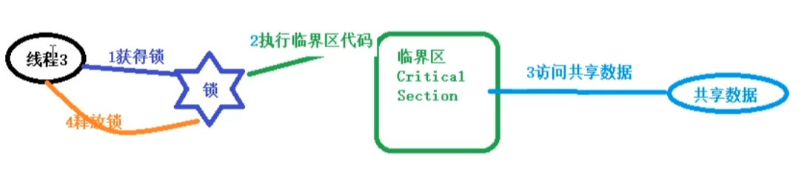
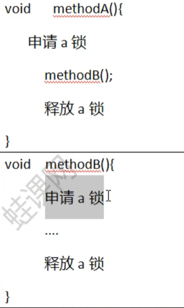

## 1.线程同步

### 1.1 线程同步机制

线程同步机制是一套用于协调线程之间的数据访问机制。该机制可以保障线程安全。线程同步是线程之间按照⼀定的顺序执⾏。

Java平台提供的线程同步机制，包括：锁，volatile关键字，final关键字，static关键字，以及相关API等

### 1.2 锁概述

- 将多个线程对共享数据的并发访问，转换为串行访问，以此来保障线程安全。

- 锁(Lock)可以理解为对共享数据进行保护的许可证，对于共享数据，必须要持有共享证；并且许可证一次只能被一个线程持有；且在结束访问猴必须释放其持有的许可证。==锁再获得之后和释放之前这段时间锁执行的代码成为临界区。==

- 该锁具有排他性，称为排它锁。

  

JVM把锁分为内部锁和显示锁两种。==内部锁==通过synchronized实现；==显示锁==通过java.concurrnet.locks.Lock接口的实现类实现，

#### 1.2.1 可重入性

一个线程持有一个锁得时候还能够成功申请该锁，则该锁是可重入的。

#### 1.2.2 锁的争用和调度

Java中内部锁属于公平锁，显示Lock锁及支持公平锁又支持非公平锁

#### 1.2.3 锁的粒度

一个锁可以保护的共享数据的数量大小。

### 1.3 Synchronized

