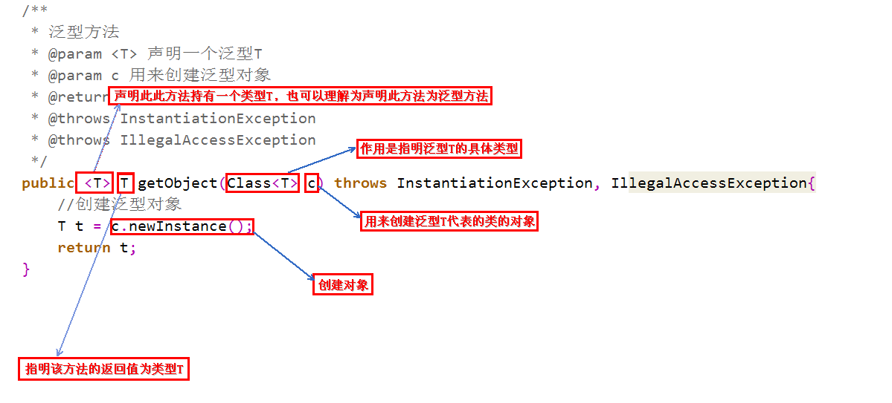

# 泛型

### 常见泛型方法语法格式




### 泛型常见问题

#### 泛型不支持类型转换

泛型不支持类型转换，但假如了类型参数的上下便捷机制。`<? extends A>`表示该类型参数可以是A(上边界)或者A的子类类型。编译时擦除到类型A，即用A类型代替类型参数。

```java
class A{}
class B extends A {}

public static void funC(List<? extends A> listA) {
    // ...          
}
public static void funD(List<B> listB) {
    funC(listB); // OK
    // ...             
}

/*支持该类和其父类的写法*/
public static void fun(Info<? super String> temp){    // 只能接收String或Object类型的泛型，String类的父类只有Object类
        System.out.print(temp + ", ") ;
}
```


##### 容器类使用泛型的好处

- **安全性：**在对参数化类型的容器中放入了错误即不匹配的类型的时候，编译器将会强制性进行错误提示。
- **便利性：**当从容器中取出元素的时候不用自己手动将Object转换为元素的实际类型了，编译器将隐式地进行自动转换。
- **表述性：带有类型实参的泛型即参数化类型**，可以让人看到**实参**就知道里面的元素E都是什么类型。
- 

##### ==List＜?＞、List＜Object＞泛型的区别==

| 引用变量的类型 | 名称                                 | 可以接受的类型                                  | 能否添加元素               | 安全性 | 便利性 | 表述性 |
| :------------- | :----------------------------------- | :---------------------------------------------- | :------------------------- | :----- | :----- | :----- |
| List           | **原始类型**                         | **任何对应List<E>的参数化类型， 包括List<?>**   | **可以添加任意类型的元素** | **无** | **无** | **无** |
| List<?>        | **通配符类型**                       | **以接受任何对应List<E>的参数化类型，包括List** | **不能添加任何元素**       | **有** | **无** | **有** |
| List<Object>   | **实际类型参数为Object的参数化类型** | **仅可以接受List和其本身类型**                  | **可以添加任意类型元素**   | **有** | **有** | **有** |


#### 泛型不支持数组

Java [泛型](https://so.csdn.net/so/search?q=泛型&spm=1001.2101.3001.7020)通过类型擦除实现，编译时类型参数就会被擦掉。例如：声明一个 List<String>，一个 List<Integer>，编译后，都变为 List，并且在 JVM 中是同一个 class 对象 List.class。

假设 Java 允许使用泛型数组，我们看看有什么问题。

```java
List<String>[] list = new LinkedList<String>[10];
```

经过类型擦除后。

```java
List[] list = new LinkedList[10];
```

接下来我们就可以往数组中放东西了。

```java
list[1] = new LinkedList<String>();	
list[0] = new LinkedList<Integer>();   // 编译通过
```

这里就出现问题了，声明的是 LinkedList<String> 类型的数组，但是居然成功放入了一个 LinkedList<Integer>()，这与 Java 协变数组类型有关，出现了类型安全问题，所以 Java 中不支持泛型数组。
