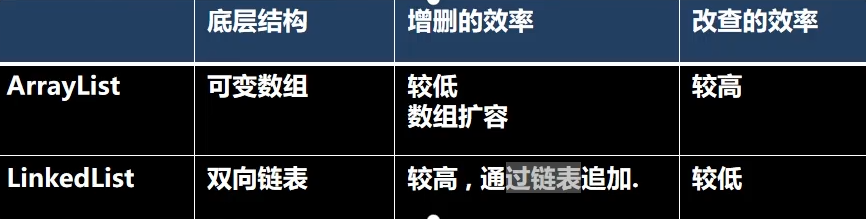

# 集合类

集合类主要有两种：单列集合(List和Set)，双列元素（以key、value存储）

#### 单列集合


#### 双列集合


## Collection实现类的特点

实现了Iterable 接口

```java
public interface Collection<E> extends Iterable<E>
```


### collection常用方法


### Collection遍历元素方式

##### 1.Iterator(迭代器)

iterator()方法返回一个iterator对象；仅用于迭代，不存储元素；

```java
Iterator iterator  = coll.iterator();

//itit快捷生成
while(iterator.hasNext()){	//必须调用hasNext(),
    sout(Iterator.next());  //相当于生成指针，逐行读取？
}
```


##### 2.增强for 循环

底层也是用迭代器实现

```java
for(Object obj:col){
    sout(o);
}
```


### List

List集合类中元素有序，且可重复；

List集合中有其对应的顺应索引，支持索引；




#### List中常用方法

除了Colllection中常用方法以外：

```java
void add(index,element)//在指定位置插入;
boolean addAll(index,list)//在指定位置插入list;
Object get(index);
int indexOf(Object obj);
int lastIndexOf(Object obj);
Object remove(int ind); //rmeove(obj) 也只会删除第一个相等的对象
Object set(int index,Object obj);//替换
//左闭右开
List subList(int fromIndex,int toIndex);

//快速打印？
list.forEach(System.out::println);
```


#### ArrayList分析

线程不安全，可以传入null值

> ==底层机制==
>
> 1.ArrayList 维护了一个 elementData的Object数组;
>
> ​	elementData被transient修饰，表示不被序列化
>
> 
>
> 2.调用无参构造，初始容量为0，第一次添加元素扩容为10，如果需要再次扩容，扩容1.5倍
>
> ​	newCapacity = oldCapacity + oldCapacit>>1;

修改IDEA设置，不然有些显示会看不到


#### Vector分析

线程安全的，sychronized

> ==扩容机制==
>
> 1.无参构造默认为容量10，扩容默认增加一倍;
>
> ​	newCapacity = oldCapacity + ((capacityIncrement>0)?
>
> ​				capacityIncrement:oldCapacity);
>
> increment被写死为0;
>


#### LinkedlList分析

> 1.LinkedList底层实现了双向链表和双端队列特点;==删除和添加快速==
>
> 2.可以添加任意元素，包括null;
>
> 3.线程不安全。


### Set

> 无序，没有索引;(不允许通过==索引==的方式遍历)
>
> 不允许重复且最多包含一个null；


#### HashSet

> 实现了Set接口，是基底层是HashMap；
>
> 可以存放null值；
>
> 无序，不重复；


##### HashSet底层机制

HashSet的基本机制是底层维护了一个Node类型的数组table，Node会以链表的形式存储每个节点。

```java
/*
共享present
private static final Object PRESENT = new Object();
*/
public boolean add(E e) {
    return map.put(e, PRESENT)==null;
}

------之后运行方法代码----->
    
public V put(K key, V value) {
    return putVal(hash(key), key, value, false, true);
}
```

1.添加元素时，先得到hash值 ->索引值；

```java
static final int hash(Object key) {
        int h;
        return (key == null) ? 0 : (h = key.hashCode()) ^ (h >>> 16);
}    
```

2.找到存储数据表table，看是否已经存放有元素；

3.没有，直接加入；

4.如果有，调用equals方法比较，如果相同，则不添加；

5.在java8中，一条链表大于等于8，且数组长度大于等于64，则会将链表变为红黑树；

```java
final V putVal(int hash, K key, V value, boolean onlyIfAbsent,
                   boolean evict) {
    
        Node<K,V>[] tab; Node<K,V> p; int n, i;
    //table为当前HashMap的数组
        if ((tab = table) == null || (n = tab.length) == 0)
            n = (tab = resize()).length;  //初始化数组到16个空间;
    //如果不发生hash碰撞
    //这里的&操作相当于直接截取hash值的低n位，
        if ((p = tab[i = (n - 1) & hash]) == null)
            tab[i] = newNode(hash, key, value, null);
        else {
            Node<K,V> e; K k;
            
       		//比较了hash值与(同一个对象或者是equals方法)
            if (p.hash == hash &&
                ((k = p.key) == key || (key != null && key.equals(k))))
                e = p;
            //判断是不是一颗红黑树
            else if (p instanceof TreeNode)
                e = ((TreeNode<K,V>)p).putTreeVal(this, tab, hash, key, value);
           
            else {
                //循环比较链表上的值，死循环
                for (int binCount = 0; ; ++binCount) {
                    //不存在添加，退出 
                    if ((e = p.next) == null) {
                        p.next = newNode(hash, key, value, null);
                        //TREEIFY_THRESHOLD为8，但binCount从0开始
                        //链表长度为8时，Treeify;当前为8，则新加的元素为第九个
                        if (binCount >= TREEIFY_THRESHOLD - 1) // -1 for 1st
                            treeifyBin(tab, hash);
                        break;
                    }
                    //已经存在退出
                    if (e.hash == hash &&
                        ((k = e.key) == key || (key != null && key.equals(k))))
                        break;
                    p = e;
                }
            }
            if (e != null) { // existing mapping for key
                V oldValue = e.value;
                if (!onlyIfAbsent || oldValue == null)
                    e.value = value;
                afterNodeAccess(e);
                return oldValue;
            }
        }
        ++modCount;
    	//超过阈值，则扩容，0.75的当前数组的最大长度；
    	//size相当于加入的结点数量，无论是在数组上还是链表上
        if (++size > threshold)
            resize();
        afterNodeInsertion(evict);
        return null;
    }
```

==注意：==

所以相同值的String，无法插入，因为同时重写了hashcode和equals方法；


#### LinkedHashSet

HashSet的子类，底层为数组+双向链表

1.插入和取出顺序一致


#### TreeSet

1.有序的，并且可以选择传入Comparator()对象的构造方法，以实现自定义排序；


## Map类

key-value

> 1.Map中的key和value可以使任何引用类型的数据，会封装到HashMap$Node对象中
>
> 2.Map中的key不允许重复，原因和HashSet一样
>
> 3.Map中的value可以重复，并且可以为null，可以是多个

 

#### Map常用方法

put

remove

get

size

isEmpty

clear

containsKey


Map/HashMap底层

```java
1.k-v 最后是存放在 HashMap$Node node = newNode(hash,key,value,null) 数据结构;

2.为了方便遍历，会创建EntrySet集合，而一个Entry对象就有k，v ，即EntrySet<Entry<K,V>>;
这里自己的感觉就是，Node其实就是实现了Entry类，所以可以使用EntrySet对Node(向上转型)进行遍历
实际上就是，entryset终究是一个set，该set里面存放了一个个entry对象，即node
    
//云里雾里，不知道为啥要entryset遍历会更快,单纯为了getket,getvalue
```


#### 遍历方式

1.keySet()方法

2.values()方法取出Collection

3.entrySet()方法取出(entrySet初始化是没有数据的，但之所以返回的set有数据是因为entrySet的iterator()方法底层最终关联了table数组)

```java
1.keySet();
//a.增强for;
Set keys = map.keySet();
for(Object key : keys){
    sout(key+"-"+map.get(key));
}
//迭代器
Iterator iterator = keyset.iterator();
while(iterator.hasNext()){
    Object key = iterator.next();
    sout(key+"-"+map.get(key));
}

2.values();
//增强for
Collections values = map.values();
for(Object value: values){
    sout(value);
}
//迭代器；
~

3.entrySet();
Set entrySet = map.entrySet() ;
//增强for
for(Object entry:entrySet){
    Map.Entry m = (Map.Entry) entry;
    sout(m.getKey()+ "-" + m.getValue());
}

//迭代
~
```


### HashMap

1.key-val对的方式存储数据(实际包装成Node类，而Node类实现了Entry)

2.key不能重复，但是值可以，

3.添加相同的key，会覆盖原本的val；

4.不保证映射的顺序；

5.没有实现同步，因此线程不安全；

默认的加载因子为0.75；

第一次树化的默认条件是，数组长度>64且某个链表长度大于等于8


### Hashtable

1.存放：K-V

2.key和values均不能为null

3.线程安全的

4.链表头部插入？

```java
1.实现了Map.Entry接口,以Entry的形式直接存储K-V,HashMap中是以Node存储;

2.初始容量为11，treshold也是0.75，而扩容机制是newCapicity=（oldCapicity<<1）+1
```


#### Properties

1.与Hashtable类似；

2.多用于读取xxx.properties文件中,加载配置文件内容


## Collections工具类

reverse(List) 	反转

shuffle(List)	随机排序

sort(List)	自然排序

sort(List,Comparator)	自定义排序

swap(List,int,int)	交换指定位置元素


max(Collection)	根据自然元素 返回最大值

min(Collection)	根据自然元素 返回最小值

frequency(Collection,Object)	元素出现的次数

copy(List dest，List src)	list拷贝

replaceAll(List,String,String替换后)	替换


## 总结 


## 常见面试题

**1.java集合的种类**

1、List(有序、可重复)

List里存放的对象是有序的，同时也是可以重复的，List关注的是索引，拥有一系列和索引相关的方法，查询速度快。因为往list集合里插入或删除数据时，会伴随着后面数据的移动，所有插入删除数据速度慢。

2、Set(无序、不能重复)

Set里存放的对象是无序，不能重复的，集合中的对象不按特定的方式排序，只是简单地把对象加入集合中。

3、Map(键值对、键唯一、值不唯一)

Map集合中存储的是键值对，键不能重复，值可以重复。根据键得到值，对map集合遍历时先得到键的set集合，对set集合进行遍历，得到相应的值。
