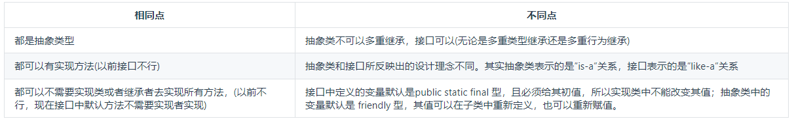

# JAVA新特性--Lambda

### 1.Default方法

Java8引入了default方法，只需在方法名前面加个default关键字即可。


#### 为什么需要default方法？

因为修改接口的时候，需要修改全部实现该接口的类(继承接口默认要实现该借口所有方法)，引入默认方法，目的是为了解决接口的修改与现有的实现不兼容的问题。


#### 抽象类和接口比较




#### ==注意==

1.如果存在唯一的最短路径的default是可以的，如果是多个那么报错。

```java
public interface A{
	default void aa() {
		System.out.println("A's aa");
	}
}
public interface B{
	default void aa() {
		System.out.println("B's aa");
	}
}
public static class D implements A,B{
	
}
/*
报错， 
Duplicate default methods named aa with the parameters () and () are inherited from the types DocApplication.B
and DocApplication.A
*/


//正常运行，输出C接口的默认方法
public interface A{
	default void aa() {
		System.out.println("A's aa");
	}
}
public interface B{
	default void aa() {
		System.out.println("B's aa");
	}
}
public interface C extends A, B{
	default void aa() {
		System.out.println("C's aa");
	}
}
public static class D implements A,B,C{
	
}

```

2.如果在报错的例子中，想使用A的默认方法可以如下

```java
public interface A{
	default void aa() {
		System.out.println("A's aa");
	}
}
public interface B{
	default void aa() {
		System.out.println("B's aa");
	}
}
public static class D implements A,B{
	@Override
    default void aa() {
		A.aa()
	}
}
```

