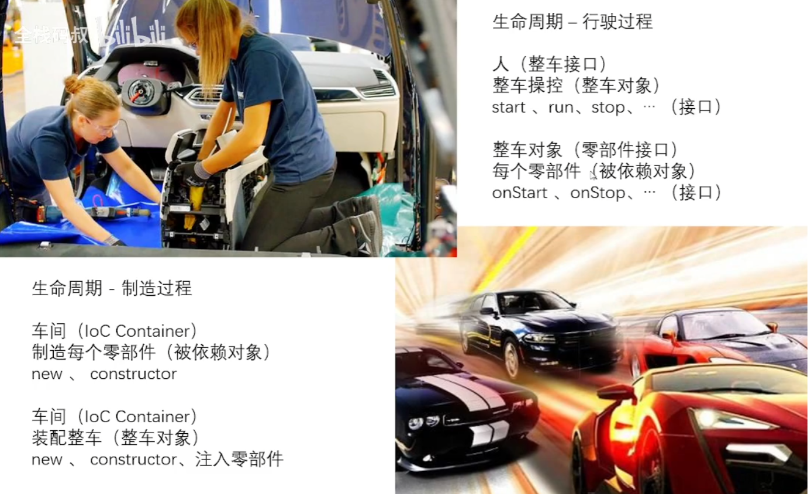

## 控制反转

IoC（Inverse of Control:控制反转）是一种设计思想，就是将原本在程序中手动创建对象的控制权，交由Spring框架来管理。IOC思想是基于IOC容器来完成的，IOC容器底层就是对象工厂（BeanFactory接口）。IOC的原理是基于xml解析、工厂设计模式、反射来实现的。 IoC 容器实际上就是个Map（key，value）Map 中存放的是各种对象。

DI(dependency )：被依赖对象会注入到相关对象中；

依赖：名词，指被依赖的对象（面向对象）

主任：动词，指被依赖对象，在使用者对象中的生成方式，是被注入的，而不是由使用者自己去生成的

### 以汽车生产举例

生命周期不一样？ioc容器来制造相关依赖零件--->人为调用相关汽车接口时传入相关零件(相当于人为使用相关功能时的操作)

==如果不是ioc的形式的话，自己手动new，也失去了一定的复用性(自己的理解)==