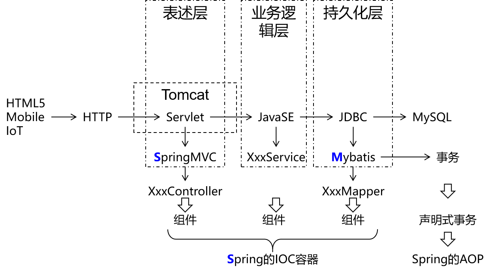

# mybatis

https://github.com/mybatis/mybatis-3


## 1.总体技术体系


### 单一架构

一个项目，一个工程，导出为一个war包，在一个Tomcat上运行。也叫all in one。



==注==

HTTP-->servlet--->javase-->MySQL,属于在原生的API上开发


### 分布式架构

一个项目，拆分成很多个模块，每个模块是一个工程。每一个工程都是运行在自己的Tomcat上。模块之间可以互相调用。每一个模块内部可以看成是一个单一架构的应用。


## 2.框架的概念

框架=jar包+配置文件


## 3.mybastis特性

- MyBatis支持定制化SQL、存储过程以及高级映射
- MyBatis避免了几乎所有的JDBC代码和手动设置参数以及结果集解析操作
- MyBatis可以使用简单的XML或注解实现配置和原始映射；将接口和Java的POJO（Plain Ordinary Java Object，普通的Java对象）映射成数据库中的记录
- Mybatis是一个半自动的ORM（Object   Relation  Mapping）框架


## 4.技术对比

- JDBC
  - SQL 夹杂在Java代码中耦合度高，导致硬编码内伤
  - 维护不易且实际开发需求中 SQL 有变化，频繁修改的情况多见
  - 代码冗长，开发效率低
- Hibernate 和 JPA
  - 操作简便，==开发效率高==
  - 程序中的长难复杂 SQL 需要绕过框架
  - 内部自动生产的 SQL，不容易做特殊优化
  - 基于全映射的全自动框架，大量字段的 POJO 进行部分映射时比较困难。
  - 反射操作太多，导致==数据库性能下降==
- MyBatis
  - 轻量级，性能出色
  - SQL 和 Java 编码分开，功能边界清晰。Java代码专注业务、SQL语句专注数据
  - 开发效率稍逊于HIbernate，但是完全能够接收


## 5.配置流程

1.导入maven依赖；

2.配置文件：

- mybatis全局配置文件，习惯命名为mybatis-config.xml,放在resources文件夹下；
- mybatis映射文，XXXXmapper.xml,即实现ORM(object relationship mapping)。

| Java概念 | 数据库概念 |
| -------- | ---------- |
| 类       | 表         |
| 属性     | 字段/列    |
| 对象     | 记录/行    |

3.junit代码


### 1、导入依赖

pom文件中导入依赖，记得修改==mysql驱动的版本==

```xml
<dependencies>
    <!-- Mybatis核心 -->
    <dependency>
        <groupId>org.mybatis</groupId>
        <artifactId>mybatis</artifactId>
        <version>3.5.7</version>
    </dependency>
    
    <!-- junit测试 -->
    <dependency>
        <groupId>junit</groupId>
        <artifactId>junit</artifactId>
        <version>4.12</version>
        <scope>test</scope>
    </dependency>
    
    <!-- MySQL驱动 记得修改驱动版本-->
    <dependency>
        <groupId>mysql</groupId>
        <artifactId>mysql-connector-java</artifactId>
        <version>8.0.0</version>
    </dependency>
    
    <!-- 数据源 -->
    <dependency>
        <groupId>com.alibaba</groupId>
        <artifactId>druid</artifactId>
        <version>1.0.31</version>
    </dependency>
</dependencies>
```


### 2、准备配置文件

#### [1]Mybatis全局配置文件

习惯上命名为mybatis-config.xml，这个文件名仅仅只是建议，并非强制要求。将来整合Spring之后，这个配置文件可以省略，所以大家操作时可以直接复制、粘贴。

```xml
<?xml version="1.0" encoding="UTF-8" ?>
<!DOCTYPE configuration
        PUBLIC "-//mybatis.org//DTD Config 3.0//EN"
        "http://mybatis.org/dtd/mybatis-3-config.dtd">
<configuration>
    
    <!-- environments表示配置Mybatis的开发环境，可以配置多个环境，在众多具体环境中，使用default属性指定实际运行时使用的环境。default属性的取值是environment标签的id属性的值。 -->
    <environments default="development">
        <!-- environment表示配置Mybatis的一个具体的环境 -->
        <environment id="development">
    
            <!-- Mybatis的内置的事务管理器 -->
            <transactionManager type="JDBC"/>
    
            <!-- 配置数据源 -->
            <dataSource type="POOLED">
    
                <!-- 建立数据库连接的具体信息 -->
                <property name="driver" value="com.mysql.jdbc.Driver"/>
                <property name="url" value="jdbc:mysql://localhost:3306/mybatis_example?serverTimezone=UTjdbc:mysql://localhost:3306/mybatis-example"/>
                <property name="username" value="root"/>
                <property name="password" value="root"/>
            </dataSource>
        </environment>
    </environments>
    
    <mappers>
        <!-- Mapper注册：指定Mybatis映射文件的具体位置 -->
        <!-- mapper标签：配置一个具体的Mapper映射文件 -->
        <!-- resource属性：指定Mapper映射文件的实际存储位置，这里需要使用一个以类路径根目录为基准的相对路径 -->
        <!--    对Maven工程的目录结构来说，resources目录下的内容会直接放入类路径，所以这里我们可以以resources目录为基准 -->
        <mapper resource="mappers/EmployeeMapper.xml"/>
    </mappers>
</configuration>
```

<span style="color:blue;font-weight:bold;">注意</span>：配置文件存放的位置是src/main/resources目录下。


#### [2]Mybatis映射文件

相关概念：<span style="color:blue;font-weight:bold;">ORM</span>（<span style="color:blue;font-weight:bold;">O</span>bject <span style="color:blue;font-weight:bold;">R</span>elationship <span style="color:blue;font-weight:bold;">M</span>apping）对象关系映射。

- 对象：Java的实体类对象
- 关系：关系型数据库
- 映射：二者之间的对应关系

| Java概念 | 数据库概念 |
| -------- | ---------- |
| 类       | 表         |
| 属性     | 字段/列    |
| 对象     | 记录/行    |


```xml
<?xml version="1.0" encoding="UTF-8" ?>
<!DOCTYPE mapper
        PUBLIC "-//mybatis.org//DTD Mapper 3.0//EN"
        "http://mybatis.org/dtd/mybatis-3-mapper.dtd">

<!-- mapper是根标签，namespace属性：在Mybatis全局范围内找到一个具体的Mapper配置 -->
<!-- 引入接口后，为了方便通过接口全类名来找到Mapper配置文件，所以通常将namespace属性设置为接口全类名 -->
<mapper namespace="com.atguigu.mybatis.dao.EmployeeMapper">

    <!-- 编写具体的SQL语句，使用id属性唯一的标记一条SQL语句 -->
    <!-- resultType属性：指定封装查询结果的Java实体类的全类名 -->
    <select id="selectEmployee" resultType="com.atguigu.mybatis.entity.Employee">
        <!-- Mybatis负责把SQL语句中的#{}部分替换成“?”占位符，在#{}内部还是要声明一个见名知意的名称 -->
        select emp_id empId,emp_name empName,emp_salary empSalary from t_emp where emp_id=#{empId}
    </select>
</mapper>
```

<span style="color:blue;font-weight:bold;">注意</span>：EmployeeMapper.xml所在的目录要和mybatis-config.xml中使用mapper标签配置的一致。


### 3、junit测试代码

```java
@Test
public void testSelectEmployee() throws IOException {
    
    // 1.创建SqlSessionFactory对象
    // ①声明Mybatis全局配置文件的路径
    String mybatisConfigFilePath = "mybatis-config.xml";
    
    // ②以输入流的形式加载Mybatis配置文件
    InputStream inputStream = Resources.getResourceAsStream(mybatisConfigFilePath);
    
    // ③基于读取Mybatis配置文件的输入流创建SqlSessionFactory对象
    SqlSessionFactory sessionFactory = new SqlSessionFactoryBuilder().build(inputStream);
    
    // 2.使用SqlSessionFactory对象开启一个会话
    SqlSession session = sessionFactory.openSession();
    
    // 3.根据Mapper配置文件的名称空间+SQL语句的id找到具体的SQL语句
    // 格式是：名称空间.SQL语句的id
    String statement = "com.atguigu.mybatis.dao.EmployeeMapper.selectEmployee";
    
    // 要传入SQL语句的参数
    Integer empId = 1;
    
    // 执行SQL语句
    Object result = session.selectOne(statement, empId);
    
    System.out.println("o = " + result);
    
    // 4.关闭SqlSession
    session.close();
}
```

说明：

- SqlSession：代表Java程序和<span style="color:blue;font-weight:bold;">数据库</span>之间的<span style="color:blue;font-weight:bold;">会话</span>。（HttpSession是Java程序和浏览器之间的会话）
- SqlSessionFactory：是“生产”SqlSession的“工厂”。
- 工厂模式：如果创建某一个对象，使用的过程基本固定，那么我们就可以把创建这个对象的相关代码封装到一个“工厂类”中，以后都使用这个工厂类来“生产”我们需要的对象。


### ==注==

在项目初始化的时候，已经生成了Configuration对象，所以查找运行sql语句时是在configuration里进行查找，而不是io读取xml。