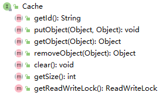
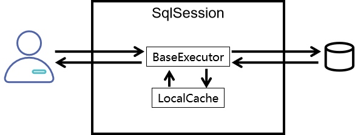
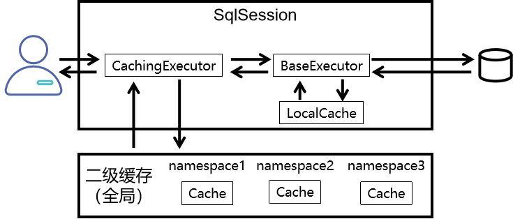

# 缓存

为什么需要缓存?

因为java程序跟mysql也是通过连接进行访问的，针对一些热点数据会频繁访问，会造成很大的压力。


## 一级缓存和二级缓存

### ①使用顺序


查询的顺序是：

- 先查询二级缓存，因为二级缓存中可能会有其他程序已经查出来的数据，可以拿来直接使用。
- 如果二级缓存没有命中，再查询一级缓存
- 如果一级缓存也没有命中，则查询数据库
- SqlSession关闭之前，一级缓存中的数据会写入二级缓存


### ②效用范围

- 一级缓存：SqlSession级别
- 二级缓存：SqlSessionFactory级别


它们之间范围的大小参考下面图：


## 一级缓存

一级缓存是默认开启的。

例子：

```java
EmployeeMapper mapper = session.getMapper(EmployeeMapper.class);
Employee employee=mapper.getEmployee(1);
Employee employee1 = mapper.getEmployee(1);
System.out.println(employee==employee1); //true
```


### 一级缓存失效的情况

- 不同的SqlSession对象
- 同一个SqlSession但是查询条件发生了变化
- 同一个SqlSession两次查询期间执行了一次增删改操作
- 同一个SqlSession两次查询期间手动清空了缓存
- 同一个SqlSession两次查询期间提交了事务


## 二级缓存

开启二级缓存，加入cache标签即可开启Mybatis自带的二级缓存

```xml
<mapper namespace="com.atguigu.mybatis.EmployeeMapper">
    
    <!-- 加入cache标签启用二级缓存功能 -->
    <cache/>
```


让实体类支持序列化

```java
public class Employee implements Serializable
```


测试样例

```java
    SqlSession session = factory.openSession();
    
    EmployeeMapper mapper = session.getMapper(EmployeeMapper.class);
    
    Employee employee = mapper.selectEmployeeById(2);
    
    System.out.println("employee = " + employee);
    
    // 在执行第二次查询前，关闭当前SqlSession
    session.close();
    
    // 开启一个新的SqlSession
    session = factory.openSession();
    
    mapper = session.getMapper(EmployeeMapper.class);
    
    employee = mapper.selectEmployeeById(2);
    
    System.out.println("employee = " + employee);
    
    session.close();

//这里产生的对象不是一个对象，但是第二次不对数据库进行查询
```

==在SqlSession关闭的时候，一级缓存中的内容才会存入二级缓存==


### 二级缓存相关配置

在Mapper配置文件中添加的cache标签可以设置一些属性：

- eviction属性：缓存回收策略

  LRU（Least Recently Used） – 最近最少使用的：移除最长时间不被使用的对象。

  FIFO（First in First out） – 先进先出：按对象进入缓存的顺序来移除它们。

  SOFT – 软引用：移除基于垃圾回收器状态和软引用规则的对象。

  WEAK – 弱引用：更积极地移除基于垃圾收集器状态和弱引用规则的对象。

  默认的是 LRU。

- flushInterval属性：刷新间隔，单位毫秒

  默认情况是不设置，也就是没有刷新间隔，缓存仅仅调用语句时刷新

- size属性：引用数目，正整数

  代表缓存最多可以存储多少个对象，太大容易导致内存溢出

- readOnly属性：只读，true/false

  true：只读缓存；会给所有调用者返回缓存对象的相同实例。因此这些对象不能被修改。这提供了很重要的性能优势。

  false：读写缓存；会返回缓存对象的拷贝（通过序列化）。这会慢一些，但是安全，因此默认是 false。


## EHcache

### 1.Mybatis环境

在Mybatis环境下整合EHCache，<span style="color:blue;font-weight:bold;">前提</span>当然是要先准备好<span style="color:blue;font-weight:bold;">Mybatis的环境</span>。

### 2.添加依赖

#### 依赖信息

```xml
<!-- Mybatis EHCache整合包 -->
<dependency>
    <groupId>org.mybatis.caches</groupId>
    <artifactId>mybatis-ehcache</artifactId>
    <version>1.2.1</version>
</dependency>
<!-- slf4j日志门面的一个具体实现 -->
<dependency>
    <groupId>ch.qos.logback</groupId>
    <artifactId>logback-classic</artifactId>
    <version>1.2.3</version>
</dependency>
```


#### 各jar包作用

| jar包名称       | 作用                            |
| --------------- | ------------------------------- |
| mybatis-ehcache | Mybatis和EHCache的整合包        |
| ehcache         | EHCache核心包                   |
| slf4j-api       | SLF4J日志门面包                 |
| logback-classic | 支持SLF4J门面接口的一个具体实现 |


### EHcache配置文件

放在resources目录下

```xml
<?xml version="1.0" encoding="utf-8" ?>
<ehcache xmlns:xsi="http://www.w3.org/2001/XMLSchema-instance"
         xsi:noNamespaceSchemaLocation="../config/ehcache.xsd">
    <!-- 磁盘保存路径 -->
    <diskStore path="D:\atguigu\ehcache"/>
    
    <defaultCache
            maxElementsInMemory="1000"
            maxElementsOnDisk="10000000"
            eternal="false"
            overflowToDisk="true"
            timeToIdleSeconds="120"
            timeToLiveSeconds="120"
            diskExpiryThreadIntervalSeconds="120"
            memoryStoreEvictionPolicy="LRU">
    </defaultCache>
</ehcache>
```


#### 在XXXmapper.xml添加cache

还是到查询操作所的Mapper配置文件中，找到之前设置的cache标签：


```xml
<cache type="org.mybatis.caches.ehcache.EhcacheCache"/>
```


### 加入logback日志

存在SLF4J时，作为简易日志的log4j将失效，此时我们需要借助SLF4J的具体实现logback来打印日志。


#### [1]各种Java日志框架简介

门面：

| 名称                                                         | 说明             |
| ------------------------------------------------------------ | ---------------- |
| JCL（Jakarta Commons Logging）                               | 陈旧             |
| SLF4J（Simple Logging Facade for Java）<span style="color:blue;">★</span> | 适合             |
| jboss-logging                                                | 特殊专业领域使用 |


实现：

| 名称                                      | 说明                                               |
| ----------------------------------------- | -------------------------------------------------- |
| log4j<span style="color:blue;">★</span>   | 最初版                                             |
| JUL（java.util.logging）                  | JDK自带                                            |
| log4j2                                    | Apache收购log4j后全面重构，内部实现和log4j完全不同 |
| logback<span style="color:blue;">★</span> | 优雅、强大                                         |

注：标记<span style="color:blue;">★</span>的技术是同一作者。


#### [2]logback配置文件


```xml
<?xml version="1.0" encoding="UTF-8"?>
<configuration debug="true">
	<!-- 指定日志输出的位置 -->
	<appender name="STDOUT"
		class="ch.qos.logback.core.ConsoleAppender">
		<encoder>
			<!-- 日志输出的格式 -->
			<!-- 按照顺序分别是：时间、日志级别、线程名称、打印日志的类、日志主体内容、换行 -->
			<pattern>[%d{HH:mm:ss.SSS}] [%-5level] [%thread] [%logger] [%msg]%n</pattern>
		</encoder>
	</appender>
	
	<!-- 设置全局日志级别。日志级别按顺序分别是：DEBUG、INFO、WARN、ERROR -->
	<!-- 指定任何一个日志级别都只打印当前级别和后面级别的日志。 -->
	<root level="DEBUG">
		<!-- 指定打印日志的appender，这里通过“STDOUT”引用了前面配置的appender -->
		<appender-ref ref="STDOUT" />
	</root>
    
	<!-- 根据特殊需求指定局部日志级别 -->
	<logger name="com.atguigu.crowd.mapper" level="DEBUG"/>
	
</configuration>
```


### EHCache配置文件说明

当借助CacheManager.add("缓存名称")创建Cache时，EhCache便会采用&lt;defalutCache/&gt;指定的的管理策略。

defaultCache标签各属性说明：

| 属性名                          | 是否必须 | 作用                                                         |
| ------------------------------- | -------- | ------------------------------------------------------------ |
| maxElementsInMemory             | 是       | 在内存中缓存的element的最大数目                              |
| maxElementsOnDisk               | 是       | 在磁盘上缓存的element的最大数目，若是0表示无穷大             |
| eternal                         | 是       | 设定缓存的elements是否永远不过期。<br />如果为true，则缓存的数据始终有效，<br />如果为false那么还要根据timeToIdleSeconds、timeToLiveSeconds判断 |
| overflowToDisk                  | 是       | 设定当内存缓存溢出的时候是否将过期的element缓存到磁盘上      |
| timeToIdleSeconds               | 否       | 当缓存在EhCache中的数据前后两次访问的时间超过timeToIdleSeconds的属性取值时，<br />这些数据便会删除，默认值是0,也就是可闲置时间无穷大 |
| timeToLiveSeconds               | 否       | 缓存element的有效生命期，默认是0.,也就是element存活时间无穷大 |
| diskSpoolBufferSizeMB           | 否       | DiskStore(磁盘缓存)的缓存区大小。默认是30MB。每个Cache都应该有自己的一个缓冲区 |
| diskPersistent                  | 否       | 在VM重启的时候是否启用磁盘保存EhCache中的数据，默认是false。 |
| diskExpiryThreadIntervalSeconds | 否       | 磁盘缓存的清理线程运行间隔，默认是120秒。每个120s，<br />相应的线程会进行一次EhCache中数据的清理工作 |
| memoryStoreEvictionPolicy       | 否       | 当内存缓存达到最大，有新的element加入的时候， 移除缓存中element的策略。<br />默认是LRU（最近最少使用），可选的有LFU（最不常使用）和FIFO（先进先出） |


### junit测试

我们可以发现，在ehcache中返回的是同一个对象。

```java
[11:17:43.600] [DEBUG] [main] [org.apache.ibatis.datasource.pooled.PooledDataSource] [Created connection 1956598686.]
[11:17:43.601] [DEBUG] [main] [org.apache.ibatis.transaction.jdbc.JdbcTransaction] [Setting autocommit to false on JDBC Connection [com.mysql.cj.jdbc.ConnectionImpl@749f539e]]
[11:17:43.615] [DEBUG] [main] [com.mjp.mybatis.mapper.EmployeeMapper.getEmployee] [==>  Preparing: select emp_id,emp_name,emp_salary from t_emp where emp_id=?]
[11:17:43.739] [DEBUG] [main] [com.mjp.mybatis.mapper.EmployeeMapper.getEmployee] [==> Parameters: 1(Integer)]
[11:17:43.791] [DEBUG] [main] [com.mjp.mybatis.mapper.EmployeeMapper.getEmployee] [<==      Total: 1]
[11:17:43.795] [DEBUG] [main] [net.sf.ehcache.store.disk.Segment] [put added 0 on heap]
[11:17:43.797] [DEBUG] [main] [org.apache.ibatis.transaction.jdbc.JdbcTransaction] [Resetting autocommit to true on JDBC Connection [com.mysql.cj.jdbc.ConnectionImpl@749f539e]]
[11:17:43.799] [DEBUG] [main] [org.apache.ibatis.transaction.jdbc.JdbcTransaction] [Closing JDBC Connection [com.mysql.cj.jdbc.ConnectionImpl@749f539e]]
[11:17:43.802] [DEBUG] [main] [org.apache.ibatis.datasource.pooled.PooledDataSource] [Returned connection 1956598686 to pool.]
[11:17:43.802] [DEBUG] [main] [com.mjp.mybatis.mapper.EmployeeMapper] [Cache Hit Ratio [com.mjp.mybatis.mapper.EmployeeMapper]: 0.5]
true

```


## 缓存原理

### 1.Cache接口

org.apache.ibatis.cache.Cache接口：所有缓存都必须实现的顶级接口


#### ①Cache接口中的方法



| 方法名         | 作用             |
| -------------- | ---------------- |
| putObject()    | 将对象存入缓存   |
| getObject()    | 从缓存中取出对象 |
| removeObject() | 从缓存中删除对象 |


### ②缓存的本质

根据Cache接口中方法的声明我们能够看到，缓存的本质是一个<span style="color:blue;font-weight:bold;">Map</span>。


### 2、PerpetualCache


org.apache.ibatis.cache.impl.PerpetualCache是Mybatis的默认缓存，也是Cache接口的默认实现。Mybatis一级缓存和自带的二级缓存都是通过PerpetualCache来操作缓存数据的。但是这就奇怪了，同样是PerpetualCache这个类，怎么能区分出来两种不同级别的缓存呢？

其实很简单，调用者不同。

- ==一级缓存==：由BaseExecutor调用PerpetualCache
- ==二级缓存==：由CachingExecutor调用PerpetualCache，而CachingExecutor可以看做是对BaseExecutor的装饰


### 3、一级缓存机制




org.apache.ibatis.executor.BaseExecutor类中的关键方法：

#### ①query()方法

```java
public <E> List<E> query(MappedStatement ms, Object parameter, RowBounds rowBounds, ResultHandler resultHandler, CacheKey key, BoundSql boundSql) throws SQLException {
    ErrorContext.instance().resource(ms.getResource()).activity("executing a query").object(ms.getId());
    if (closed) {
        throw new ExecutorException("Executor was closed.");
    }
    if (queryStack == 0 && ms.isFlushCacheRequired()) {
        clearLocalCache();
    }
    List<E> list;
    try {
        queryStack++;
        
        // 尝试从本地缓存中获取数据
        list = resultHandler == null ? (List<E>) localCache.getObject(key) : null;
        
        if (list != null) {
            handleLocallyCachedOutputParameters(ms, key, parameter, boundSql);
        } else {
            
            // 如果本地缓存中没有查询到数据，则查询数据库
            list = queryFromDatabase(ms, parameter, rowBounds, resultHandler, key, boundSql);
        }
    } finally {
        queryStack--;
    }
    if (queryStack == 0) {
        for (org.apache.ibatis.executor.BaseExecutor.DeferredLoad deferredLoad : deferredLoads) {
            deferredLoad.load();
        }
        // issue #601
        deferredLoads.clear();
        if (configuration.getLocalCacheScope() == LocalCacheScope.STATEMENT) {
            // issue #482
            clearLocalCache();
        }
    }
    return list;
}
```


#### ②queryFromDatabase()方法

```java
private <E> List<E> queryFromDatabase(MappedStatement ms, Object parameter, RowBounds rowBounds, ResultHandler resultHandler, CacheKey key, BoundSql boundSql) throws SQLException {
    List<E> list;
    localCache.putObject(key, EXECUTION_PLACEHOLDER);
    try {
        
        // 从数据库中查询数据
        list = doQuery(ms, parameter, rowBounds, resultHandler, boundSql);
    } finally {
        localCache.removeObject(key);
    }
    
    // 将数据存入本地缓存
    localCache.putObject(key, list);
    if (ms.getStatementType() == StatementType.CALLABLE) {
        localOutputParameterCache.putObject(key, parameter);
    }
    return list;
}
```


### 4、二级缓存机制




下面我们来看看CachingExecutor类中的query()方法在不同情况下使用的具体缓存对象：

##### ①未开启二级缓存


##### ②使用自带二级缓存


##### ③使用EHCache


