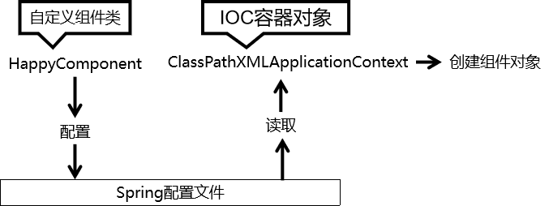
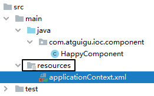
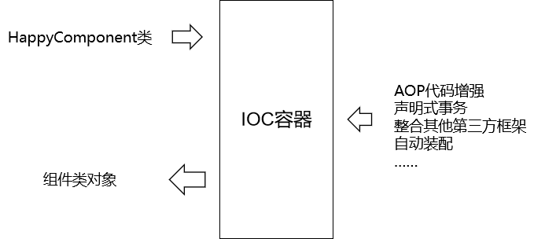

## 1创建bean

### 1.目标




### 2.步骤

1.创建相应maven module,导入相应依赖

```xml
<dependencies>
    <!-- 基于Maven依赖传递性，导入spring-context依赖即可导入当前所需所有jar包 -->
    <dependency>
        <groupId>org.springframework</groupId>
        <artifactId>spring-context</artifactId>
        <version>5.3.1</version>
    </dependency>
    <!-- junit测试 -->
    <dependency>
        <groupId>junit</groupId>
        <artifactId>junit</artifactId>
        <version>4.12</version>
        <scope>test</scope>
    </dependency>
</dependencies>
```


2.创建组件

```java
package com.atguigu.ioc.component;
    
public class HappyComponent {
    
    public void doWork() {
        System.out.println("component do work ...");
    }
    
}
```


3.创建Spring配置文件

XMLConfigurationFile选项中可以快速创建spring配置文件




4.配置bean

```xml
<!-- 实验一 [重要]创建bean -->
<bean id="happyComponent" class="com.atguigu.ioc.component.HappyComponent"/>
```

- bean标签：通过配置bean标签告诉IOC容器需要创建对象的组件是什么
- id属性：bean的唯一标识
- class属性：组件类的全类名


==5.创建测试类==

```java
public class IOCTest {
    private ApplicationContext ioc 
        = new ClassPathXmlApplicationContext("applicationContext.xml");
    @Test
    public void test01(){
        HappyComponent happycomponent = (HappyComponent) ioc
            	.getBean("happyComponent");
        happycomponent.doWork();
    }
}
```


### 3.相关知识点

1.无参构造器

Spring 底层默认通过反射技术调用组件类的无参构造器来创建组件对象，这一点需要注意。如果在需要无参构造器时，没有无参构造器，会抛出异常。

所以对一个JavaBean来说，<span style="color:blue;font-weight:bold;">无参构造器</span>和<span style="color:blue;font-weight:bold;">属性的getXxx()、setXxx()方法</span>是<span style="color:blue;font-weight:bold;">必须存在</span>的，特别是在框架中。


2.IOC创建对象有啥好处



在Spring环境下能够享受到的所有福利，都必须通过 IOC 容器附加到组件类上，所以随着我们在 Spring 中学习的功能越来越多，IOC 容器创建的组件类的对象就会比自己 new 的对象强大的越来越多。


## 2获取bean

- 根据id获取
- 根据类型获取


### 1.根据id获取；

```java
HappyComponent happycomponent = (HappyComponent) ioc.getBean("happyComponent");
```


### 2.根据类型获取；

```java
HappyComponent bean = ioc.getBean(HappyComponent.class);
```


####  **当指定类型的bean不唯一**

```xml
<!-- 实验一 [重要]创建bean -->
<bean id="happyComponent" class="com.atguigu.ioc.component.HappyComponent"/>

<!-- 实验二 [重要]获取bean -->
<bean id="happyComponent2" class="com.atguigu.ioc.component.HappyComponent"/>
```

根据类型获取时会抛出异常：

> org.springframework.beans.factory.<span style="color:blue;font-weight:bold;">NoUniqueBeanDefinitionException</span>: No qualifying bean of type 'com.atguigu.ioc.component.HappyComponent' available: expected single matching bean but found 2: happyComponent,happyComponent2


### 3.注意点

如果组件类实现了接口，根据接口类型可以获取 bean 吗？

> 可以，前提是bean唯一

如果一个接口有多个实现类，这些实现类都配置了 bean，根据接口类型可以获取 bean 吗？

> 不行，因为bean不唯一

==所以==

根据类型来获取bean时，在满足bean唯一性的前提下，其实只是看：『对象 <span style="color:blue;font-weight:bold;">instanceof</span> 指定的类型』的返回结果，只要返回的是true就可以认定为和类型匹配，能够获取到。


## 3给Bean属性赋值

通过==property 标签==设置，原理是通过setXXXX方法注入。

```xml
<!-- 实验三 [重要]给bean的属性赋值：setter注入 -->
<bean id="happyComponent3" class="com.atguigu.ioc.component.HappyComponent">
    
    <!-- property标签：通过组件类的setXxx()方法给组件对象设置属性 -->
    <!-- name属性：指定属性名（这个属性名是getXxx()、setXxx()方法定义的，和成员变量无关） -->
    <!-- value属性：指定属性值 -->
    <property name="componentName" value="veryHappy"/>
</bean>
```


### 1.给引用外部属性赋值

使用ref=""

```xml
<bean id="happyComponent4" class="com.atguigu.ioc.component.HappyComponent">
    <!-- ref 属性：通过 bean 的 id 引用另一个 bean -->
    <property name="happyMachine" ref="happyMachine"/>
</bean>
```

**再配置外部的bean，通过id和ref关联**

```xml
<bean id="happyMachine" class="com.atguigu.ioc.component.HappyMachine">
    <property name="machineName" value="makeHappy"
</bean>
```


### 2.在内部直接配置

```xml
<!-- 实验五 [重要]给bean的属性赋值：内部bean -->
<bean id="happyComponent5" class="com.atguigu.ioc.component.HappyComponent">
    <property name="happyMachine">
        <!-- 在一个 bean 中再声明一个 bean 就是内部 bean -->
        <!-- 内部 bean 可以直接用于给属性赋值，可以省略 id 属性 -->
        <bean class="com.atguigu.ioc.component.HappyMachine">
            <property name="machineName" value="makeHappy"/>
        </bean>
    </property>
</bean>
```


### 3.级联属性赋值

```xml
<!--关联对象的bean-->
<bean id="happyMachine2" class="com.atguigu.ioc.component.HappyMachine"/>

<!--级联属性赋值-->
<bean id="happyComponent6" class="com.atguigu.ioc.component.HappyComponent">
    <!-- 装配关联对象 -->
    <property name="happyMachine" ref="happyMachine2"/>
    <!-- 对HappyComponent来说，happyMachine的machineName属性就是级联属性 -->
    <property name="happyMachine.machineName" value="cascadeValue"/>
</bean>
```


### 4.构造器注入

```xml
<!-- 实验八 给bean的属性赋值：构造器注入 -->
<bean id="happyTeam" class="com.atguigu.ioc.component.HappyTeam">
    <constructor-arg value="happyCorps"/>
    <constructor-arg value="10"/>
    <constructor-arg value="1000.55"/>
</bean>
```


## 4给Bean的属性：引入外部属性文件

### 使用外部文件配置数据库连接

#### 1.配置pom依赖

```xml
        <!-- MySQL驱动 -->
        <dependency>
            <groupId>mysql</groupId>
            <artifactId>mysql-connector-java</artifactId>
            <version>5.1.3</version>
        </dependency>
        <!-- 数据源 -->
        <dependency>
            <groupId>com.alibaba</groupId>
            <artifactId>druid</artifactId>
            <version>1.0.31</version>
        </dependency>
```

#### 2.配置外部属性文件

```properties
jdbc.user=root
jdbc.password=root
jdbc.url=jdbc:mysql://localhost:3306/mybatis_example?serverTimezone=UTC
jdbc.driver=com.mysql.jdbc.Driver
```

#### 3.配置属性

```xml
<!-- 引入外部属性文件 -->
<context:property-placeholder location="classpath:jdbc.properties"/>

<!-- 实验六 [重要]给bean的属性赋值：引入外部属性文件 -->
<bean id="druidDataSource" class="com.alibaba.druid.pool.DruidDataSource">
    <property name="url" value="${jdbc.url}"/>
    <property name="driverClassName" value="${jdbc.driver}"/>
    <property name="username" value="${jdbc.user}"/>
    <property name="password" value="${jdbc.password}"/>
</bean>
```

#### 4.测试

```java
 @Test
    public void test03() throws SQLException {
        DataSource bean = ioc.getBean(DataSource.class);
        Connection connection = bean.getConnection();
        System.out.println(connection);
    }
```


## 5赋值：特殊值处理

### 1.字面量

```xml
<!-- 使用value属性给bean的属性赋值时，Spring会把value属性的值看做字面量 -->
<property name="commonValue" value="hello"/>
```


### 2.类似变量举例

```xml
<!-- 使用ref属性给bean的属性复制是，Spring会把ref属性的值作为一个bean的id来处理 -->
<!-- 此时ref属性的值就不是一个普通的字符串了，它应该是一个bean的id -->
<property name="happyMachine" ref="happyMachine"/>
```

### 3.null值

```xml
        <property name="commonValue">
            <!-- null标签：将一个属性值明确设置为null -->
            <null/>
        </property>
```

### 4.xml实体

```xml
<!-- 实验九 给bean的属性赋值：特殊值处理 -->
<bean id="propValue" class="com.atguigu.ioc.component.PropValue">
    <!-- 小于号在XML文档中用来定义标签的开始，不能随便使用 -->
    <!-- 解决方案一：使用XML实体来代替 -->
    <property name="expression" value="a &lt; b"/>
</bean>
```


### 5.CDATA

```xml
<!-- 实验九 给bean的属性赋值：特殊值处理 -->
<bean id="propValue" class="com.atguigu.ioc.component.PropValue">
    <property name="expression">
        <!-- 解决方案二：使用CDATA节 -->
        <!-- CDATA中的C代表Character，是文本、字符的含义，CDATA就表示纯文本数据 -->
        <!-- XML解析器看到CDATA节就知道这里是纯文本，就不会当作XML标签或属性来解析 -->
        <!-- 所以CDATA节中写什么符号都随意 -->
        <value><![CDATA[a < b]]></value>
    </property>
</bean>
```


## 6.P名称空间

相当于直接跳过property属性配置，而在bean的配置中配置条件，但需要导入相关的xml约束。

```xml
<!-- 实验十 给bean的属性赋值：使用p名称空间 -->
<bean id="happyMachine3"
      class="com.atguigu.ioc.component.HappyMachine"
      p:machineName="goodMachine"
/>
```

使用 p 名称空间需要导入相关的 XML 约束，在 IDEA 的协助下导入即可：

```xml
<?xml version="1.0" encoding="UTF-8"?>
<beans xmlns="http://www.springframework.org/schema/beans"
       xmlns:xsi="http://www.w3.org/2001/XMLSchema-instance"
       xmlns:context="http://www.springframework.org/schema/context" xmlns:p="http://www.springframework.org/schema/p"
       xsi:schemaLocation="http://www.springframework.org/schema/beans http://www.springframework.org/schema/beans/spring-beans.xsd http://www.springframework.org/schema/context https://www.springframework.org/schema/context/spring-context.xsd">
```


## 7.集合赋值

相当于该类拥有集合属性，给集合属性赋值

==会进行相应的类型转换，但要注意特性，例如给list属性赋<set>标签，会使得list集合中去重。==

```xml
<!-- 实验十一 给bean的属性赋值：集合属性 -->
<bean id="happyTeam2" class="com.atguigu.ioc.component.HappyTeam">
    <property name="memberNameList">
        <!-- list标签：准备一组集合类型的数据，给集合属性赋值 -->
        <!--<list>
            <value>member01</value>
            <value>member02</value>
            <value>member03</value>
        </list>-->
        <!-- 使用set标签也能实现相同效果，只是附带了去重功能 -->
        <!--<set>
            <value>member01</value>
            <value>member02</value>
            <value>member02</value>
        </set>-->
        <!-- array也同样兼容 -->
        <array>
            <value>member01</value>
            <value>member02</value>
            <value>member02</value>
        </array>
    </property>
    <property name="managerList">
        <!-- 给Map类型的属性赋值 -->
        <!--<map>
            <entry key="财务部" value="张三"/>
            <entry key="行政部" value="李四"/>
            <entry key="销售部" value="王五"/>
        </map>-->
        <!-- 也可以使用props标签 -->
        <props>
            <prop key="财务部">张三2</prop>
            <prop key="行政部">李四2</prop>
            <prop key="销售部">王五2</prop>
        </props>
    </property>
</bean>
```


## 8.自动装配

在bean的配置中添加autowire属性。

可以配置byName，byType的属性自动关联。

例如，HappyController中需要使用HappyService

**Java代码**

```java
public class HappyController {
        
    private HappyService happyService;
    
    public HappyService getHappyService() {
        return happyService;
    }
    
    public void setHappyService(HappyService happyService) {
        this.happyService = happyService;
    }
}
```


**XML配置**

```xml
<!-- 实验十二 自动装配 -->
<bean id="happyService" class="com.atguigu.ioc.component.HappyService"/>

<!-- 使用bean标签的autowire属性设置自动装配效果 -->
<!-- byType表示根据类型进行装配，此时如果类型匹配的bean不止一个，那么会抛NoUniqueBeanDefinitionException -->
<!-- byName表示根据bean的id进行匹配。而bean的id是根据需要装配组件的属性的属性名来确定的 -->
<bean id="happyController"
      class="com.atguigu.ioc.component.HappyController"
      autowire="byName"
>
    <!-- 手动装配：在property标签中使用ref属性明确指定要装配的bean -->
    <!--<property name="happyService" ref="happyService"/>-->
</bean>
```


## 9.FactoryBean机制

FactoryBean是Spring提供的一种整合第三方框架的常用机制。和普通的bean不同，配置一个FactoryBean类型的bean，==在获取bean的时候得到的并不是class属性中配置的这个类的对象，而是getObject()方法的返回值==。通过这种机制，Spring可以帮我们把复杂组件创建的详细过程和繁琐细节都屏蔽起来，只把最简洁的使用界面展示给我们。


### 1.实现bean接口

```java
package com.atguigu.ioc.factory;

import com.atguigu.ioc.component.HappyMachine;
import org.springframework.beans.factory.FactoryBean;

// 实现FactoryBean接口时需要指定泛型
// 泛型类型就是当前工厂要生产的对象的类型
public class HappyFactoryBean implements FactoryBean<HappyMachine> {

    private String machineName;

    public String getMachineName() {
        return machineName;
    }

    public void setMachineName(String machineName) {
        this.machineName = machineName;
    }

    @Override
    public HappyMachine getObject() throws Exception {
        // 方法内部模拟创建、设置一个对象的复杂过程
        HappyMachine happyMachine = new HappyMachine();

        happyMachine.setMachineName(this.machineName);

        return happyMachine;
    }

    @Override
    public Class<?> getObjectType() {
        // 返回要生产的对象的类型
        return HappyMachine.class;
    }
}

```


### 2.配置

```xml
<!-- 实验十四 FactoryBean机制 -->
<!-- 这个bean标签中class属性指定的是HappyFactoryBean，但是将来从这里获取的bean是HappyMachine对象 -->
<bean id="happyMachine3" class="com.atguigu.ioc.factory.HappyFactoryBean">
    <!-- property标签仍然可以用来通过setXxx()方法给属性赋值 -->
    <property name="machineName" value="iceCreamMachine"/>
</bean>
```


## 10.bean的作用域

在Spring中可以通过配置bean标签的scope属性来指定bean的作用域范围，各取值含义参加下表：

| 取值      | 含义                                    | 创建对象的时机  |
| --------- | --------------------------------------- | --------------- |
| singleton | 在IOC容器中，这个bean的对象始终为单实例 | IOC容器初始化时 |
| prototype | 这个bean在IOC容器中有多个实例           | 获取bean时      |


如果是在WebApplicationContext环境下还会有另外两个作用域（但不常用）：

| 取值    | 含义                 |
| ------- | -------------------- |
| request | 在一个请求范围内有效 |
| session | 在一个会话范围内有效 |


**配置样例**

```xml
<!-- 实验十五 bean的作用域 -->
<!-- scope属性：取值singleton（默认值），bean在IOC容器中只有一个实例，IOC容器初始化时创建对象 -->
<!-- scope属性：取值prototype，bean在IOC容器中可以有多个实例，getBean()时创建对象 -->
<bean id="happyMachine4" scope="prototype" class="com.atguigu.ioc.component.HappyMachine">
    <property name="machineName" value="iceCreamMachine"/>
</bean>
```


## 11.bean的生命周期

### 生命周期

- bean对象创建（调用无参构造器）
- 给bean对象设置属性
- ==bean对象初始化之前操作==（由bean的后置处理器负责）
- **bean对象初始化**（需在配置bean时指定初始化方法）
- ==bean对象初始化之后操作==（由bean的后置处理器负责）
- bean对象就绪可以使用
- **bean对象销毁**（需在配置bean时指定销毁方法）
- IOC容器关闭


### 初始化和销毁方法

#### ①创建两个方法作为初始化和销毁方法

用com.atguigu.ioc.component.HappyComponent类测试：

```java
public void happyInitMethod() {
    System.out.println("HappyComponent初始化");
}
    
public void happyDestroyMethod() {
    System.out.println("HappyComponent销毁");
}
```

#### ②配置bean时指定初始化和销毁方法

```xml
<!-- 实验十六 bean的生命周期 -->
<!-- 使用init-method属性指定初始化方法 -->
<!-- 使用destroy-method属性指定销毁方法 -->
<bean id="happyComponent"
      class="com.atguigu.ioc.component.HappyComponent"
      init-method="happyInitMethod"
      destroy-method="happyDestroyMethod"
>
    <property name="happyName" value="uuu"/>
</bean>
```


### 后置处理器

配置后置处理器需要实现BeanPostProcessor接口中的两个方法，值得注意的是，这两个方法 并不是仅针对某个bean生效的，而是对容器中的所有bean生效的。

```javascript
package com.atguigu.ioc.process;
    
import org.springframework.beans.BeansException;
import org.springframework.beans.factory.config.BeanPostProcessor;
    
// 声明一个自定义的bean后置处理器
// 注意：bean后置处理器不是单独针对某一个bean生效，而是针对IOC容器中所有bean都会执行
public class MyHappyBeanProcessor implements BeanPostProcessor {
    
    @Override
    public Object postProcessBeforeInitialization(Object bean, String beanName) throws BeansException {
    
        System.out.println("☆☆☆" + beanName + " = " + bean);
    
        return bean;
    }
    
    @Override
    public Object postProcessAfterInitialization(Object bean, String beanName) throws BeansException {
    
        System.out.println("★★★" + beanName + " = " + bean);
    
        return bean;
    }
}
```


## 12.集合类型的bean（仅了解）

```xml
<!-- 实验 给bean的属性赋值：集合属性 -->
<util:list id="machineList">
    <bean class="com.atguigu.ioc.component.HappyMachine">
        <property name="machineName" value="machineOne"/>
    </bean>
    <bean class="com.atguigu.ioc.component.HappyMachine">
        <property name="machineName" value="machineTwo"/>
    </bean>
    <bean class="com.atguigu.ioc.component.HappyMachine">
        <property name="machineName" value="machineThree"/>
    </bean>
</util:list>
```

