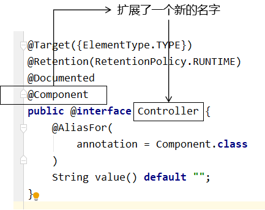
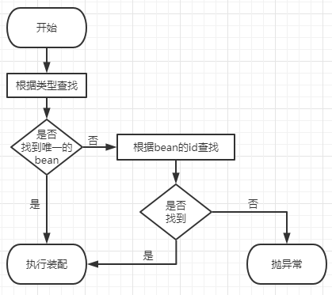

## 一.标记与扫描

### 1、注解的作用

注解：所有的操作均由JAVA代码来完成，xml和注解只是告诉框架中的java代码如何执行


扫描：Spring 为了知道程序员在哪些地方标记了什么注解，就需要通过扫描的方式，来进行检测。然后根据注解进行后续操作。


### 2、依赖

```xml
<dependencies>

    <!-- 基于Maven依赖传递性，导入spring-context依赖即可导入当前所需所有jar包 -->
    <dependency>
        <groupId>org.springframework</groupId>
        <artifactId>spring-context</artifactId>
        <version>5.3.1</version>
    </dependency>

    <!-- junit测试 -->
    <dependency>
        <groupId>junit</groupId>
        <artifactId>junit</artifactId>
        <version>4.12</version>
        <scope>test</scope>
    </dependency>

</dependencies>
```


### 3、创建组件类

#### ①使用@Component注解标记的普通组件

```java
package com.atguigu.ioc.component;

import org.springframework.stereotype.Component;

@Component
public class CommonComponent {
}
```


#### ②使用@Controller注解标记的控制器组件

这个组件就是我们在三层架构中表述层里面，使用的控制器。以前是Servlet，以后我们将会使用Controller来代替Servlet。

```java
package com.atguigu.ioc.component;

import org.springframework.stereotype.Controller;

@Controller
public class SoldierController {
}
```


#### ③使用@Service注解标记的业务逻辑组件

这个组件就是我们在三层架构中使用的业务逻辑组件。

```java
package com.atguigu.ioc.component;

import org.springframework.stereotype.Service;

@Service
public class SoldierService {

}
```


#### ④使用@Repository注解标记的持久化层组件

这个组件就是我们以前用的Dao类，但是以后我们整合了Mybatis，这里就变成了Mapper接口，而Mapper接口是由Mybatis和Spring的整合包负责扫描的。

由于Mybatis整合包想要把Mapper接口背后的代理类加入Spring的IOC容器需要结合Mybatis对Mapper配置文件的解析，所以这个事情是Mybatis和Spring的整合包来完成，将来由Mybatis负责扫描，也不使用@Repository注解。

```java
package com.atguigu.ioc.component;

import org.springframework.stereotype.Repository;

@Repository
public class SoldierDao {
}
```


==注：==四个接口本质上没有区别，只是为了区分类的不同功能而取了别名，均是建立在Component基础之上。




### 4、扫描

#### 1.最基本的扫描方式

```xml
<!-- 配置自动扫描的包 -->
<!-- 最基本的扫描方式 -->
<context:component-scan base-package="com.atguigu.ioc.component"/>
```

从IOC容器中获取bean；

```java
private ApplicationContext iocContainer = new ClassPathXmlApplicationContext("applicationContext.xml");

@Test
public void testAnnotationcScanBean() {
    CommonComponent commonComponent = iocContainer.getBean(CommonComponent.class);
    
    SoldierController soldierController = iocContainer.getBean(SoldierController.class);
    
    SoldierService soldierService = iocContainer.getBean(SoldierService.class);
    
    SoldierDao soldierDao = iocContainer.getBean(SoldierDao.class);
    
    System.out.println("commonComponent = " + commonComponent);
    System.out.println("soldierController = " + soldierController);
    System.out.println("soldierService = " + soldierService);
    System.out.println("soldierDao = " + soldierDao);
}
```


#### 2.指定匹配模式

```xml
    <!-- 情况二：在指定扫描包的基础上指定匹配模式 -->
    <context:component-scan
            base-package="com.atguigu.ioc.component"
            resource-pattern="Soldier*.class"/>
```


#### 3.指定排除的组件

指定不扫描的组件

```xml
<!-- 情况三：指定不扫描的组件 -->
<context:component-scan base-package="com.atguigu.ioc.component">
    
    <!-- context:exclude-filter标签：指定排除规则 -->
    <!-- type属性：指定根据什么来进行排除，annotation取值表示根据注解来排除 -->
    <!-- expression属性：指定排除规则的表达式，对于注解来说指定全类名即可 -->
    <context:exclude-filter type="annotation" expression="org.springframework.stereotype.Controller"/>
</context:component-scan>
```


#### 4.扫描指定组件

```xml
<!-- 情况四：仅扫描指定的组件 -->
<!-- 仅扫描 = 关闭默认规则 + 追加规则 -->
<!-- use-default-filters属性：取值false表示关闭默认扫描规则 -->
<context:component-scan base-package="com.atguigu.ioc.component" use-default-filters="false">
    
    <!-- context:include-filter标签：指定在原有扫描规则的基础上追加的规则 -->
    <context:include-filter type="annotation" expression="org.springframework.stereotype.Controller"/>
</context:component-scan>
```


### 5.组件的beanName

#### ①默认情况

类名首字母小写就是bean的id。例如：SoldierController类对应的bean的id就是soldierController。

#### ②使用value属性指定

```java
@Controller(value = "tianDog")
public class SoldierController {
}
```


当注解中只设置一个属性时，value属性的属性名可以省略：

```java
@Service("smallDog")
public class SoldierService {

}
```


## 二.自动装配

SoldierController需要SoldierService，SoldierService需要SoldierDao；

**示例：**

```java
@Controller(value = "tianDog")
public class SoldierController {
	//需要依赖的组件，以往我们需要手动创建；
    private SoldierService soldierService;

    public void getMessage() {
        soldierService.getMessage();
    }

}
```


### 1.自动装配实现

#### ①、前提

参与自动装配的组件（需要装配别人、被别人装配）全部都必须在IOC容器中。


#### ②、Autowired注解

在成员变量上直接标记@Autowired注解即可，不需要提供setXxx()方法。以后我们在项目中的正式用法就是这样。

**例：给Controller装配Service**

```java
@Controller(value = "tianDog")
public class SoldierController {
    
    @Autowired
    private SoldierService soldierService;
    
    public void getMessage() {
        soldierService.getMessage();
    }
    
}
```


### ==2.@Autowired其他细节==

标记在其他位置

#### 1.构造器注入

```java
@Controller(value = "tianDog")
public class SoldierController {
    private SoldierService soldierService;
    
    @Autowired
    public SoldierController(SoldierService soldierService) {
        this.soldierService = soldierService;
    }
    ……
```


#### 2.setXxx()方法

```java
@Controller(value = "tianDog")
public class SoldierController {
    private SoldierService soldierService;

    @Autowired
    public void setSoldierService(SoldierService soldierService) {
        this.soldierService = soldierService;
    }
    ……
```


### ==3.工作流程==



- 首先根据所需要的组件类型到IOC容器中查找
  - 能够找到唯一的bean：直接执行装配
  - 如果完全找不到匹配这个类型的bean：装配失败
  - 和所需类型匹配的bean不止一个
    - 没有@Qualifier注解：根据@Autowired标记位置成员变量的变量名作为bean的id进行匹配
      - 能够找到：执行装配
      - 找不到：装配失败
    - 使用@Qualifier注解：根据@Qualifier注解中指定的名称作为bean的id进行匹配
      - 能够找到：执行装配
      - 找不到：装配失败

```java
@Controller(value = "tianDog")
public class SoldierController {
    
    @Autowired
    @Qualifier(value = "maomiService222")
    // 根据面向接口编程思想，使用接口类型引入Service组件
    private ISoldierService soldierService;
```


给@Autowired注解设置required = false属性表示：能装就装，装不上就不装。但是实际开发时，基本上所有需要装配组件的地方都是必须装配的，用不上这个属性。

```java
@Controller(value = "tianDog")
public class SoldierController {

    // 给@Autowired注解设置required = false属性表示：能装就装，装不上就不装
    @Autowired(required = false)
    private ISoldierService soldierService;
```


## 三.完全注解开发

因为在SpringBoot中，就是完全舍弃XML配置文件，全面使用注解来完成主要的配置。

### 1、使用配置类取代配置文件

使用@Configuration注解将一个普通的类标记为Spring的配置类。

==ComponentScan:==配置自动扫描的包

```java
@Configuration
@ComponentScan("com.atguigu.ioc.component")
public class MyConfiguration {
    
    // @Bean注解相当于XML配置文件中的bean标签
    // @Bean注解标记的方法的返回值会被放入IOC容器
    //个人的理解是你可以用@Bean额外生成一个bean放置到ioc容器中
    @Bean
    public CommonComponent getComponent() {
    
        CommonComponent commonComponent = new CommonComponent();
    
        commonComponent.setComponentName("created by annotation config");
    
        return commonComponent;
    }
    
}
```


### 2.测试类

```java
public class TestSpring {
    // ClassPathXmlApplicationContext根据XML配置文件创建IOC容器对象
	private ApplicationContext iocContainer = new ClassPathXmlApplicationContext("applicationContext.xml");

	// AnnotationConfigApplicationContext根据配置类创建IOC容器对象	
    private ApplicationContext iocContainerAnnotation = new AnnotationConfigApplicationContext(MyConfiguration.class);


    @Test
    public void test01(){
        Object commonComponent = iocContainerAnnotation.getBean("commonComponent");
        Object commonComponent1 = iocContainerAnnotation.getBean("getComponent");
        System.out.println(commonComponent);
        System.out.println(commonComponent1);
    }
}
```


## 四.整合Junit4

### 1、整合的好处

- 好处1：不需要自己创建IOC容器对象了
- 好处2：任何需要的bean都可以在测试类中直接享受自动装配


### 2、操作

#### ①加入依赖

```xml
<!-- Spring的测试包 -->
<dependency>
    <groupId>org.springframework</groupId>
    <artifactId>spring-test</artifactId>
    <version>5.3.1</version>
</dependency>
```


#### ②创建测试类

```java
// junit的@RunWith注解：指定Spring为Junit提供的运行器
@RunWith(SpringJUnit4ClassRunner.class)

// Spring的@ContextConfiguration指定Spring配置文件的位置
@ContextConfiguration(value = {"classpath:applicationContext.xml"})
public class JunitIntegrationSpring {
    
    @Autowired
    private SoldierController soldierController;
    
    @Test
    public void testIntegration() {
        System.out.println("soldierController = " + soldierController);
    }
    
}
```


