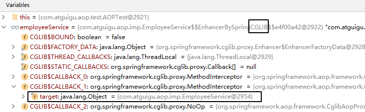
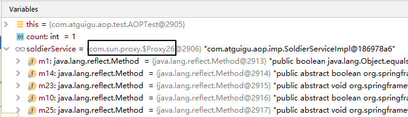
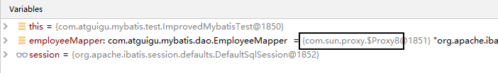
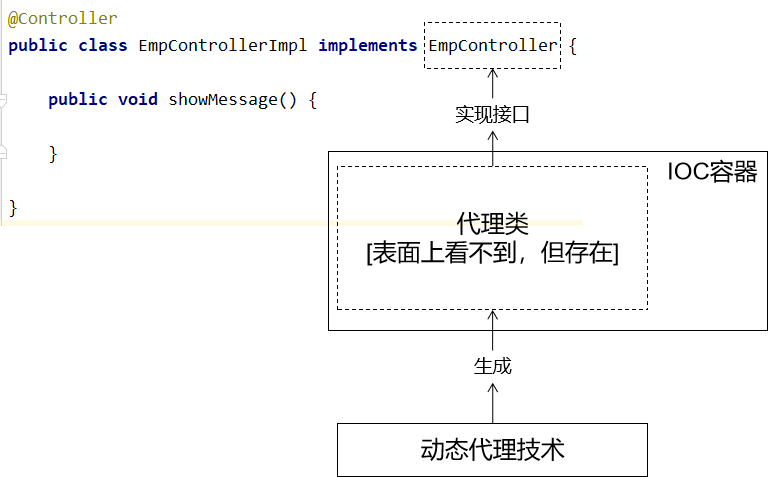
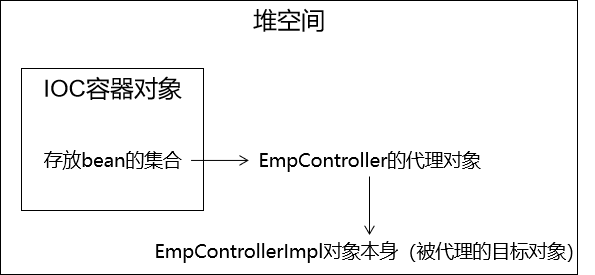
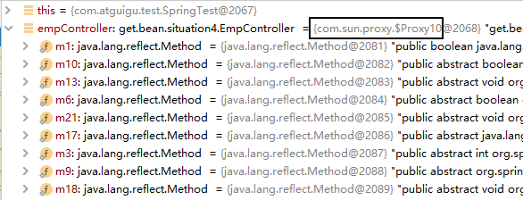
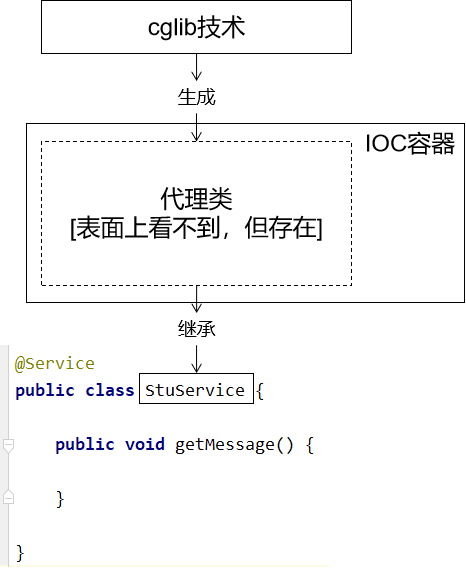
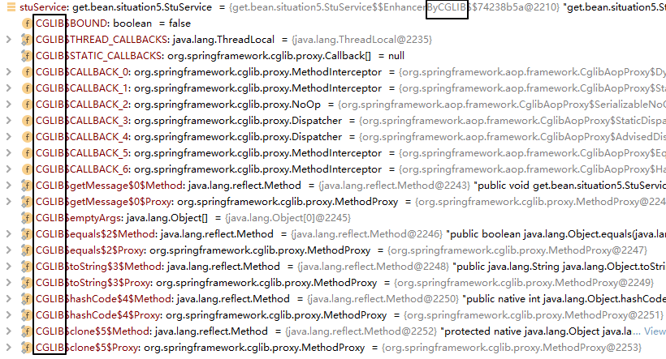
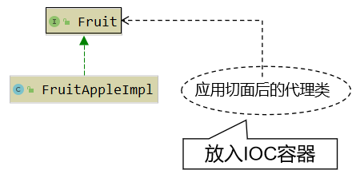
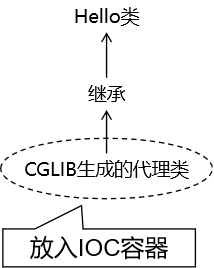

## 1.基于注解的AOP

AOP：Aspect Oriented Programming面向切面编程


### 一、涉及技术


- 动态代理（InvocationHandler）：JDK原生的实现方式，需要被代理的目标类必须实现接口。因为这个技术要求<span style="color:blue;font-weight:bold;">代理对象和目标对象实现同样的接口</span>（兄弟两个拜把子模式）。
- cglib：通过<span style="color:blue;font-weight:bold;">继承被代理的目标类</span>（认干爹模式）实现代理，所以不需要目标类实现接口。
- AspectJ：本质上是静态代理，<span style="color:blue;font-weight:bold;">将代理逻辑“织入”被代理的目标类编译得到的字节码文件</span>，所以最终效果是动态的。weaver就是织入器。Spring只是借用了AspectJ中的注解。


### 二、基本实现

#### 1.pom文件引入依赖


#### 2.被代理目标资源

**接口类**

```java
public interface Calculator {
    
    int add(int i, int j);
    
    int sub(int i, int j);
    
    int mul(int i, int j);
    
    int div(int i, int j);
    
}
```

**实现类**

在Spring环境下工作，所有的一切都必须放在IOC容器中。现在接口的实现类是AOP要代理的目标类，所以它也必须放入IOC容器。

```java
package com.atguigu.aop.imp;
    
import com.atguigu.aop.api.Calculator;
import org.springframework.stereotype.Component;
    
@Component
public class CalculatorPureImpl implements Calculator {
    
    @Override
    public int add(int i, int j) {
    
        int result = i + j;
    
        System.out.println("方法内部 result = " + result);
    
        return result;
    }
    
    @Override
    public int sub(int i, int j) {
    
        int result = i - j;
    
        System.out.println("方法内部 result = " + result);
    
        return result;
    }
    
    @Override
    public int mul(int i, int j) {
    
        int result = i * j;
    
        System.out.println("方法内部 result = " + result);
    
        return result;
    }
    
    @Override
    public int div(int i, int j) {
    
        int result = i / j;
    
        System.out.println("方法内部 result = " + result);
    
        return result;
    }
}
```


#### 3.创建切面类

```java
// @Aspect表示这个类是一个切面类
@Aspect
// @Component注解保证这个切面类能够放入IOC容器
@Component
public class LogAspect {
        
    // @Before注解：声明当前方法是前置通知方法
    // value属性：指定切入点表达式，由切入点表达式控制当前通知方法要作用在哪一个目标方法上
    @Before(value = "execution(public int com.atguigu.aop.api.Calculator.add(int,int))")
    public void printLogBeforeCore() {
        System.out.println("[AOP前置通知] 方法开始了");
    }
    
    @AfterReturning(value = "execution(public int com.atguigu.aop.api.Calculator.add(int,int))")
    public void printLogAfterSuccess() {
        System.out.println("[AOP返回通知] 方法成功返回了");
    }
    
    @AfterThrowing(value = "execution(public int com.atguigu.aop.api.Calculator.add(int,int))")
    public void printLogAfterException() {
        System.out.println("[AOP异常通知] 方法抛异常了");
    }
    
    @After(value = "execution(public int com.atguigu.aop.api.Calculator.add(int,int))")
    public void printLogFinallyEnd() {
        System.out.println("[AOP后置通知] 方法最终结束了");
    }
    
}
```


#### 4.创建Spring的配置文件

```xml
<?xml version="1.0" encoding="UTF-8"?>
<beans xmlns="http://www.springframework.org/schema/beans"
       xmlns:xsi="http://www.w3.org/2001/XMLSchema-instance" xmlns:aop="http://www.springframework.org/schema/aop"
       xmlns:context="http://www.springframework.org/schema/context"
       xsi:schemaLocation="http://www.springframework.org/schema/beans http://www.springframework.org/schema/beans/spring-beans.xsd http://www.springframework.org/schema/aop https://www.springframework.org/schema/aop/spring-aop.xsd http://www.springframework.org/schema/context https://www.springframework.org/schema/context/spring-context.xsd">
    
    <!-- 开启基于注解的AOP功能 -->
    <aop:aspectj-autoproxy/>
    
    <!-- 配置自动扫描的包 -->
    <context:component-scan base-package="com.atguigu.aop"/>
    
</beans>
```


#### 5.测试

```java
@RunWith(SpringJUnit4ClassRunner.class)
@ContextConfiguration(value = {"classpath:applicationContext.xml"})
public class AOPTest {
    
    @Autowired
    private Calculator calculator;
    
    @Test
    public void testAnnotationAOP() {
    
        int add = calculator.add(10, 2);
        System.out.println("方法外部 add = " + add);
    
    }
    
}
```


打印效果如下：

> [AOP前置通知] 方法开始了
> 方法内部 result = 12
> [AOP返回通知] 方法成功返回了
> [AOP后置通知] 方法最终结束了
> 方法外部 add = 12


#### 6.通知执行顺序

- Spring版本5.3.x以前：
  - 前置通知
  - 目标操作
  - 后置通知
  - 返回通知或异常通知
- Spring版本5.3.x以后：
  - 前置通知
  - 目标操作
  - 返回通知或异常通知
  - 后置通知


### 三、获取细节信息

#### 1.JoinPoint注入

- 要点1：JoinPoint接口通过getSignature()方法获取目标方法的签名
- 要点2：通过目标方法签名对象获取方法名
- 要点3：通过JoinPoint对象获取外界调用目标方法时传入的实参列表组成的数组

- 要点3：通过JoinPoint对象获取外界调用目标方法时传入的实参列表组成的数组

```java
// @Before注解标记前置通知方法
// value属性：切入点表达式，告诉Spring当前通知方法要套用到哪个目标方法上
// 在前置通知方法形参位置声明一个JoinPoint类型的参数，Spring就会将这个对象传入
// 根据JoinPoint对象就可以获取目标方法名称、实际参数列表
@Before(value = "execution(public int com.atguigu.aop.api.Calculator.add(int,int))")
public void printLogBeforeCore(JoinPoint joinPoint) {
    
    // 1.通过JoinPoint对象获取目标方法签名对象
    // 方法的签名：一个方法的全部声明信息
    Signature signature = joinPoint.getSignature();
    
    // 2.通过方法的签名对象获取目标方法的详细信息
    String methodName = signature.getName();
    System.out.println("methodName = " + methodName);
    
    int modifiers = signature.getModifiers();
    System.out.println("modifiers = " + modifiers);
    
    String declaringTypeName = signature.getDeclaringTypeName();
    System.out.println("declaringTypeName = " + declaringTypeName);
    
    // 3.通过JoinPoint对象获取外界调用目标方法时传入的实参列表
    Object[] args = joinPoint.getArgs();
    
    // 4.由于数组直接打印看不到具体数据，所以转换为List集合
    List<Object> argList = Arrays.asList(args);
    
    System.out.println("[AOP前置通知] " + methodName + "方法开始了，参数列表：" + argList);
}
```

需要获取方法签名、传入的实参等信息时，可以在通知方法声明JoinPoint类型的形参。


#### 2.获取方法返回值

在返回通知中，通过@AfterReturning注解的returning属性获取目标方法的返回值

```java
// @AfterReturning注解标记返回通知方法
// 在返回通知中获取目标方法返回值分两步：
// 第一步：在@AfterReturning注解中通过returning属性设置一个名称
// 第二步：使用returning属性设置的名称在通知方法中声明一个对应的形参
@AfterReturning(
        value = "execution(public int com.atguigu.aop.api.Calculator.add(int,int))",
        returning = "targetMethodReturnValue"
)
public void printLogAfterCoreSuccess(JoinPoint joinPoint, Object targetMethodReturnValue) {
    
    String methodName = joinPoint.getSignature().getName();
    
    System.out.println("[AOP返回通知] "+methodName+"方法成功结束了，返回值是：" + targetMethodReturnValue);
}
```


#### 3.异常捕获


在异常通知中，通过@AfterThrowing注解的throwing属性获取目标方法抛出的异常对象

```java
// @AfterThrowing注解标记异常通知方法
// 在异常通知中获取目标方法抛出的异常分两步：
// 第一步：在@AfterThrowing注解中声明一个throwing属性设定形参名称
// 第二步：使用throwing属性指定的名称在通知方法声明形参，Spring会将目标方法抛出的异常对象从这里传给我们
@AfterThrowing(
        value = "execution(public int com.atguigu.aop.api.Calculator.add(int,int))",
        throwing = "targetMethodException"
)
public void printLogAfterCoreException(JoinPoint joinPoint, Throwable targetMethodException) {
    
    String methodName = joinPoint.getSignature().getName();
    
    System.out.println("[AOP异常通知] "+methodName+"方法抛异常了，异常类型是：" + targetMethodException.getClass().getName());
}
```


打印效果局部如下：

> [AOP异常通知] div方法抛异常了，异常类型是：java.lang.ArithmeticException
>
> java.lang.ArithmeticException: / by zero
>
> at com.atguigu.aop.imp.CalculatorPureImpl.div(CalculatorPureImpl.java:42)
> at sun.reflect.NativeMethodAccessorImpl.invoke0(Native Method)
> at sun.reflect.NativeMethodAccessorImpl.invoke(NativeMethodAccessorImpl.java:62)
> at sun.reflect.DelegatingMethodAccessorImpl.invoke(DelegatingMethodAccessorImpl.java:43)
> at java.lang.reflect.Method.invoke(Method.java:498)
> at org.springframework.aop.support.AopUtils.invokeJoinpointUsingReflection(AopUtils.java:344)


### 四、切入点表达式

#### 1、声明

在一处声明切入点表达式之后，其他有需要的地方引用这个切入点表达式。易于维护，一处修改，处处生效。声明方式如下：

```java
    // 切入点表达式重用
    @Pointcut("execution(* *..*.add(..))")
    public void declarPointCut() {}
```


#### 2、同一个类内部引用

```java
    @Before(value = "declarPointCut()")
    public void printLogBeforeCoreOperation(JoinPoint joinPoint) {
```


#### 3、在不同类中引用

```java
@Around(value = "com.atguigu.spring.aop.aspect.LogAspect.declarPointCut()")
public Object roundAdvice(ProceedingJoinPoint joinPoint) {
```


#### 4、集中管理

而作为存放切入点表达式的类，可以把整个项目中所有切入点表达式全部集中过来，便于统一管理：

```java
@Component
public class AtguiguPointCut {
    
    @Pointcut(value = "execution(public int *..Calculator.sub(int,int))")
    public void atguiguGlobalPointCut(){}
    
    @Pointcut(value = "execution(public int *..Calculator.add(int,int))")
    public void atguiguSecondPointCut(){}
    
    @Pointcut(value = "execution(* *..*Service.*(..))")
    public void transactionPointCut(){}
}
```


#### ==5、表达式细节==

- 用*号代替“权限修饰符”和“返回值”部分表示“权限修饰符”和“返回值”不限
- 在包名的部分，一个“*”号只能代表包的层次结构中的一层，表示这一层是任意的。
  - 例如：*.Hello匹配com.Hello，不匹配com.atguigu.Hello
- 在包名的部分，使用“*..”表示包名任意、包的层次深度任意
- 在类名的部分，类名部分整体用*号代替，表示类名任意
- 在类名的部分，可以使用*号代替类名的一部分

```java
*Service
```

上面例子表示匹配所有名称以Service结尾的类或接口


- 在方法名部分，可以使用*号表示方法名任意
- 在方法名部分，可以使用*号代替方法名的一部分

```java
*Operation
```

上面例子表示匹配所有方法名以Operation结尾的方法


- 在方法参数列表部分，使用(..)表示参数列表任意
- 在方法参数列表部分，使用(int,..)表示参数列表以一个int类型的参数开头
- 在方法参数列表部分，基本数据类型和对应的包装类型是不一样的
  - 切入点表达式中使用 int 和实际方法中 Integer 是不匹配的
- 在方法返回值部分，如果想要明确指定一个返回值类型，那么必须同时写明权限修饰符

```java
execution(public int *..*Service.*(.., int))
```

上面例子是对的，下面例子是错的：

```java
execution(* int *..*Service.*(.., int))
```

但是public *表示权限修饰符明确，返回值任意是可以的。


- 对于execution()表达式整体可以使用三个逻辑运算符号
  - execution() || execution()表示满足两个execution()中的任何一个即可
  - execution() && execution()表示两个execution()表达式必须都满足
  - !execution()表示不满足表达式的其他方法


### 5、环绕通知

环绕通知对应整个try...catch...finally结构，包括前面四种通知的所有功能。

```java
// 使用@Around注解标明环绕通知方法
@Around(value = "com.atguigu.aop.aspect.AtguiguPointCut.transactionPointCut()")
public Object manageTransaction(
    
        // 通过在通知方法形参位置声明ProceedingJoinPoint类型的形参，
        // Spring会将这个类型的对象传给我们
        ProceedingJoinPoint joinPoint) {
    
    // 通过ProceedingJoinPoint对象获取外界调用目标方法时传入的实参数组
    Object[] args = joinPoint.getArgs();
    
    // 通过ProceedingJoinPoint对象获取目标方法的签名对象
    Signature signature = joinPoint.getSignature();
    
    // 通过签名对象获取目标方法的方法名
    String methodName = signature.getName();
    
    // 声明变量用来存储目标方法的返回值
    Object targetMethodReturnValue = null;
    
    try {
    
        // 在目标方法执行前：开启事务（模拟）
        System.out.println("[AOP 环绕通知] 开启事务，方法名：" + methodName + "，参数列表：" + Arrays.asList(args));
    
        // 过ProceedingJoinPoint对象调用目标方法
        // 目标方法的返回值一定要返回给外界调用者
        targetMethodReturnValue = joinPoint.proceed(args);
    
        // 在目标方法成功返回后：提交事务（模拟）
        System.out.println("[AOP 环绕通知] 提交事务，方法名：" + methodName + "，方法返回值：" + targetMethodReturnValue);
    
    }catch (Throwable e){
    
        // 在目标方法抛异常后：回滚事务（模拟）
        System.out.println("[AOP 环绕通知] 回滚事务，方法名：" + methodName + "，异常：" + e.getClass().getName());
    
    }finally {
    
        // 在目标方法最终结束后：释放数据库连接
        System.out.println("[AOP 环绕通知] 释放数据库连接，方法名：" + methodName);
    
    }
    
    return targetMethodReturnValue;
}
```


### 6、切面优先级

相同目标方法上同时存在多个切面时，切面的优先级控制切面的<span style="color:blue;font-weight:bold;">内外嵌套</span>顺序。

- 优先级高的切面：外面
- 优先级低的切面：里面


使用@Order注解可以控制切面的优先级：

- @Order(较小的数)：优先级高
- @Order(较大的数)：优先级低


### 7、没有接口的情况

在目标类没有实现任何接口的情况下，Spring会自动使用cglib技术实现代理。为了证明这一点，我们做下面的测试：

#### 1、创建目标类

请确保这个类在自动扫描的包下，同时确保切面的切入点表达式能够覆盖到类中的方法。

```java
@Service
public class EmployeeService {
    
    public void getEmpList() {
        System.out.println("方法内部 com.atguigu.aop.imp.EmployeeService.getEmpList");
    }
    
}
```


#### 2、测试

```java
    @Autowired
    private EmployeeService employeeService;
    
    @Test
    public void testNoInterfaceProxy() {
        employeeService.getEmpList();
        System.out.println();
    }
```


#### 3、Debug查看

##### ①没有实现接口情况




##### ②有实现接口的情况




同时我们发现：Mybatis调用的Mapper接口类型的对象其实也是动态代理机制



## 2.AOP队获取bean的影响

### 一、根据类型获取bean

#### 1、情景一

- bean对应的类没有实现任何接口

- 根据bean本身的类型获取bean

  - 测试：IOC容器中同类型的bean只有一个

    正常获取到IOC容器中的那个bean对象

  - 测试：IOC容器中同类型的bean有多个

    会抛出NoUniqueBeanDefinitionException异常，表示IOC容器中这个类型的bean有多个


#### 2、情景二

- bean对应的类实现了接口，这个接口也只有这一个实现类
  - 测试：根据接口类型获取bean
  - 测试：根据类获取bean
  - 结论：上面两种情况其实都能够正常获取到bean，而且是同一个对象


#### 3、情景三

- 声明一个接口

- 接口有多个实现类

- 接口所有实现类都放入IOC容器

  - 测试：根据接口类型获取bean

    会抛出NoUniqueBeanDefinitionException异常，表示IOC容器中这个类型的bean有多个

  - 测试：根据类获取bean

    正常


#### 4、情景四

- 声明一个接口
- 接口有一个实现类
- 创建一个切面类，对上面接口的实现类应用通知
  - 测试：根据接口类型获取bean
  - 测试：根据类获取bean


原因分析：

- 应用了切面后，真正放在IOC容器中的是代理类的对象
- 目标类并没有被放到IOC容器中，所以根据目标类的类型从IOC容器中是找不到的




从内存分析的角度来说，IOC容器中引用的是代理对象，代理对象引用的是目标对象。IOC容器并没有直接引用目标对象，所以根据目标类本身在IOC容器范围内查找不到。




debug查看代理类的类型：




#### 5、情景五

- 声明一个类
- 创建一个切面类，对上面的类应用通知
  - 测试：根据类获取bean，能获取到




debug查看实际类型：




### 二、自动装配

自动装配需先从IOC容器中获取到唯一的一个bean才能够执行装配。所以装配能否成功和装配底层的原理，和前面测试的获取bean的机制是一致的。


#### 1、情景一

- 目标bean对应的类没有实现任何接口

- 根据bean本身的类型装配这个bean

  - 测试：IOC容器中同类型的bean只有一个

    正常装配

  - 测试：IOC容器中同类型的bean有多个

    会抛出NoUniqueBeanDefinitionException异常，表示IOC容器中这个类型的bean有多个


#### 2、情景二

- 目标bean对应的类实现了接口，这个接口也只有这一个实现类

  - 测试：根据接口类型装配bean

    正常

  - 测试：根据类装配bean

    正常


#### 3、情景三

- 声明一个接口

- 接口有多个实现类

- 接口所有实现类都放入IOC容器

  - 测试：根据接口类型装配bean

    @Autowired注解会先根据类型查找，此时会找到多个符合的bean，然后根据成员变量名作为bean的id进一步筛选，如果没有id匹配的，则会抛出NoUniqueBeanDefinitionException异常，表示IOC容器中这个类型的bean有多个

  - 测试：根据类装配bean

    正常


#### 4、情景四

- 声明一个接口

- 接口有一个实现类

- 创建一个切面类，对上面接口的实现类应用通知

  - 测试：根据接口类型装配bean

    正常

  - 测试：根据类装配bean

    此时获取不到对应的bean，所以无法装配，抛出下面的异常：

> Caused by: org.springframework.beans.factory.BeanNotOfRequiredTypeException: Bean named 'fruitApple' is expected to be of type 'com.atguigu.bean.impl.FruitAppleImpl' but was actually of type 'com.sun.proxy.$Proxy15'


#### 5、情景五

- 声明一个类

- 创建一个切面类，对上面的类应用通知

  - 测试：根据类装配bean

    正常


### 三、总结

#### 1、对实现了接口的类应用切面




#### 2、对没实现接口的类应用切面



