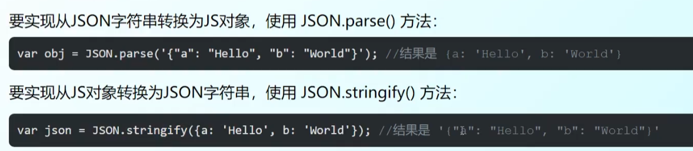

# VUE day1 html和css


## html

Hyper Text Markup Language，超文本标记语言；


### 目录结构


### html布局:

​	


### 标题：

​	<h1>......<h6> 标题大小

### 段落：

​	<p> </p>


### 图像：

#### 	1.图像标签和属性：

```html
	      //没有闭合标签，alt为预备可替换文本

```


## CSS


CSS有三种方式标记：

​	1.id；  ==单独标注==  用#标识

​	2.class； ==表示同一类==	用.标识

​	3.直接使用标签

​	

​	在<head>里面<style>里用相应的css样式来对html进行编辑。

```html
<style type="text/css">
		#title1 {
			font-size: 2em;
			text-align: center;
		}
		
		.comment{
			font-size: 0.8em;
			text-align: center;
		}
		
		img {
			width:500px;
			display: block;
			margin: auto;
		}
		
		#lianxi{
			color: burlywood;
			width: 500px;
			height: 500px;
			background-color: antiquewhite;
			margin: 50px auto 50px auto;  //居中
			/* 上 右 下 左 */
		}
	</style>
```


## JSON

JS中一切结尾对象；所以支持通过JSON来表示，例如字符串、数字、对象等：

- 对象表示为键值对
- 数据由逗号分割
- 花括号保存对象
- 方括号保存数组



