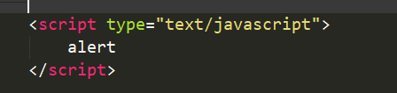
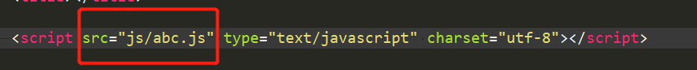
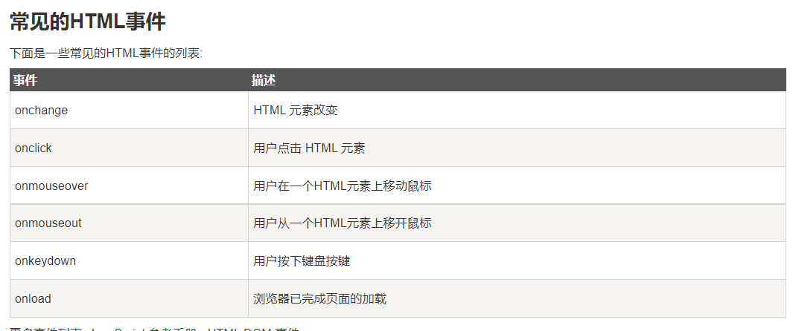
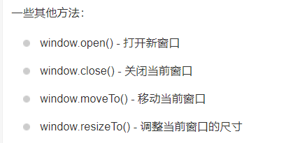
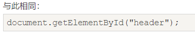

# VUE day2 js


### Javascript 使用方法

#### 	1.内嵌

​			


#### 	2.外部引用

​	

​	


### 数据类型：

变量用var 关键字做定义:

​	数值 ==可带小数点，也可以不带==

​	字符  ==使用引号保卫文本==

​	布尔型 ==true、false==

​	null  ==引用一个没有定义的变量==

​	undefined

​	


### 逻辑运算符：


### 赋值运算符：


### 程序控制结构：

#### 	分支结构

​		==if结构：==

​			if(条件表达式){

​				语句

​			}else{

​				语句

​			}

​		

​		==switch语句：==

​			switch(表达式){

​				case 值1: 语句块1

​					break；

​				case 值2: 语句块2

​					break；

​				...

​				case 值n: 语句块n

​					break；


​			}

​		


#### 	循环语句

while 循环：

```javascript
while(条件表达式){
    语句块
}
```


直到循环结构：

```javascript
do{
    语句块
}while(条件表达式);
```


计数循环

```javascript
for(初始化 ; 循环条件 ; 变量更新 ){
    语句块
}

for(变量 in 对象){
    语句块
}

```

==break结束整个循环，continue结束本次循环==


函数定义：

```javascript
function 函数名(形式参数列表){
    函数体语句块
}
```


#### 交互处理

​	


#### JS中的两个对象

window




document




