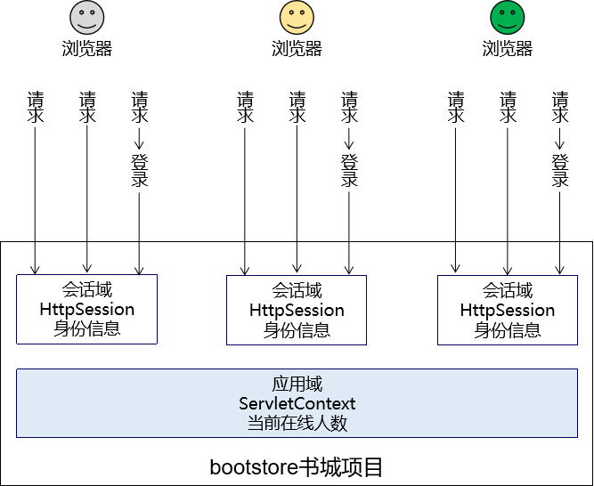

# Thymeleaf

==为什么需要MVC？==

我们之前在书城项目第二阶段做登录的时候，曾经提出过**优化登录失败后的处理**，曾经编写过下面这段代码


这段代码虽然说可以实现在登录失败之后跳转回到登录页面，并且展示失败信息，但是代码实在是太恶心了，根本没法维护，所以我们需要将视图展示抽取出来，单独作为一个View视图层

但是我们如果只使用HTML作为视图的话，它是无法展示动态数据的，所以我们对HTML的新的期待：既能够正常显示页面，又能在页面中包含动态数据部分。而动态数据单靠HTML本身是无法做到的，所以此时我们需要引入服务器端动态视图模板技术。


### MVC和三层架构的关系


### Thymeleaf简介

Thymeleaf是一款用于渲染XML/XHTML/HTML5内容的模板引擎。类似JSP，Velocity，FreeMaker等， 它也可以轻易的与Spring MVC等Web框架进行集成作为Web应用的模板引擎。它的主要作用是在静态页面上渲染显示动态数据。

```html
 <p th:text="${username}">Original Value</p>
```

#### 物理视图和逻辑视图

##### 物理视图

在Servlet中，将请求转发到一个HTML页面文件时，使用的完整的转发路径就是<span style="color:blue;font-weight:bold;">物理视图</span>。

如果我们把所有的HTML页面都放在某个统一的目录下，那么转发地址就会呈现出明显的规律：

> /pages/user/login.html
> /pages/user/login_success.html
> /pages/user/regist.html
> /pages/user/regist_success.html
>
> ……

路径的开头都是：/pages/user/

路径的结尾都是：.html

所以，路径开头的部分我们称之为<span style="color:blue;font-weight:bold;">视图前缀</span>，路径结尾的部分我们称之为<span style="color:blue;font-weight:bold;">视图后缀</span>。


##### 逻辑视图

物理视图=视图前缀+逻辑视图+视图后缀

上面的例子中：

| 视图前缀     | 逻辑视图      | 视图后缀 | 物理视图                       |
| ------------ | ------------- | -------- | ------------------------------ |
| /pages/user/ | login         | .html    | /pages/user/login.html         |
| /pages/user/ | login_success | .html    | /pages/user/login_success.html |


##### 创建Servlet基类

重写了init方法初始化

```java
import org.thymeleaf.TemplateEngine;
import org.thymeleaf.context.WebContext;
import org.thymeleaf.templatemode.TemplateMode;
import org.thymeleaf.templateresolver.ServletContextTemplateResolver;

import javax.servlet.ServletContext;
import javax.servlet.ServletException;
import javax.servlet.http.HttpServlet;
import javax.servlet.http.HttpServletRequest;
import javax.servlet.http.HttpServletResponse;
import java.io.IOException;

public class ViewBaseServlet extends HttpServlet {

    private TemplateEngine templateEngine;

    @Override
    public void init() throws ServletException {

        // 1.获取ServletContext对象
        ServletContext servletContext = this.getServletContext();

        // 2.创建Thymeleaf解析器对象
        ServletContextTemplateResolver templateResolver = new ServletContextTemplateResolver(servletContext);

        // 3.给解析器对象设置参数
        // ①HTML是默认模式，明确设置是为了代码更容易理解
        templateResolver.setTemplateMode(TemplateMode.HTML);

        // ②设置前缀
        String viewPrefix = servletContext.getInitParameter("view-prefix");

        templateResolver.setPrefix(viewPrefix);

        // ③设置后缀
        String viewSuffix = servletContext.getInitParameter("view-suffix");

        templateResolver.setSuffix(viewSuffix);

        // ④设置缓存过期时间（毫秒）
        templateResolver.setCacheTTLMs(60000L);

        // ⑤设置是否缓存
        templateResolver.setCacheable(true);

        // ⑥设置服务器端编码方式
        templateResolver.setCharacterEncoding("utf-8");

        // 4.创建模板引擎对象
        templateEngine = new TemplateEngine();

        // 5.给模板引擎对象设置模板解析器
        templateEngine.setTemplateResolver(templateResolver);

    }

    protected void processTemplate(String templateName, HttpServletRequest req, HttpServletResponse resp) throws IOException {
        // 1.设置响应体内容类型和字符集
        resp.setContentType("text/html;charset=UTF-8");

        // 2.创建WebContext对象
        WebContext webContext = new WebContext(req, resp, getServletContext());

        // 3.处理模板数据
        templateEngine.process(templateName, webContext, resp.getWriter());
    }
}
```


## 基本语法


### 语法示例

#### 1.标签值

```xml
<p th:text="标签体新值">标签体原始值</p>
```

#### 2.修改指定属性值

```xml
<input type="text" name="username" th:value="文本框新值" value="文本框旧值" />
```

#### 3.解析URL地址

```xml
<a th:href="@{/index.html}">访问index.html</a>
```

@{}的作用是<span style="color:blue;font-weight:bold;">在字符串前附加『上下文路径』</span>,经过解析后得到：

> /webday08/index.html


### 设置URL

#### 1.首页使用URL地址解析

没有使用thymeleaf之前我们是通过访问index.html本身直接访问首页的。


但我们可以都改为访问Servlet进行跳转。


#### 2.地址附加请求参数

使用小括号

```html
<a th:href="@{/index(username=@{username},password='123456')}"></a>
```


### 域对象

#### 1.请求域

HttpServletRequest对象内部给我们提供的存储空间，在一次请求中使用

Servlet中代码：

```java
String requestAttrName = "helloRequestAttr";
String requestAttrValue = "helloRequestAttr-VALUE";

request.setAttribute(requestAttrName, requestAttrValue);
```

Thymeleaf表达式：

```html
<p th:text="${helloRequestAttr}">request field value</p>
```


#### 2.会话域


Servlet中代码：

```java
// ①通过request对象获取session对象
HttpSession session = request.getSession();
// ②存入数据
session.setAttribute("helloSessionAttr", "helloSessionAttr-VALUE");
```

Thymeleaf表达式：

```html
<p th:text="${session.helloSessionAttr}">这里显示会话域数据</p>
```


#### 3.全局域



Servlet中代码：

```java
// ①通过调用父类的方法获取ServletContext对象
ServletContext servletContext = getServletContext();
// ②存入数据
servletContext.setAttribute("helloAppAttr", "helloAppAttr-VALUE");
```

Thymeleaf表达式：

```html
<p th:text="${application.helloAppAttr}">这里显示应用域数据</p>
```


### 获取请求参数

#### 1.获取请求参数的语法

```html
${param.参数名}
```


##### 根据一个参数名获取一个参数值

页面代码：

```html
<p th:text="${param.username}">这里替换为请求参数的值</p>
```

页面显示效果：


##### 根据一个参数名获取多个参数值

页面代码：

```html
<p th:text="${param.team}">这里替换为请求参数的值</p>
```

页面显示效果：


如果想要精确获取某一个值，可以使用数组下标。页面代码：

```html
<p th:text="${param.team[0]}">这里替换为请求参数的值</p>
<p th:text="${param.team[1]}">这里替换为请求参数的值</p>
```

页面显示效果：


### 内置对象


#### 公共内置对象


ervlet中将List集合数据存入请求域：

```java
request.setAttribute("aNotEmptyList", Arrays.asList("aaa","bbb","ccc"));
request.setAttribute("anEmptyList", new ArrayList<>());
```

页面代码：

```html
<p>#list对象isEmpty方法判断集合整体是否为空aNotEmptyList：<span th:text="${#lists.isEmpty(aNotEmptyList)}">测试#lists</span></p>
<p>#list对象isEmpty方法判断集合整体是否为空anEmptyList：<span th:text="${#lists.isEmpty(anEmptyList)}">测试#lists</span></p>
```


### 分支和迭代

#### if和unless

```html
<table>
    <tr>
        <th>员工编号</th>
        <th>员工姓名</th>
        <th>员工工资</th>
    </tr>
    <tr th:if="${#lists.isEmpty(employeeList)}">
        <td colspan="3">抱歉！没有查询到你搜索的数据！</td>
    </tr>
    <tr th:if="${not #lists.isEmpty(employeeList)}">
        <td colspan="3">有数据！</td>
    </tr>
    <tr th:unless="${#lists.isEmpty(employeeList)}">
        <td colspan="3">有数据！</td>
    </tr>
</table>
```


#### switch

```html
<h3>测试switch</h3>
<div th:switch="${user.memberLevel}">
    <p th:case="level-1">银牌会员</p>
    <p th:case="level-2">金牌会员</p>
    <p th:case="level-3">白金会员</p>
    <p th:case="level-4">钻石会员</p>
</div>
```


#### 迭代

```html
<!--遍历显示请求域中的teacherList-->
<table border="1" cellspacing="0" width="500">
    <tr>
        <th>编号</th>
        <th>姓名</th>
    </tr>
    <tbody th:if="${#lists.isEmpty(teacherList)}">
        <tr>
            <td colspan="2">教师的集合是空的!!!</td>
        </tr>
    </tbody>

    <!--
集合不为空，遍历展示数据
-->
    <tbody th:unless="${#lists.isEmpty(teacherList)}">
        <!--
使用th:each遍历
用法:
1. th:each写在什么标签上？ 每次遍历出来一条数据就要添加一个什么标签，那么th:each就写在这个标签上
2. th:each的语法    th:each="遍历出来的数据,数据的状态 : 要遍历的数据"
3. status表示遍历的状态，它包含如下属性:
3.1 index 遍历出来的每一个元素的下标
3.2 count 遍历出来的每一个元素的计数
3.3 size 遍历的集合的长度
3.4 current 遍历出来的当前元素
3.5 even/odd 表示遍历出来的元素是否是奇数或者是否是偶数
3.6 first 表示遍历出来的元素是否是第一个
3.7 last 表示遍历出来的元素是否是最后一个
-->
        <tr th:each="teacher,status : ${teacherList}">
            <td th:text="${status.count}">这里显示编号</td>
            <td th:text="${teacher.teacherName}">这里显示老师的名字</td>
        </tr>
    </tbody>
</table>
```

