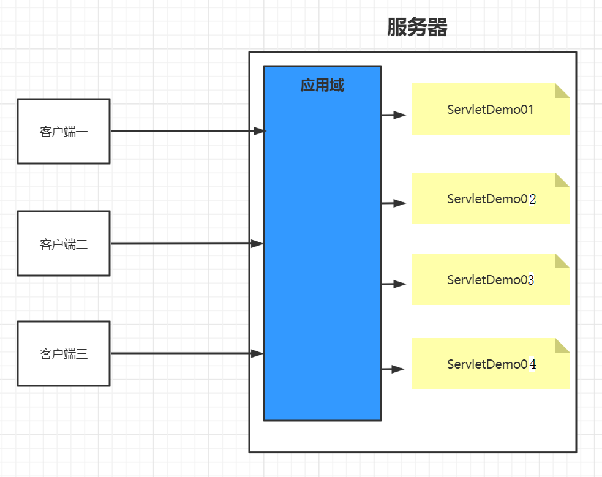
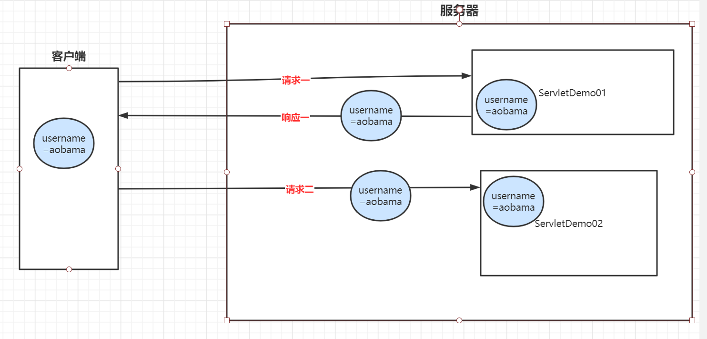
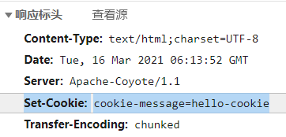
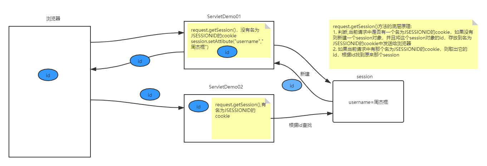

# 会话

**为什么需要会话**

保持用户登录状态，就是当用户在登录之后，会在服务器中保存该用户的登录状态，当该用户后续访问该项目中的其它动态资源(Servlet或者Thymeleaf)的时候，能够判断当前是否是已经登录过的。而从用户登录到用户退出登录这个过程中所发生的所有请求，其实都是在一次会话范围之内

### 域对象

#### 应用域



整个项目部署之后，只会有一个应用域对象，所有客户端都是共同访问同一个应用域对象，在该项目的所有动态资源中也是共用一个应用域对象


#### 请求域


每一次请求都有一个请求域对象，当请求结束的时候对应的请求域对象也就销毁了


#### 会话域


会话域是从客户端连接上服务器开始，一直到客户端关闭，这一整个过程中发生的所有请求都在同一个会话域中；而不同的客户端是不能共用会话域的。


## Cookie

### cookie技术

#### 概念

一种客户端的会话技术，服务器存放在浏览器的一小份数据，浏览器以后每次访问该连服务器是都会携带该数据。




#### 作用

1. 在浏览器中存放数据
2. 将浏览器中存放的数据携带到服务器
3. 应用场景：记住用户名，保存播放进度


#### 入门

##### 创建Cookie对象

```java
Cookie cookie = new Cookie("cookie-message","hello-cookie");
```

##### Cookie返回客户端

```java
response.addCookie(cookie);
```



##### 获取客户端带来的cookies

```java
request.getCookies();
```

遍历

```java
		//1. 从请求中取出cookie
        //底层是由名为"Cookie"的请求头携带的
        Cookie[] cookies = request.getCookies();

        //2. 遍历出每一个cookie
        if (cookies != null) {
            for (Cookie cookie : cookies) {
                //匹配cookie的name
                if (cookie.getName().equals("cookie-message")) {
                    //它就是我们想要的那个cookie
                    //我们就获取它的value
                    String value = cookie.getValue();
                    System.out.println("在ServletDemo02中获取str的值为：" + value);
                }
            }
        }
```


#### 时效性

如果不设置，默认Cookie的有效期为一次会话范围内，可以用过setMaxAge()方法让Cookie持久化保存到浏览器上。

- 会话级Cookie
  - 服务器端并没有明确指定Cookie的存在时间
  - 在浏览器端，Cookie数据存在于内存中
  - 只要浏览器还开着，Cookie数据就一直都在
  - 浏览器关闭，内存中的Cookie数据就会被释放
- 持久化Cookie
  - 服务器端明确设置了Cookie的存在时间
  - 在浏览器端，Cookie数据会被保存到硬盘上
  - Cookie在硬盘上存在的时间根据服务器端限定的时间来管控，不受浏览器关闭的影响
  - 持久化Cookie到达了预设的时间会被释放

`cookie.setMaxAge(int expiry)`参数单位是秒，表示cookie的持久化时间，如果设置参数为0，表示将浏览器中保存的该cookie删除


#### domain和path

我们可以通过调用cookie的setPath()和setDomain()方法来设置cookie的domain和path


### Session

session是服务器端的技术。服务器为每一个浏览器开辟一块内存空间，即session对象。个人理解，session是依赖cookie实现的


#### API介绍

- request.getSession(); 获得session(如果第一次调用的时候其实是创建session,第一次之后通过sessionId找到session进行使用)
- Object getAttribute(String name) ;获取值
- void setAttribute(String name, Object value) ;存储值
- void removeAttribute(String name)  ;移除值


#### session工作机制

- 服务器端没调用request.getSession()方法：什么都不会发生
- 服务器端调用了request.getSession()方法
  - 服务器端检查当前请求中是否携带了JSESSIONID的Cookie
    - 有：根据JSESSIONID在服务器端查找对应的HttpSession对象
      - 能找到：将找到的HttpSession对象作为request.getSession()方法的返回值返回
      - 找不到：服务器端新建一个HttpSession对象作为request.getSession()方法的返回值返回
    - 无：服务器端新建一个HttpSession对象作为request.getSession()方法的返回值返回




#### 时效性

**为啥要设置时效性**

用户量很大之后，Session对象相应的也要创建很多。如果一味创建不释放，那么服务器端的内存迟早要被耗尽。

**设置方法**

1.设置最大闲置时间

```java
// 设置默认的最大闲置时间
session.setMaxInactiveInterval(15); //默认1800s
```

2.强制session失效

```java
session.invalidate();
```

