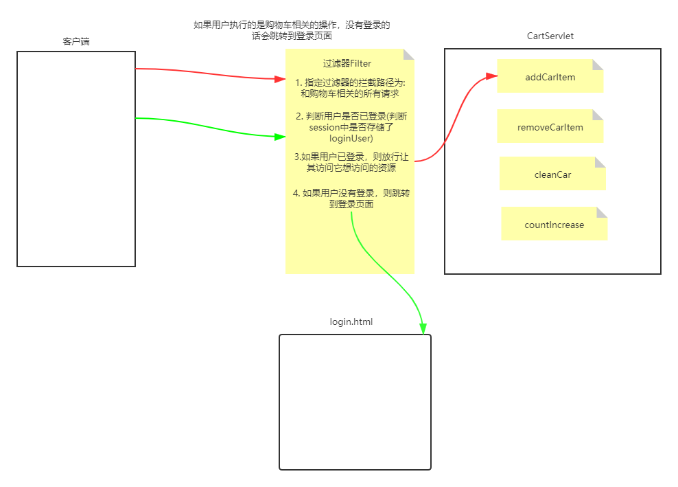
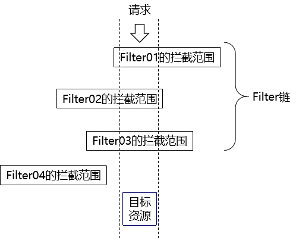

## Filter

### 概念

Filter：一个实现了特殊接口(Filter)的Java类. 实现对请求资源(jsp,servlet,html,)的过滤的功能.  过滤器是一个运行在服务器的程序, 优先于请求资源(Servlet或者jsp,html)之前执行. 过滤器是javaweb技术中**最为实用**的技术之一


### 作用

Filter的作用是对目标资源进行过滤，应用场景：登录权限检查，解决乱码等；


### 设置Filter

1.配置文件web.xml

```xml
<filter>
    <filter-name>encodingFilter</filter-name>
    <filter-class>com.atguigu.filter.EncodingFilter</filter-class>
</filter>
<filter-mapping>
    <filter-name>encodingFilter</filter-name>
    <!--url-pattern表示指定拦截哪些资源-->
    <url-pattern>/demo01</url-pattern>
</filter-mapping>
```

2.重写doFilter方法

```java
public class EncodingFilter implements Filter {
    @Override
    public void destroy() {   
    }

    @Override
    public void doFilter(ServletRequest req, ServletResponse resp, FilterChain chain) throws ServletException, IOException {
        //解决请求参数的乱码
        HttpServletRequest request = (HttpServletRequest) req;
        request.setCharacterEncoding("UTF-8");
        //每次有请求被当前filter接收到的时候，就会执行doFilter进行过滤处理
        System.out.println("EncodingFilter接收到了一个请求...");
        //这句代码表示放行
        chain.doFilter(req, resp);
    }

    @Override
    public void init(FilterConfig config) throws ServletException {
    }
}
```


### 生命周期

servlet的创建时间：默认在第一次接收请求时，可以通过`<load-on-startup>`标签配置Servlet在服务器启动的时候创建

servlet的销毁时间：Servlet会在服务器关闭或者将项目从服务器上移除的时候销毁

#### Filter的生命周期方法

| 生命周期阶段 | 执行时机         | 生命周期方法                             |
| ------------ | ---------------- | ---------------------------------------- |
| 创建对象     | Web应用启动时    | init方法，通常在该方法中做初始化工作     |
| 拦截请求     | 接收到匹配的请求 | doFilter方法，通常在该方法中执行拦截过滤 |
| 销毁         | Web应用卸载前    | destroy方法，通常在该方法中执行资源释放  |


### 过滤匹配机制

**目的**

过滤器匹配的目的是指定当前过滤器要拦截哪些资源

#### 1.精准匹配

指定被拦截资源的完整路径：

```xml
<!-- 配置Filter要拦截的目标资源 -->
<filter-mapping>
    <!-- 指定这个mapping对应的Filter名称 -->
    <filter-name>FilterDemo01</filter-name>
    <!-- 通过请求地址模式来设置要拦截的资源 -->
    <url-pattern>/demo01</url-pattern>
</filter-mapping>
```


#### 2.模糊匹配

在我们配置了url-pattern为/user/*之后，请求地址只要是/user开头的那么就会被匹配。

```xml
<filter-mapping>
    <filter-name>Target02Filter</filter-name>
    <url-pattern>/user/*</url-pattern>
</filter-mapping>
```

<span style="color:blue;font-weight:bold;">极端情况：/*匹配所有请求</span>


#### 3.扩展名匹配

```xml
<filter-mapping>
    <filter-name>Target04Filter</filter-name>
    <url-pattern>*.png</url-pattern>
</filter-mapping>
```

上述例子表示拦截所有以`.png`结尾的请求

#### 4.匹配Servlet名称

```xml
<filter-mapping>
    <filter-name>Target05Filter</filter-name>
    <!-- 根据Servlet名称匹配 -->
    <servlet-name>Target01Servlet</servlet-name>
</filter-mapping>
```


### 过滤器链

一个请求可能被多个过滤器所过滤，只有都放行，才能到达目标资源。




==执行顺序==

过滤器链中每一个Filter执行的<span style="color:blue;font-weight:bold;">顺序是由web.xml中filter-mapping配置的顺序决定</span>的。


## Listener

### 2.1观察者模式

观察者模式是二十三中设计模式之一，它是指多个对象间存在一对多的依赖关系，当一个对象的状态发生改变时，所有依赖于它的对象都得到通知并被自动更新。这种模式有时又称作发布-订阅模式

- 观察者：监控『被观察者』的行为，一旦发现『被观察者』触发了事件，就会调用事先准备好的方法执行操作。
- 被观察者：『被观察者』一旦触发了被监控的事件，就会被『观察者』发现。


### 2.2 ServletContextListener的使用

#### 2.2.1 作用

ServletContextListener是监听ServletContext对象的创建和销毁的，因为ServletContext对象是在服务器启动的时候创建、在服务器关闭的时候销毁，所以ServletContextListener也可以监听服务器的启动和关闭

#### 2.2.2 使用场景

将来学习SpringMVC的时候，会用到一个ContextLoaderListener，这个监听器就实现了ServletContextListener接口，表示对ServletContext对象本身的生命周期进行监控。

#### 2.2.3 代码实现

##### 2.2.3.1 创建监听器类

```java
package com.atguigu.listener;

import javax.servlet.ServletContextEvent;
import javax.servlet.ServletContextListener;

/**
 * 包名:com.atguigu.listener
 *
 * @author Leevi
 * 日期2021-05-18  14:10
 * ServletContextLisneter监听器可以监听服务器的启动和关闭
 * 1. contextInitialized()方法可以监听服务器的启动
 * 2. contextDestroyed()方法可以监听服务器的关闭
 */
public class MyContextListener implements ServletContextListener {

    @Override
    public void contextInitialized(ServletContextEvent sce) {
        System.out.println("服务器启动了...");
    }

    @Override
    public void contextDestroyed(ServletContextEvent sce) {
        System.out.println("服务器关闭了...");
    }
}

```

##### 2.2.3.2 注册监听器

```xml
<!--配置Listener-->
<listener>
    <listener-class>com.atguigu.listener.MyContextListener</listener-class>
</listener>
```


### 2.3 监听器的简介

#### 2.3.1 监听器的概念

监听器：专门用于对其他对象身上发生的事件或状态改变进行监听和相应处理的对象，当被监视的对象发生情况时，立即采取相应的行动。
<span style="color:blue;font-weight:bold;">Servlet监听器</span>：Servlet规范中定义的一种特殊类，它用于监听Web应用程序中的ServletContext，HttpSession 和HttpServletRequest等域对象的创建与销毁事件，以及监听这些域对象中的属性发生修改的事件。

#### 2.3.2 Servlet监听器的分类(==仅了解==即可)

##### 2.3.2.1 ServletContextListener

作用：监听ServletContext对象的创建与销毁

| 方法名                                      | 作用                     |
| ------------------------------------------- | ------------------------ |
| contextInitialized(ServletContextEvent sce) | ServletContext创建时调用 |
| contextDestroyed(ServletContextEvent sce)   | ServletContext销毁时调用 |

ServletContextEvent对象代表从ServletContext对象身上捕获到的事件，通过这个事件对象我们可以获取到ServletContext对象。

##### 2.3.2.2 HttpSessionListener

作用：监听HttpSession对象的创建与销毁

| 方法名                                 | 作用                      |
| -------------------------------------- | ------------------------- |
| sessionCreated(HttpSessionEvent hse)   | HttpSession对象创建时调用 |
| sessionDestroyed(HttpSessionEvent hse) | HttpSession对象销毁时调用 |

HttpSessionEvent对象代表从HttpSession对象身上捕获到的事件，通过这个事件对象我们可以获取到触发事件的HttpSession对象。

##### 2.3.2.3 ServletRequestListener

作用：监听ServletRequest对象的创建与销毁

| 方法名                                      | 作用                         |
| ------------------------------------------- | ---------------------------- |
| requestInitialized(ServletRequestEvent sre) | ServletRequest对象创建时调用 |
| requestDestroyed(ServletRequestEvent sre)   | ServletRequest对象销毁时调用 |

ServletRequestEvent对象代表从HttpServletRequest对象身上捕获到的事件，通过这个事件对象我们可以获取到触发事件的HttpServletRequest对象。另外还有一个方法可以获取到当前Web应用的ServletContext对象。

##### 2.3.2.4 ServletContextAttributeListener

作用：监听ServletContext中属性的创建、修改和销毁

| 方法名                                               | 作用                                 |
| ---------------------------------------------------- | ------------------------------------ |
| attributeAdded(ServletContextAttributeEvent scab)    | 向ServletContext中添加属性时调用     |
| attributeRemoved(ServletContextAttributeEvent scab)  | 从ServletContext中移除属性时调用     |
| attributeReplaced(ServletContextAttributeEvent scab) | 当ServletContext中的属性被修改时调用 |

ServletContextAttributeEvent对象代表属性变化事件，它包含的方法如下：

| 方法名              | 作用                     |
| ------------------- | ------------------------ |
| getName()           | 获取修改或添加的属性名   |
| getValue()          | 获取被修改或添加的属性值 |
| getServletContext() | 获取ServletContext对象   |

##### 2.3.2.5 HttpSessionAttributeListener

作用：监听HttpSession中属性的创建、修改和销毁

| 方法名                                        | 作用                              |
| --------------------------------------------- | --------------------------------- |
| attributeAdded(HttpSessionBindingEvent se)    | 向HttpSession中添加属性时调用     |
| attributeRemoved(HttpSessionBindingEvent se)  | 从HttpSession中移除属性时调用     |
| attributeReplaced(HttpSessionBindingEvent se) | 当HttpSession中的属性被修改时调用 |

HttpSessionBindingEvent对象代表属性变化事件，它包含的方法如下：

| 方法名       | 作用                          |
| ------------ | ----------------------------- |
| getName()    | 获取修改或添加的属性名        |
| getValue()   | 获取被修改或添加的属性值      |
| getSession() | 获取触发事件的HttpSession对象 |

##### 2.3.2.6 ServletRequestAttributeListener

作用：监听ServletRequest中属性的创建、修改和销毁

| 方法名                                               | 作用                                 |
| ---------------------------------------------------- | ------------------------------------ |
| attributeAdded(ServletRequestAttributeEvent srae)    | 向ServletRequest中添加属性时调用     |
| attributeRemoved(ServletRequestAttributeEvent srae)  | 从ServletRequest中移除属性时调用     |
| attributeReplaced(ServletRequestAttributeEvent srae) | 当ServletRequest中的属性被修改时调用 |

ServletRequestAttributeEvent对象代表属性变化事件，它包含的方法如下：

| 方法名               | 作用                             |
| -------------------- | -------------------------------- |
| getName()            | 获取修改或添加的属性名           |
| getValue()           | 获取被修改或添加的属性值         |
| getServletRequest () | 获取触发事件的ServletRequest对象 |

##### 2.3.2.7 HttpSessionBindingListener

作用：监听某个对象在Session域中的创建与移除

| 方法名                                      | 作用                              |
| ------------------------------------------- | --------------------------------- |
| valueBound(HttpSessionBindingEvent event)   | 该类的实例被放到Session域中时调用 |
| valueUnbound(HttpSessionBindingEvent event) | 该类的实例从Session中移除时调用   |

HttpSessionBindingEvent对象代表属性变化事件，它包含的方法如下：

| 方法名       | 作用                          |
| ------------ | ----------------------------- |
| getName()    | 获取当前事件涉及的属性名      |
| getValue()   | 获取当前事件涉及的属性值      |
| getSession() | 获取触发事件的HttpSession对象 |

##### 2.3.2.8 HttpSessionActivationListener

作用：监听某个对象在Session中的序列化与反序列化。

| 方法名                                    | 作用                                  |
| ----------------------------------------- | ------------------------------------- |
| sessionWillPassivate(HttpSessionEvent se) | 该类实例和Session一起钝化到硬盘时调用 |
| sessionDidActivate(HttpSessionEvent se)   | 该类实例和Session一起活化到内存时调用 |

HttpSessionEvent对象代表事件对象，通过getSession()方法获取事件涉及的HttpSession对象。