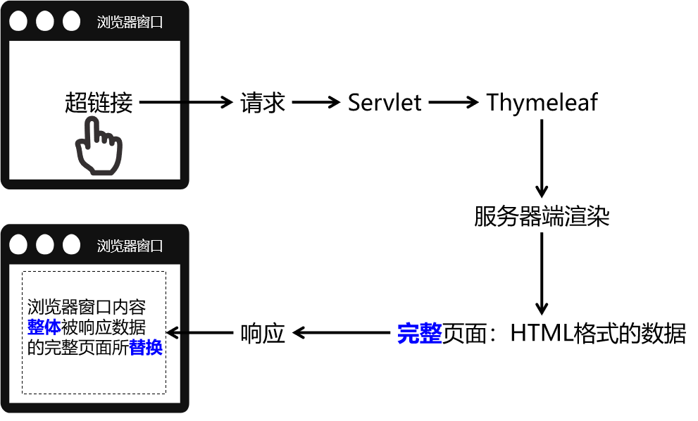
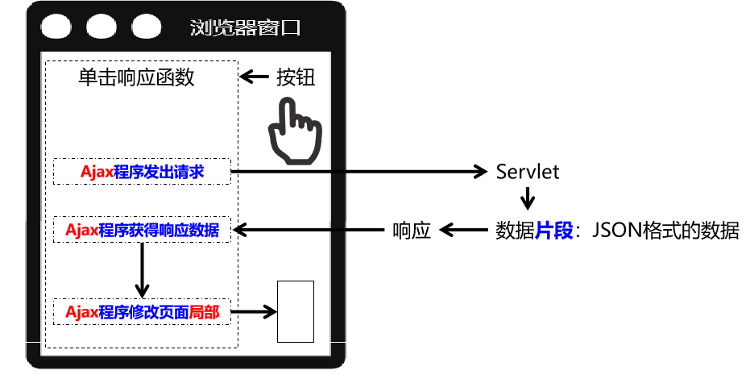
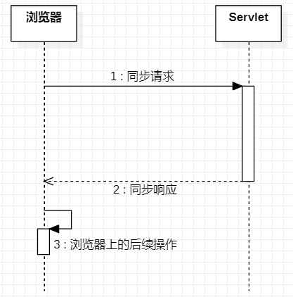

# Ajax&Axios


## Ajax

服务端渲染




Ajax渲染




### 1.前后端分离

真正的前后端分离是前端项目和后端项目分服务器部署，在我们这里我们先理解为彻底舍弃服务器端渲染，数据全部通过Ajax方式以JSON格式来传递


#### 1.1同步和异步

Ajax全称是 Asynchronous JavaScript And Xml。实际应用中Ajax指的是：<span style="color:blue;font-weight:bold;">不刷新浏览器窗口</span>，<span style="color:blue;font-weight:bold;">不做页面跳转</span>，<span style="color:blue;font-weight:bold;">局部更新页面内容</span>的技术。

<span style="color:blue;font-weight:bold;">『同步』</span>和<span style="color:blue;font-weight:bold;">『异步』</span>是一对相对的概念，那么什么是同步，什么是异步呢？


##### 1.1.1 同步

多个操作<span style="color:blue;font-weight:bold;">按顺序执行</span>，前面的操作没有完成，后面的操作就必须<span style="color:blue;font-weight:bold;">等待</span>。所以同步操作通常是<span style="color:blue;font-weight:bold;">串行</span>的。




##### 1.1.2 异步

多个操作相继开始<span style="color:blue;font-weight:bold;">并发执行</span>，即使开始的先后顺序不同，但是由于它们各自是<span style="color:blue;font-weight:bold;">在自己独立的进程或线程中</span>完成，所以<span style="color:blue;font-weight:bold;">互不干扰</span>，<span style="color:blue;font-weight:bold;">谁也<span style="color:red;font-weight:bold;">不用等</span>谁</span>。


## Axios

### 2.1 Axios简介

使用原生的JavaScript程序执行Ajax极其繁琐，所以一定要使用框架来完成。而Axios就是目前最流行的前端Ajax框架。

Axios官网：http://www.axios-js.com/


使用Axios和使用Vue一样，导入对应的*.js文件即可。官方提供的script标签引入方式为：

```html
<script src="https://unpkg.com/axios/dist/axios.min.js"></script>
```

我们可以把这个axios.min.js文件下载下来保存到本地来使用。


### 2.2 Axios基本用法


#### 2.2.1 前端代码

HTML标签：

```javascript
    <div id="app">
        <button @click="commonParam">普通请求参数</button>
    </div>
```

Vue+axios代码：

```javascript
new Vue({
    "el":"#app",
    "data":{},
    "methods":{
        "commonParam":function () {
            axios({
                "method":"post",
                "url":"/demo/AjaxServlet?method=commonParam",
                "params":{
                    "userName":"tom",
                    "userPwd":"123456"
                }
            }).then(function (response) {
                console.log(response);
            }).catch(function (error) {
                console.log(error);
            });
        }
    }
});
```

#### 2.2.2 后端代码

```java
public class AjaxServlet extends ModelBaseServlet {
    protected void commonParam(HttpServletRequest request, HttpServletResponse response) throws ServletException, IOException {

        String userName = request.getParameter("userName");
        String userPwd = request.getParameter("userPwd");

        System.out.println("userName = " + userName);
        System.out.println("userPwd = " + userPwd);

        response.setContentType("text/html;charset=UTF-8");
        response.getWriter().write("服务器端返回普通文本字符串作为响应");

    }
}
```


#### 2.2.3 axios程序接收到的响应对象结构


| 属性名     | 作用                                             |
| ---------- | ------------------------------------------------ |
| config     | 调用axios(config对象)方法时传入的JSON对象        |
| data       | 服务器端返回的响应体数据                         |
| headers    | 响应消息头                                       |
| request    | 原生JavaScript执行Ajax操作时使用的XMLHttpRequest |
| status     | 响应状态码                                       |
| statusText | 响应状态码的说明文本                             |

#### 2.2.4 服务器端处理请求失败后

```javascript
catch(function (error) {     // catch()服务器端处理请求出错后，会调用

    console.log(error);         // error就是出错时服务器端返回的响应数据
    console.log(error.response);        // 在服务器端处理请求失败后，获取axios封装的JSON格式的响应数据对象
    console.log(error.response.status); // 在服务器端处理请求失败后，获取响应状态码
    console.log(error.response.statusText); // 在服务器端处理请求失败后，获取响应状态说明文本
    console.log(error.response.data);   // 在服务器端处理请求失败后，获取响应体数据

});
```

在给catch()函数传入的回调函数中，error对象封装了服务器端处理请求失败后相应的错误信息。其中，axios封装的响应数据对象，是error对象的response属性。response属性对象的结构如下图所示：


### 2.3 发送JSON

#### 2.3.1 前端代码

HTML代码：

```html
<button @click="requestBodyJSON">请求体JSON</button>
```

Vue+axios代码：

```javascript
……
"methods":{
    "requestBodyJSON":function () {
        axios({
            "method":"post",
            "url":"/demo/AjaxServlet?method=requestBodyJSON",
            "data":{
                "stuId": 55,
                "stuName": "tom",
                "subjectList": [
                    {
                        "subjectName": "java",
                        "subjectScore": 50.55
                    },
                    {
                        "subjectName": "php",
                        "subjectScore": 30.26
                    }
                ],
                "teacherMap": {
                    "one": {
                        "teacherName":"tom",
                        "tearcherAge":23
                    },
                    "two": {
                        "teacherName":"jerry",
                        "tearcherAge":31
                    },
                },
                "school": {
                    "schoolId": 23,
                    "schoolName": "atguigu"
                }
            }
        }).then(function (response) {
            console.log(response);
        }).catch(function (error) {
            console.log(error);
        });
    }
}
……
```

效果：


#### 2.3.2 后端代码

Gson是Google研发的一款非常优秀的<span style="color:blue;font-weight:bold;">JSON数据解析和生成工具</span>，它可以帮助我们将数据在JSON字符串和Java对象之间互相转换。

```java
protected void requestBodyJSON(HttpServletRequest request, HttpServletResponse response) throws ServletException, IOException {

    // 1.由于请求体数据有可能很大，所以Servlet标准在设计API的时候要求我们通过输入流来读取
    BufferedReader reader = request.getReader();

    // 2.创建StringBuilder对象来累加存储从请求体中读取到的每一行
    StringBuilder builder = new StringBuilder();

    // 3.声明临时变量
    String bufferStr = null;

    // 4.循环读取
    while((bufferStr = reader.readLine()) != null) {
        builder.append(bufferStr);
    }

    // 5.关闭流
    reader.close();

    // 6.累加的结果就是整个请求体
    String requestBody = builder.toString();

    // 7.创建Gson对象用于解析JSON字符串
    Gson gson = new Gson();
	
    // 8.将JSON字符串还原为Java对象
    Student student = gson.fromJson(requestBody, Student.class);
    System.out.println("student = " + student);
    System.out.println("requestBody = " + requestBody);
    
    // 将Java对象转换为JSON对象
    String json = gson.toJson(student);

    response.setContentType("text/html;charset=UTF-8");
    response.getWriter().write("服务器端返回普通文本字符串作为响应");
}
```

