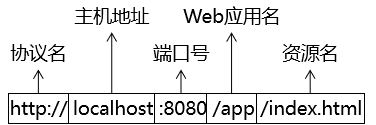

## Servlet

Servlet是运行在服务端的java小程序，是sun公司提供一套定义动态资源规范；从代码层面上讲Servlet是一个接口。

### 作用

用于接收、处理客户端请求；在整个web应用中，servlet主要负责处理请求、协调调度功能。我们可以把servlet成为web应用中的控制器。


### 1.入门案例

##### 1.1 目标

在页面上点击超链接，由Servlet处理这个请求，并返回一个响应字符串：Hello,I am Servlet

##### 1.2 思路


1.在web目录下（不是WEB-INF）创建index网页；

```html
<!-- /Web应用地址/Servlet地址 -->
<a href="http://localhost:8080/项目名/helloServlet">Servlet Hello World</a>
```

2.导入servlet包，实现servlet接口

```java
public class HelloServlet implements Servlet {

    @Override
    public void service(ServletRequest servletRequest, ServletResponse servletResponse) throws ServletException, IOException {

        // 控制台打印，证明这个方法被调用了
        System.out.println("我是HelloServlet，我执行了！");

        // 返回响应字符串
        // 1、获取能够返回响应数据的字符流对象
        PrintWriter writer = servletResponse.getWriter();

        // 2、向字符流对象写入数据
        writer.write("Hello,I am Servlet");
    }

}
```

3.配置servlet映射，有两种方式；

- 通过注解；
- 通过配置文件，web-inf下的web.xml文件

```xml
<!-- 配置Servlet本身 -->
<servlet>
    <!-- 全类名太长，给Servlet设置一个简短名称 -->
    <servlet-name>HelloServlet</servlet-name>
    <!-- 配置Servlet的全类名 -->
    <servlet-class>com.atguigu.servlet.HelloServlet</servlet-class>
</servlet>

<!-- 将Servlet和访问地址关联起来 -->
<servlet-mapping>
    <servlet-name>HelloServlet</servlet-name>
    <url-pattern>/helloServlet</url-pattern>
</servlet-mapping>
```

##### 1.3小结

需求：在浏览器上点超链接能够访问Java程序


### 2.生命周期

创建：Tomcat第一次接收到访问Servlet的请求时；

销毁：Tomcat服务器关闭时


#### 常用方法作用

2.1.1 init方法

该方法会在Servlet实例对象被创建出来之后执行，我们可以在该方法中获取当前Servlet的初始化参数，以及进行一些读取配置文件之类的操作

2.1.2 service方法

该方法会在Servlet实例对象每次接收到请求的时候均执行，我们可以在该方法中接收、处理请求，以及将客户端需要的数据响应给客户端

2.1.3 destroy方法

该方法会在Servlet实例对象销毁之前执行，我们可以在该方法中做一些资源回收、释放、关闭等等操作


==request.getContextPath()==:动态获取上下文路径，即获得传入请求的/Web项目名称。


#### 提前到服务器启动时创建

通过修改web.xml中Servlet的配置可以实现:

```xml
<!-- 配置Servlet本身 -->
<servlet>
    <!-- 全类名太长，给Servlet设置一个简短名称 -->
    <servlet-name>HelloServlet</servlet-name>

    <!-- 配置Servlet的全类名 -->
    <servlet-class>com.atguigu.servlet.HelloServlet</servlet-class>

    <!-- 配置Servlet启动顺序 -->
    <load-on-startup>1</load-on-startup>
</servlet>
```


#### ServletConfig的介绍

##### 接口方法介绍

| 方法名                  | 作用                                                         |
| ----------------------- | ------------------------------------------------------------ |
| getServletName()        | 获取&lt;servlet-name&gt;HelloServlet&lt;/servlet-name&gt;定义的Servlet名称 |
| getServletContext()     | 获取ServletContext对象                                       |
| **getInitParameter()**  | 获取配置Servlet时设置的『初始化参数』，根据名字获取值        |
| getInitParameterNames() | 获取所有初始化参数名组成的Enumeration对象                    |


getInitParameter可以在相应的servlet配置文档里添加<Init>标签获取

```xml
    <!-- 配置初始化参数 -->
    <init-param>
        <param-name>goodMan</param-name>
        <param-value>me</param-value>
    </init-param>
```

即如上，可以通过ServeletConfig.getInitParameter("goodMan")获取、


### 3.体系结构


Servlet接口有一个实现类是GenericServlet，而GenericServlet有一个子类是HttpServlet，我们创建Servlet的时候会选择继承HttpServlet，因为它里面相当于也实现了Servlet接口，并且对一些方法做了默认实现；而且子类的功能会比父类的更加强大。


#### HttpServlet实现原理

我们编写Servlet类继承HttpServlet的时候，只需要重写doGet()和doPost()方法就行了。那么HttpServlet是怎么实现分类的。

HttpServlet里包装了HttpServletRequest和HttpServletResponse两个类；当服务器默认调用service时，HttpServlet中实际是将ServletRequest和ServletReponse进行了强转，并且实际调用的是自己是香的service方法。

在HttpServlet自己实现的service方法中，进行了getMethod()方法的判断，从而达到了doGet()还是doPost()方法的判断。


### 4.工程路径


#### 1.目录详解

##### 1.1工程目录

我们写代码的地方，但是在服务器上运行的不是这个

##### 1.2.部署目录

经过Java源文件<span style="color:blue;font-weight:bold;">编译</span>和<span style="color:blue;font-weight:bold;">目录重组</span>后，IDEA就替我们准备好了可以在服务器上运行的部署目录

##### 1.3编写路径的基准

用户通过浏览器访问服务器，而服务器上运行的是部署目录，所以写路径的时候<span style="color:blue;font-weight:bold;">参考部署目录</span>而不是工程目录

##### 工程目录和部署目录的对应关系

<span style="color:blue;font-weight:bold;">工程目录下的web目录对应部署目录的根目录</span>，同时部署目录的根目录也是路径中的<span style="color:blue;font-weight:bold;">Web应用根目录</span>


#### 2.URL

url是`uniform Resource Locater`的简写，中文翻译为`统一资源定位符`，它是某个互联网资源的唯一访问地址，客户端可以通过url访问到具体的互联网资源

##### 2.1url的组成



##### 2.2url的使用场景

客户端访问服务器的资源，或者一台服务器中要访问另外一台服务器的资源都是通过url访问


#### 3.URI

uniform resource identifier

uri的写法是`/项目部署名/资源路径`


### 5.ServletContext

服务器为其部署的每一个应用(项目)都创建了一个ServletContext对象。ServletContext属于整个项目的，该项目中的所有Servlet都可以共享同一个ServletContext对象

#### 获取ServletContext的两种方式

1.调用getServletContext方法获取。

```java
ServletContext ServletContext = getServletContext()
```

2.调用ServletConfig接口的getServletContext方法。

```java
getServletConfig().getServletContext()
```


#### ServletContext作用

##### 1.获取全局初始化参数

1.在web.xml中配置相应参数

```xml
<context-param>
    <param-name>username</param-name>
    <param-value>hahahaha</param-value>
</context-param>
```

2.在Servlet中获取

```java
//与使用Servlet直接使用getInitParameter()获取的范围不一样
String username = servletContext.getInitParameter("username");
```


##### 2.设置域对象

###### 什么是域对象

域对象就是在一定的作用域范围内进行数据共享的对象，ServletContext作为全局域对象可以在整个项目的所有动态资源(包含所有Servlet)中进行数据共享

1.通过setAttribute(String,Object)设置键值。

```java
servletContext.setAttribute("key",value)
```

2.通过getAttribute(String) 获取。

```java
(String)servletContext.getAttribute("key")
```


##### 3.获取资源真实路径

```java
String realPath = servletContext.getRealPath("资源在web目录中的路径");
```


