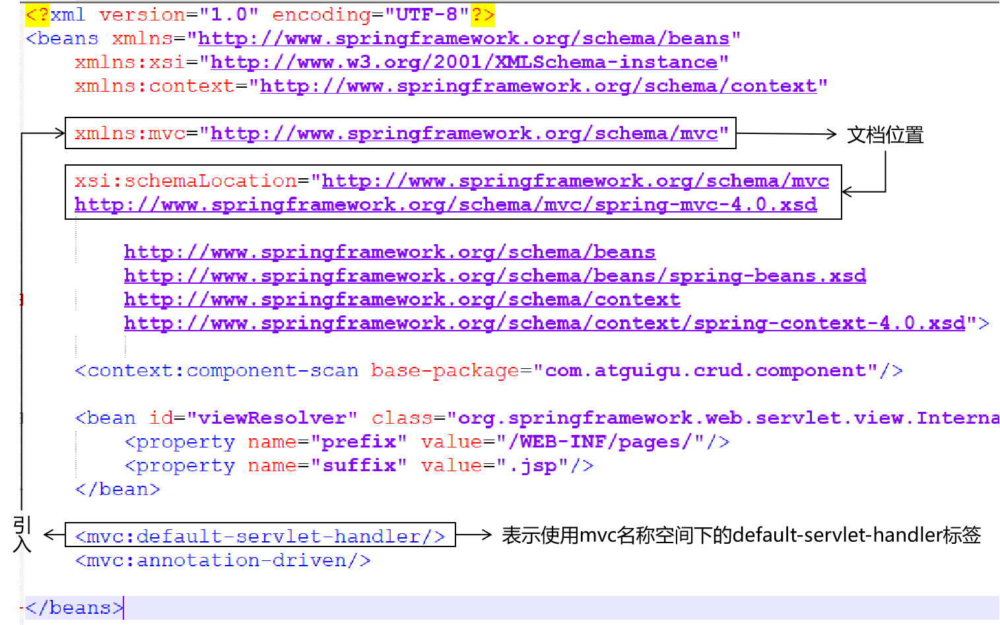
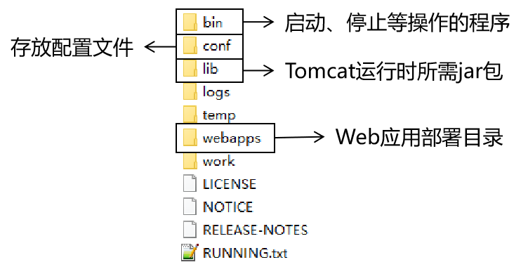
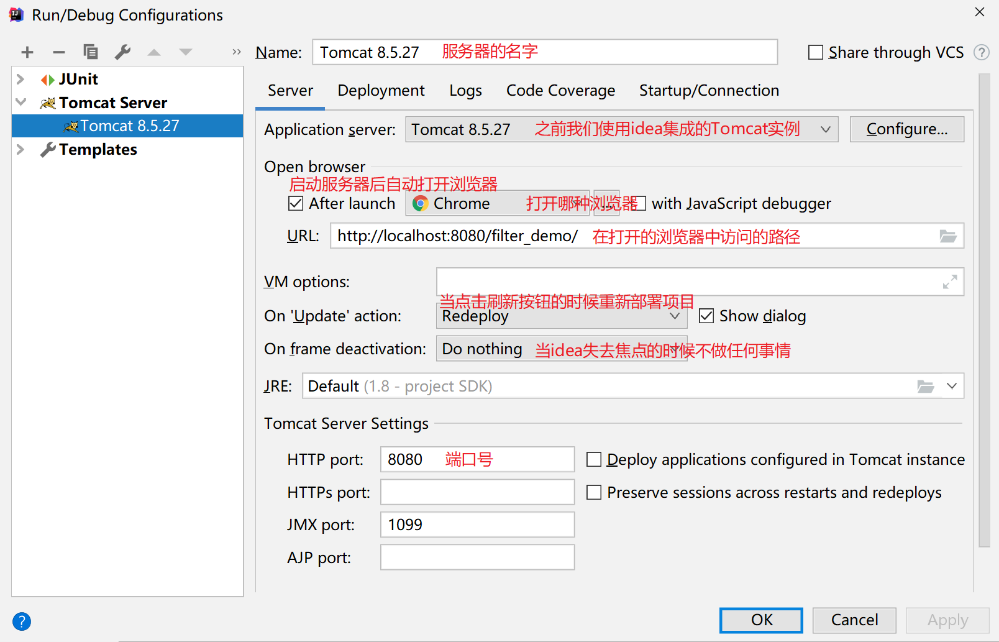

## XML

### 2.内容讲解

#### 2.1 配置文件

##### 2.1.1 配置文件的作用

配置文件是用于给应用程序提供配置参数以及初始化设置的一些有特殊格式的文件

##### 2.1.1 常见的配置文件类型

1. properties文件,例如druid连接池就是使用properties文件作为配置文件
2. XML文件,例如Tomcat就是使用XML文件作为配置文件
3. YAML文件,例如SpringBoot就是使用YAML作为配置文件
4. json文件,通常用来做文件传输，也可以用来做前端或者移动端的配置文件

#### 2.2 properties文件

##### 2.2.1 文件示例

```properties
atguigu.jdbc.url=jdbc:mysql://192.168.198.100:3306/mybatis1026
atguigu.jdbc.driver=com.mysql.jdbc.Driver
atguigu.jdbc.username=root
atguigu.jdbc.password=atguigu
```

##### 2.2.2 语法规范

- 由键值对组成
- 键和值之间的符号是等号
- 每一行都必须顶格写，前面不能有空格之类的其他符号

#### 2.3 XML文件

##### 2.3.1 文件示例

```xml
<?xml version="1.0" encoding="UTF-8"?>
<web-app xmlns="http://xmlns.jcp.org/xml/ns/javaee"
         xmlns:xsi="http://www.w3.org/2001/XMLSchema-instance"
         xsi:schemaLocation="http://xmlns.jcp.org/xml/ns/javaee http://xmlns.jcp.org/xml/ns/javaee/web-app_4_0.xsd"
         version="4.0">

    <!-- 配置SpringMVC前端控制器 -->
    <servlet>
        <servlet-name>dispatcherServlet</servlet-name>
        <servlet-class>org.springframework.web.servlet.DispatcherServlet</servlet-class>

        <!-- 在初始化参数中指定SpringMVC配置文件位置 -->
        <init-param>
            <param-name>contextConfigLocation</param-name>
            <param-value>classpath:spring-mvc.xml</param-value>
        </init-param>

        <!-- 设置当前Servlet创建对象的时机是在Web应用启动时 -->
        <load-on-startup>1</load-on-startup>

    </servlet>
    <servlet-mapping>
        <servlet-name>dispatcherServlet</servlet-name>

        <!-- url-pattern配置斜杠表示匹配所有请求 -->
        <!-- 两种可选的配置方式：
                1、斜杠开头：/
                2、包含星号：*.atguigu
             不允许的配置方式：前面有斜杠，中间有星号
                /*.app
         -->
        <url-pattern>/</url-pattern>
    </servlet-mapping>
</web-app>
```

##### 2.3.2 概念介绍

XML是e<span style="color:blue;font-weight:bold;">X</span>tensible <span style="color:blue;font-weight:bold;">M</span>arkup <span style="color:blue;font-weight:bold;">L</span>anguage的缩写，翻译过来就是<span style="color:blue;font-weight:bold;">可扩展标记语言</span>。所以很明显，XML和HTML一样都是标记语言，也就是说它们的基本语法都是标签。

| 属性名             | 作用                                                         |
| ------------------ | ------------------------------------------------------------ |
| xmlns              | 指出当前XML文档约束规则的名称空间在哪里<br />我们就是通过这个属性来引用一个具体的名称空间 |
| xmlns:xsi          | 指出xmlns这个属性是在哪个约束文档中被定义的                  |
| xsi:schemaLocation | 语法格式：在xsi名称空间下引用schemaLocation属性<br />配置含义：指定当前XML文档中所用到的约束文档本身的文件的地址 |

xmlns和xsi:schemaLocation对应关系如下图：


引入多个名称空间的例子如下：

```xml
<?xml version="1.0" encoding="UTF-8"?>
<beans xmlns="http://www.springframework.org/schema/beans"
	xmlns:xsi="http://www.w3.org/2001/XMLSchema-instance"
	xmlns:context="http://www.springframework.org/schema/context"
	xmlns:mvc="http://www.springframework.org/schema/mvc"
	xsi:schemaLocation="http://www.springframework.org/schema/mvc http://www.springframework.org/schema/mvc/spring-mvc-4.0.xsd
		http://www.springframework.org/schema/beans http://www.springframework.org/schema/beans/spring-beans.xsd
		http://www.springframework.org/schema/context http://www.springframework.org/schema/context/spring-context-4.0.xsd">

	<context:component-scan base-package="com.atguigu.crud.component"/>
	
	<bean id="viewResolver" class="org.springframework.web.servlet.view.InternalResourceViewResolver">
		<property name="prefix" value="/WEB-INF/pages/"/>
		<property name="suffix" value=".jsp"/>
	</bean>
	
	<mvc:default-servlet-handler/>
	<mvc:annotation-driven/>

</beans>
```



看到这么复杂，这么长的名称空间字符串，我们会觉得很担心，根本记不住。但是其实不需要记，在IDEA中编写配置文件时，IDEA会协助我们导入，会有提示。我们<span style="color:blue;font-weight:bold;">理解各个部分的含义能够调整</span>即可。

##### 2.3.3==总结==

xmlns相当于一个自定义前缀，xmlns:属性名标定文档位置，然后xsi：schemaLoction给出文档位置。


##### 2.3.4 XML解析(重点)

###### 2.3.4.3 常见的XML解析器

在使用Java代码解析XML的时候，我们通常不会直接使用JDK内置的原生的DOM或者SAX解析XML，因为代码实在是太复杂了。一些公司和组织已经封装好了优秀的XML解析器，我们通常会使用第三方XML解析器来解析XML

1. JAXP: sun公司提供的解析。支持dom和sax。（不常用）
2. JDOM
3. DOM4J（常用） 

###### 2.3.4.5 DOM4J的API介绍

1. 创建SAXReader对象

```java
SAXReader saxReader = new SAXReader();
```

2. 解析XML获取Document对象: 需要传入要解析的XML文件的字节输入流

```java
Document document = reader.read(inputStream);
```

3. 获取文档的根标签

```java
Element rootElement = documen.getRootElement()
```


4. 获取标签的子标签

```java
//获取所有子标签
List<Element> sonElementList = rootElement.elements();
//获取指定标签名的子标签
List<Element> sonElementList = rootElement.elements("标签名");
```

​	==使用Xpath来获取特定标签==

- selectSingleNode("路径规则"): 根据路径规则，查找满足条件的第一个节点
- selectNodes("路径规则"): 根据路径规则，查找满足条件的所有节点


5. 获取标签体内的文本

```java
String text = element.getText();
```

6. 获取标签的某个属性的值

```java
String value = element.AttributeValue("属性名");
```


## Tomcat

Tomcat的作用是作为Web服务器部署Web项目，从而让客户端能够访问，在这个过程中它扮演者两个角色: Web服务器和Servlet容器。


### 目录结构



#### 部署web项目

将web项目打包成war包，放到tomcat的webapps目录中即可。

#### tomcat端口号

在conf下的server.xml下设定了端口号

```xml
……
<!-- 第22行 -->
<Server port="8005" shutdown="SHUTDOWN">
……
<Connector port="8080" protocol="HTTP/1.1"
		   connectionTimeout="20000"
		   redirectPort="8443" />
……
<Connector port="8009" protocol="AJP/1.3" redirectPort="8443" />
```

三个位置共定义了3个端口号，Tomcat启动后，这个三个端口号都会被占用。


### 动态工程目录

| 目录或文件名            | 功能                                                         |
| ----------------------- | ------------------------------------------------------------ |
| src目录                 | 存放Java源文件                                               |
| web目录                 | 存放Web开发相关资源                                          |
| web/WEB-INF目录         | 存放web.xml文件、classes目录、lib目录                        |
| web/WEB-INF/web.xml文件 | 别名：部署描述符deployment descriptor<br />作用：Web工程的核心配置文件 |
| web/WEB-INF/classes目录 | 存放编译得到的*.class字节码文件                              |
| web/WEB-INF/lib目录     | 存放第三方jar包                                              |


### IDEA用tomcat部署项目



#### ==注意==

使用IDEA部署web项目，所部署的war包是保存在tomcat下的，并不是当前的代码目录，所以有些资源更新的时候，记得进行部署的清理操作，再重新部署。


