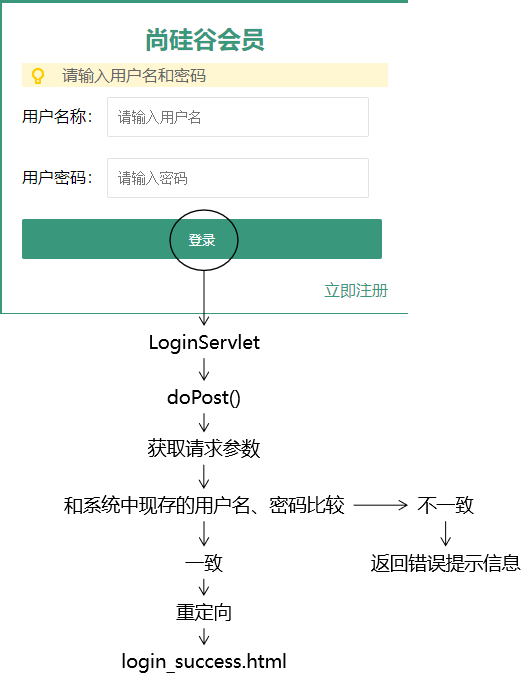

## base使用

因为在页面中有很多的a标签、表单以及Ajax请求(以后会学)都需要写访问路径，而在访问路径中**项目路径**是一样的，所以如果不统一编写**项目路径**的话，就会发生当项目路径发生改变的时候该页面所有用到项目路径的地方都需要更改的情况

#### base标签的语法规则

- base标签要写在head标签内
- base标签必须写在所有其他有路径的标签的前面
- base标签使用href属性设置路径的基准
- base标签生效的机制是：最终的访问地址=base标签href属性设置的基准+具体标签内的路径
- ==如果某个路径想要基于base中的路径进行路径编写，那么它不能以`/`开头==

```javascript
<head>
    <meta charset="UTF-8"/>
    <meta name="viewport" content="width=device-width, initial-scale=1.0"/>
    <title>书城首页</title>
    <base href="/bookstore/"/>
    <link rel="stylesheet" href="static/css/minireset.css"/>
    <link rel="stylesheet" href="static/css/common.css"/>
    <link rel="stylesheet" href="static/css/iconfont.css"/>
    <link rel="stylesheet" href="static/css/index.css"/>
    <link rel="stylesheet" href="static/css/swiper.min.css"/>
</head>
```


## 登录检查



1.创建LoginServlet，继承HttpServlet，重写doGet，doPost方法；

```java
public class LoginServlet extends HttpServlet {
    @Override
    protected void doPost(HttpServletRequest request, HttpServletResponse response) throws ServletException, IOException {
        doGet(request, response);
    }

    @Override
    protected void doGet(HttpServletRequest request, HttpServletResponse response) throws ServletException, IOException {
        request.setCharacterEncoding("UTF-8");
        response.setContentType("text/html;charset=UTF-8");
        //1. 获取客户端传入的请求参数
        String username = request.getParameter("username");
        String password = request.getParameter("password");

        //2. 校验用户名和密码是否正确: 先不连接数据库，使用静态数据进行校验
        if ("tom".equals(username) && "123456".equals(password)) {
            //登录成功
            //跳转到login_success.html页面
            //重定向
            response.sendRedirect(request.getContextPath()+"/pages/user/login_success.html");
        }else {
            //登录失败
            //则向客户端响应登录失败的信息
            response.getWriter().write("用户名或密码错误,登录失败!!!");

            //优化方式一: 跳转回到登录页面
            //response.sendRedirect(request.getContextPath()+"/pages/user/login.html");

            //优化方式二: 向浏览器响应超文本，在超文本中提示登录失败
            //直接通过response响应整个login.html页面的内容
            //response.getWriter().write("");
        }
    }
}
```

2.在web.xml配置servlet信息

```xml
<servlet>
    <servlet-name>LoginServlet</servlet-name>
    <servlet-class>com.atguigu.bookstore.servlet.LoginServlet</servlet-class>
</servlet>
<servlet-mapping>
    <servlet-name>LoginServlet</servlet-name>
    <url-pattern>/login</url-pattern>
</servlet-mapping>
```

3.设置表单提交地址和post方式

```html
<form id="loginForm" action="login" method="post">
	<label>用户名称：</label>
	<input class="itxt" type="text" v-model:value="username" placeholder="请输入用户名" autocomplete="off" tabindex="1" name="username" id="username" />
	<br />
	<br />
	<label>用户密码：</label>
	<input class="itxt" type="password" v-model:value="password" placeholder="请输入密码" autocomplete="off" tabindex="1" name="password" id="password" />
	<br />
	<br />
	<button type="submit" id="sub_btn" @click="loginCheck">登录</button>
</form>
```


## 注册检查