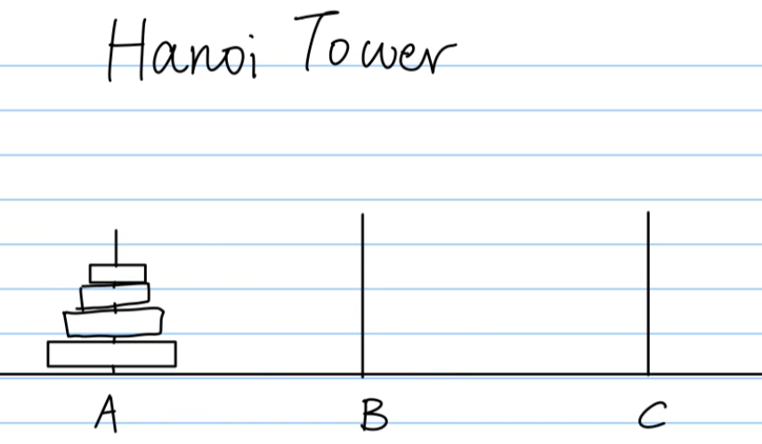
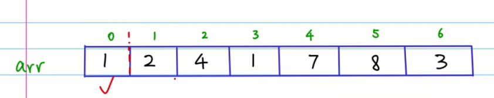
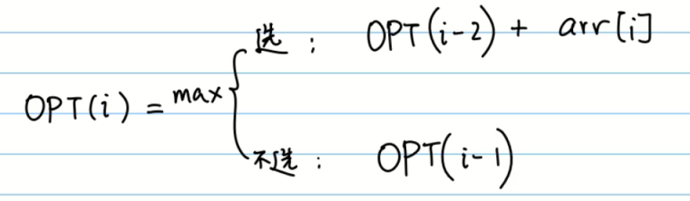
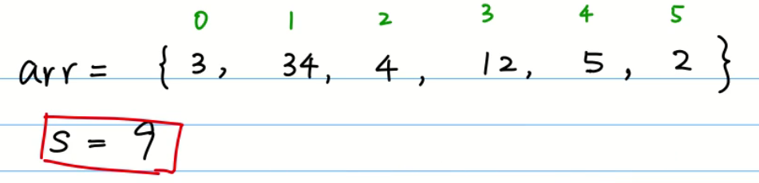

## 算法思想


### 递归

#### 阶乘：


#### 斐波那契数列：

```java
public int f(int n){
	if(n==1 || n==2){
        return 1;
    }else{
   		return f(n-1)+f(n-2);
    }

}
```


#### 汉诺塔Hannota：



移动n个环到C时，需要先将n-1移动到B；

然后将第n个环移动到C；

以此类推。。。。

==规律为：== 一个环，2的1次方-1； 两个环卫2的2次方-1 步； 三个环为2的3次方-1 步；...n个环为2的n次方-1步。

```java
public static void move(int disk, char M, char N){
    
}

public static void hannoi(int n, char A, char B, char C){
    if(n==1){
        return 1;
    }else{
        return hannoi(n-1,A,C,B)+1+hannoi(n-1,B,A,C);
    }
    
}
```


### 动态规划：

#### 1.求数组间隔数最大和






```java
递归：2的n次方，复杂度

public static int rec_opt(int[] arr,int i){
        if(i==0){
            return arr[0];
        }else if(i==1){
            return Math.max(arr[0],arr[1]);
        }else{
            return Math.max(rec_opt(arr,i-1),arr[i]+rec_opt(arr,i-2));
        }
}

动态规划：
    public static int opt(int[] arr){
        int[] opt =new int[arr.length];
        opt[0] = arr[0];
        opt[1] = Math.max(arr[0],arr[1]);
        for (int i=2;i<arr.length;i++) {
            opt[i] = Math.max(opt[i-1],arr[i]+opt[i-2]);
        }
        return opt[opt.length-1];
    }
```


#### 2.数之和为9

https://www.bilibili.com/video/BV12W411v7rd?spm_id_from=333.999.0.0



如图数组，判断是否能有数之和为9

```java
递归
public static boolean rec_sum(int[] arr,int s , int i){
    if(s==0){
        return true;
    }else if(i==0){
        return arr[i]==s;
    }else if(arr[i] > s){
        return rec_sum(arr,s,i-1);
    }else{
        reurn rec_sum(arr,s,i-1) || rec_sum(arr,s-arr[i],i-1);
    }
    
}


动态规划
public static boolean sum(int[] arr,int S){
        boolean[][] subset = new boolean[arr.length][S+1];
    //初始化判断数组
        for (int i = 0; i < arr.length; i++) {
            for (int j = 0; j < S+1; j++) {
                if(j==0){
                    subset[i][j]=true;
                }if(i==0){
                    subset[i][j]=false;
                }
            }
        }
        subset[0][arr[0]]=true;
    
        for (int i = 1; i < subset.length; i++) {
            for (int j = 1; j < subset[0].length; j++) {
                if(arr[i] > S){
                    subset[i][j]=subset[i-1][j];
                }else{
                    if(j-arr[i]>0) {
                        subset[i][j] = subset[i - 1][j] || subset[i - 1][j - arr[i]];
                    }else{
                        subset[i][j] = subset[i - 1][j];
                    }
                }
            }
        }
        return subset[subset.length-1][subset[0].length-1];
    }


```

