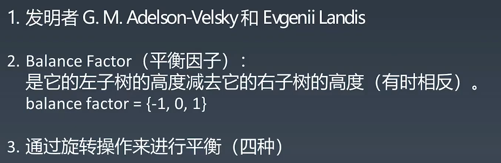
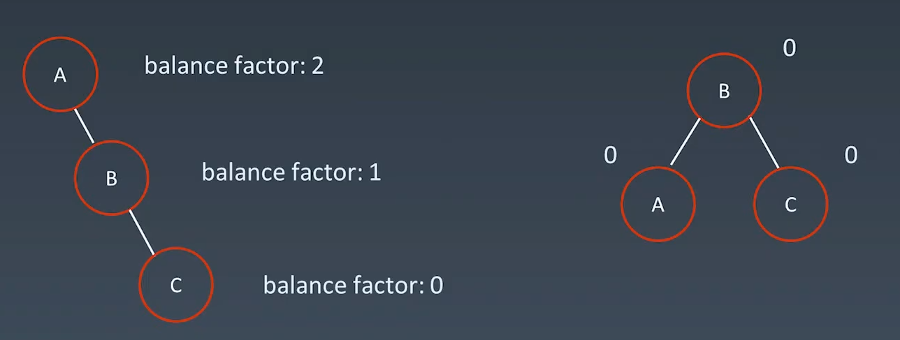
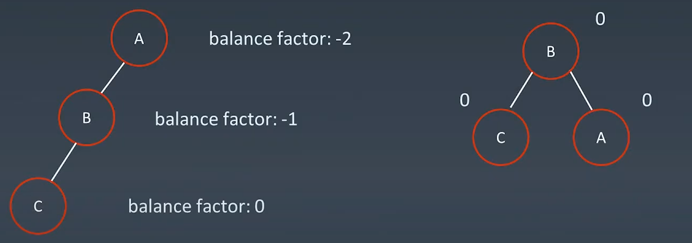
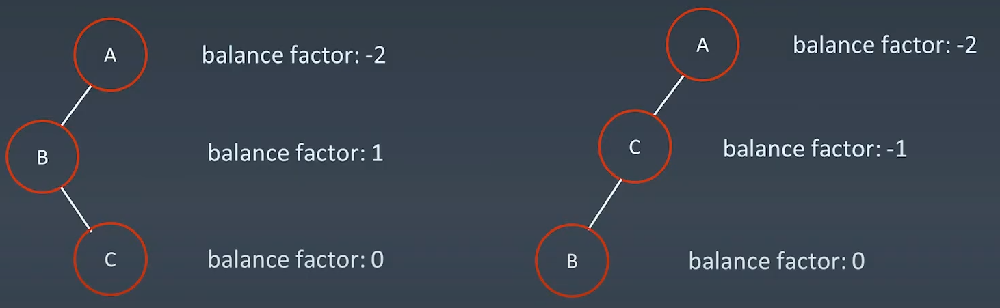
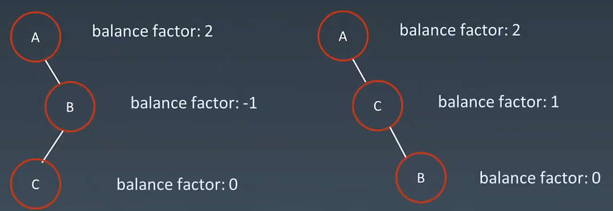

### Tree 高级树、AVL、红黑树

树Tree

二叉树 Binary Tree

==遍历== 先序、中序、后序

二叉搜索的中序遍历有序;

#### AVL树

##### 旋转操作

==左旋==

==右旋==

==左右旋==

​	然后右旋；

==右左旋==

​	然后左旋；

#### 红黑树

==红黑树和AVL树对比==

1.AVL树相比红黑树提供更快的查找，由于更严格的平衡；

2.红黑树提供更快的插入和移除

3.AVL需要花费额外空间去存储平衡因子和高度，红黑树只需要存储0,1代表红黑；

4.编程语言一般使用红黑树，而数据处理一般使用AVL

#### 字典树

核心点：

1.创建一个长度为26的数组子节点；

2。借助char中a为97，即数arr[i-97]是否为null进行查找或插入。
