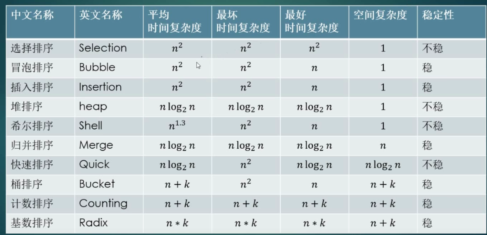
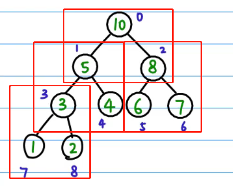

## 排序算法


在线练习：https://lab.csdn.net/welcome




#### 冒泡排序


```java
public int[] bubblingSort( int[] nums) {
        int temp;
        for(int i =0;i<nums.length;i++){
            for(int j=0;j<nums.length-i-1;j++){
                if(nums[j]>nums[j+1]){
                    temp = nums[j];
                    nums[j] = nums[j+1];
                    nums[j+1]  =temp;
                }
            }
        }
        return nums;
    }
```


#### 选择排序


#### 插入排序


#### 堆排序：

使用数组，以树的形式进行排序；

其中以 i=3 为例子：

​	parent = (i-1)/2 向下取整

​	c1 = 2i + 1

​	c2 = 2i + 2




```java
class Solution {
    
//交换
    static void swap(int arr[], int i ,int j){
        int temp = arr[i];
        arr[i] = arr[j];
        arr[j] = temp;
    }

//构建对某个点做heapify操作
    static void heapify (int tree[],int n, int i){
        if(i>=n){
            return;
        }
        int c1 = 2*i +1;
        int c2 = 2*i +2;
        int max = i;
        if(c1<n && tree[c1] >tree[max]){
            max = c1;
        }if(c2<n && tree[c2] >tree[max]){
            max = c2;
        }
        if(max != i){
            swap(tree,max ,i);
            heapify(tree,n,max);
        }

    }

//从头到尾排序
    static void build_heap(int tree[], int n){
        int last_node = n-1;
        int parent =(last_node - 1)/2;
        for(int i = parent ;i>=0;i--){
            heapify(tree,n,i);
        }
    }

//每次更换首尾节点
    static void heap_sort(int tree[],int n){
        build_heap(tree,n);
        int i;
        for(i = n-1 ;i>=0;i--){
            swap(tree, i ,0);
            heapify(tree, i , 0);
        }

    }

    public int[] heapSort( int[] nums) {
        heap_sort(nums,nums.length);
        return nums;
    }
}
```

