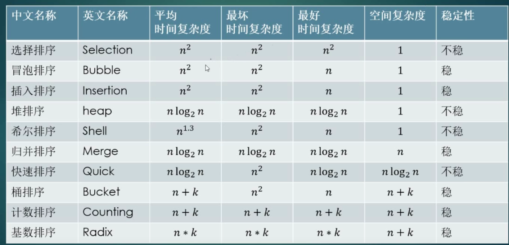
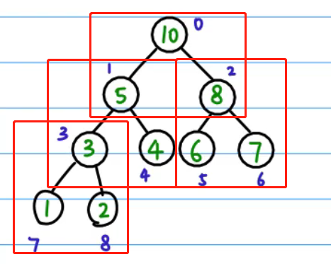

## 排序算法


在线练习：https://lab.csdn.net/welcome




#### 冒泡排序

数组中，最大的值出现在最后一个位置；

数组中，第二大的值出现在倒数第二个位置；

...

两两对比，大值放在后面；

```java
public int[] bubblingSort( int[] nums) {
        int temp;
        for(int i =0;i<nums.length-1;i++){
            for(int j=0;j<nums.length-i-1;j++){
                if(nums[j]>nums[j+1]){
                    temp = nums[j];
                    nums[j] = nums[j+1];
                    nums[j+1]  =temp;
                }
            }
        }
        return nums;
}
```


#### 简单选择排序

数组中，最大的值出现在最后一个位置；（找到最大值的index，与最后一个位置交换）

数组中，第二大的值出现在倒数第二个位置；

...

```java
public int[] selectSort( int[] nums) {
        
    	for(int i =0;i<nums.length-1;i++){
            int index = 0;
            int max = nums[0];
            for(int j =0;j<nums.length-i;j++){
                if(nums[j]>max){
                    index = j;
                    max = nums[j];
                }
       		}
            if(index!=nums.length-i-1){
                int temp = nums[index];
                nums[index] = nums[nums.length-i-1];
                nums[nums.length-i-1] = temp;
            }
        }
}
```


#### 快速排序

1.选定pivot中心轴(随意选取,一般以左边为准)

2.将大于pivot的数字放在pivot的右边

3.将小于pivot的数字放在pivot的左边

4.分别对左右子序列重复前三步步骤

```java
static void quickSort(int[] arr,int left,int right){
        if(left>=right){
            return ;
        }
        int l =left,r=right;
        int pivot = arr[l];

        while(l<r){
            while(arr[r]>=pivot&&l<r){
                r--;
            }
            if(r>l){
                arr[l]=arr[r];
            }
            while(arr[l]<pivot&&l<r){
                l++;
            }
            if(r>l){
                arr[r] = arr[l];
            }
        }
        arr[l]=pivot;
        quickSort(arr,left,l-1);
        quickSort(arr,l+1,right);
    }
```


#### 插入排序


```java
for(int i=1;i<n;i++){
    int key = a[i];
    int j = i-1;
    while(j>=0 && a[j]>key){
        a[j+1] = a[j];
        j--;
    }
    a[j+1] = key;
}
```


#### 堆排序：

使用数组，以树的形式进行排序；

其中以 i=3 为例子：

​	parent = (i-1)/2 向下取整

​	c1 = 2i + 1

​	c2 = 2i + 2




```java
class Solution {
    
	//交换
   void swap(int arr[], int i ,int j){
        int temp = arr[i];
        arr[i] = arr[j];
        arr[j] = temp;
    }

	//构建对某个点做heapify操作
   void heapify(int[] arr,int n,int i){
        int c1 = 2*i+1;
        int c2 = 2*i+2;
        int max = i;
        if(c1<n&&arr[c1]>arr[max]){
            max = c1;
        }
        if(c2<n&&arr[c2]>arr[max]){
            max = c2;
        }
        if(max!=i){
            swap(arr,max,i);
        }
    }

	//对长度为n的数组节点heapify；
    void buildHeap(int tree[], int n){
        //将数组看成一个二叉树
        //最后一个节点
        int last_node = n-1;
        //最后一个节点的父节点
        int parent =(last_node - 1)/2;
        for(int i = parent ;i>=0;i--){
            heapify(tree,n,i);
        }
    }

	//每次更换首尾节点
    void heapSort(int[] arr){
        int len = arr.length;
        buildHeap(arr,len);
        for (int i = len-1; i >=0 ; i--) {
            swap(arr,i,0);
            buildHeap(arr,i);
        }
    }

}
```


#### 归并排序


```java
public void mergeSort(int[] arr,int left, int right){
        if(right<=left)
            return;
        int mid = ((right-left)>>1) + left;
        mergeSort(arr,left,mid);
        mergeSort(arr,mid+1,right);
        merge(arr,left,mid,right);
    }

    public void merge(int[] arr,int left,int mid,int right){
        int[] temp = new int[right-left+1];
        int i= left;
        int j = mid+1;
        int index = 0;
        while(i<=mid&&j<=right){
            if(arr[i]<arr[j]){
                temp[index++] = arr[i++];
            }else{
                temp[index++]  =arr[j++];
            }
        }
        while(i<=mid){
            temp[index++] = arr[i++];
        }
        while(j<=right){
            temp[index++] = arr[j++];

        }

        int s= left;
        int k = 0;
        while(k<temp.length){
            arr[s++] = temp[k++];
        }
    }
```


