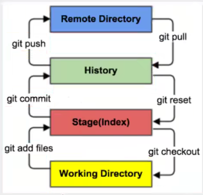
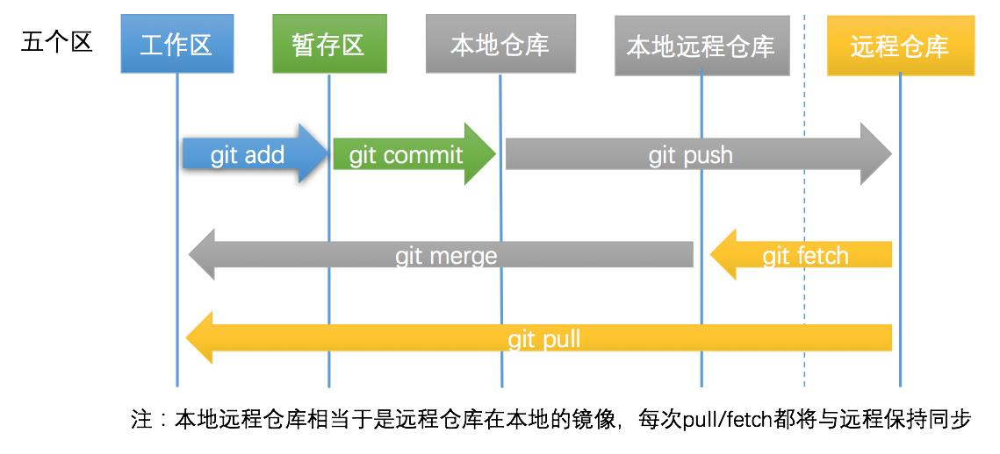
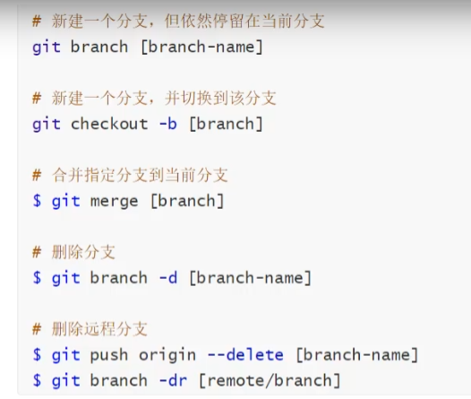

## Git基本操作

#### 1.常用linux命令

==改变目录 cd==

. 当前目录

.. 上一级目录

==显示当前路径==

pwd (print work directory)

==显示文件==

ls 查看目录中所有的文件

ll 更详细

==新建文件==

touch

==删除==

rm	只能删除文件

rm -r 删除文件夹和文件

==新建一个目录==

mkdir

==移动文件==

mv

==其他==

reset 初始化终端

clear 清屏

history 查看历史命令

exit 退出

#### 2.基础命令

==git 配置==------git config -l

1.配置：

git config --global user.name “~”

git config --global user.password “~”

2.查看：

git config system --list (查看系统配置)

git config --global

基本配置文件存储在Git目录的etc包下，用户信息存储在C:\Users\54060的.gitconfig 文件。

#### 3.仓库关联

​	git init	仓库初始化

​	git status  查看状态

​	git clone [url]  克隆仓库

Git 有三个工作区域：工作目录（working directory）、暂存区(stage/stage)、资源库（Repository）；加上远程的git仓库会有四个。

==提交到暂存区==  git add -A

==提交到本地仓库== git commit -m “备注message内容”

==提交到远程仓库== git push

#### 4.ssh连接

ssh-keygen -t rsa   生成公钥秘钥

生成的公钥放在C盘用户目录下的.ssh文件夹。

#### 5.git分支

 
