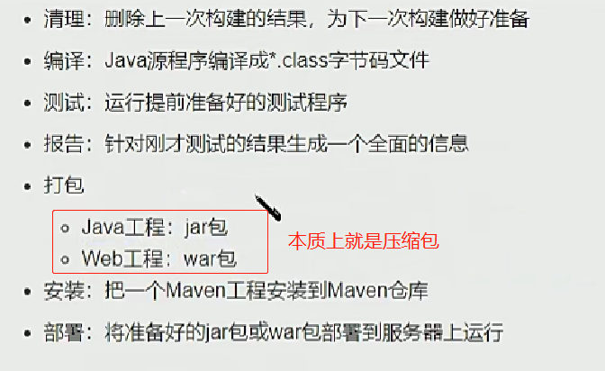

Apache软件基金会组织下软件工具


### 为啥要用maven

1.框架封装程度越来越高，使用的jar包越来越多；

2.jar包来源：不安全，繁琐

3.jar包之间的依赖关系错综复杂


### 构建




### 配置：

1.conf包下setting文件

配置本地仓库

```xml
D:\desitory\maven desitory
```

配置阿里云镜像仓库：

```xml
<!-- 阿里云仓库 -->
        <mirror>
            <id>alimaven</id>
            <mirrorOf>central</mirrorOf>
            <name>aliyun maven</name>
            <url>http://maven.aliyun.com/nexus/content/repositories/central/</url>
        </mirror>
    
        <!-- 中央仓库1 -->
        <mirror>
            <id>repo1</id>
            <mirrorOf>central</mirrorOf>
            <name>Human Readable Name for this Mirror.</name>
            <url>http://repo1.maven.org/maven2/</url>
        </mirror>
    
        <!-- 中央仓库2 -->
        <mirror>
            <id>repo2</id>
            <mirrorOf>central</mirrorOf>
            <name>Human Readable Name for this Mirror.</name>
            <url>http://repo2.maven.org/maven2/</url>
        </mirror>
```

配置一下JDK版本

```xml
<profile>
      <id>jdk-1.8</id>

      <activation>
        <activeByDefalut>true</activeByDefalut>
		<jdk>1.8</jdk>
      </activation>

      <properties>
        <maven.compiler.source>1.8</maven.compiler.source>
		<maven.compiler.target>1.8</maven.compiler.target>
		<maven.compiler.compilerVersion>1.8</maven.compiler.compilerVersion>
      </properties>
</profile>
```


2.环境配置

1.配置JAVA_HOME(依赖java)

2.配置MAVEN_HOME

```java
MAVEN_HOME: maven bin目录上一层目录;
PATH : %MAVEN_HOME%\bin
```


