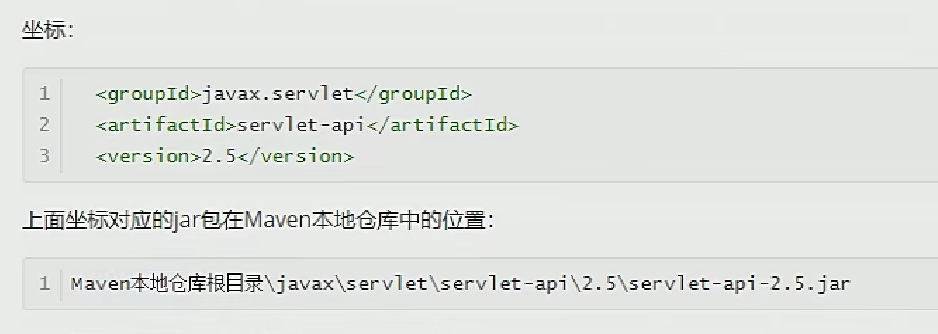
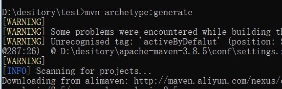
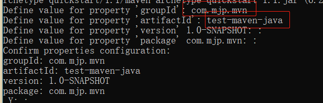
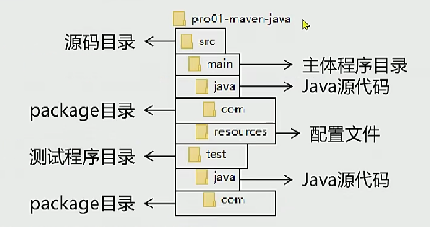

# MAVEN工程

## 1.坐标

### 向量说明

groupId：公司id

artifactId：一个项目或者是项目模块的id

version：版本号

​	例：1.0snapshot

​	snapshot，不稳定版本，快照版本；

​	release，稳定版本。


### 坐标和仓库中jar的存储路径关系




## 2.实操

生成工程

​	mvn archetype:generate






调整：

默认生成junit版本为3.8，改为4.1.2，修改pom文件

```xml
 <dependencies>
    <dependency>
      <groupId>junit</groupId>
      <artifactId>junit</artifactId>
      <version>4.1.2</version>
      <scope>test</scope>
    </dependency>
  </dependencies>
```


## 3.核心概念：POM

### ①含义

POM：<span style="color:blue;font-weight:bold;">P</span>roject <span style="color:blue;font-weight:bold;">O</span>bject <span style="color:blue;font-weight:bold;">M</span>odel，项目对象模型。和POM类似的是：DOM：Document Object Model，文档对象模型。


### ②思想

POM表示将工程抽象为一个模型，再用程序中的对象来描述这个模型。这样我们就可以用程序来管理项目了。我们在开发过程中，最基本的做法就是将现实生活中的事物抽象为模型，然后封装模型相关的数据作为一个对象，这样就可以在程序中计算与现实事物相关的数据。


### ③对应的配置文件

POM理念集中体现在Maven工程根目录下<span style="color:blue;font-weight:bold;">pom.xml</span>这个配置文件中。所以这个pom.xml配置文件就是Maven工程的核心配置文件。其实学习Maven就是学这个文件怎么配置，各个配置有什么用。


其实就是pom文件管理的都是一个个maven工程？ maven工程相互依赖，工程下各种jar包


### 目录结构



==target目录：==与src目录同级，存放输出结果（编译等）。