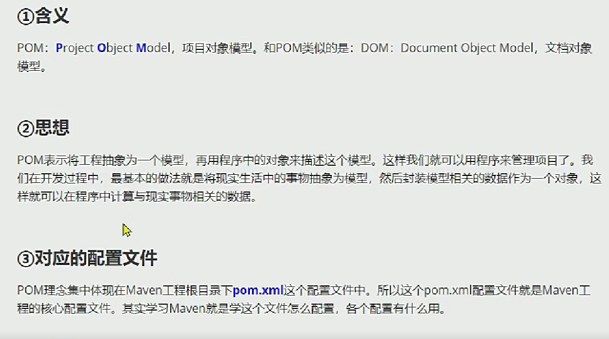

# MAVEN工程

## 1.坐标

### 向量说明

groupId：公司id

artifactId：一个项目或者是项目模块的id

version：版本号

​	例：1.0snapshot

​	snapshot，不稳定版本，快照版本；

​	release，稳定版本。


### 坐标和仓库中jar的存储路径关系


## 2.实操

生成工程

​	mvn archetype:generate


调整：

默认生成junit版本为3.8，改为4.1.2，修改pom文件

```xml
 <dependencies>
    <dependency>
      <groupId>junit</groupId>
      <artifactId>junit</artifactId>
      <version>4.1.2</version>
      <scope>test</scope>
    </dependency>
  </dependencies>
```


## 3.核心概念：POM



其实就是pom文件管理的都是一个个maven工程？ maven工程相互依赖，工程下各种jar包


### 目录结构


==target目录：==与src目录同级，存放输出结果（编译等）。