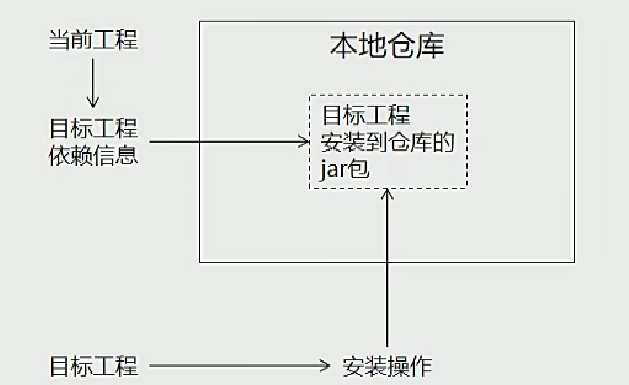
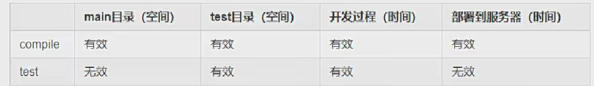
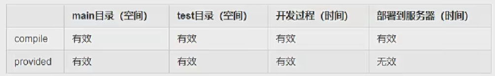
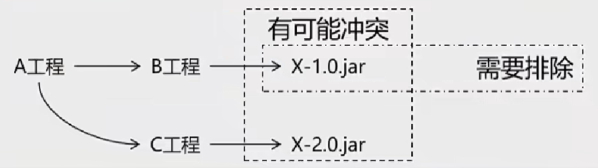
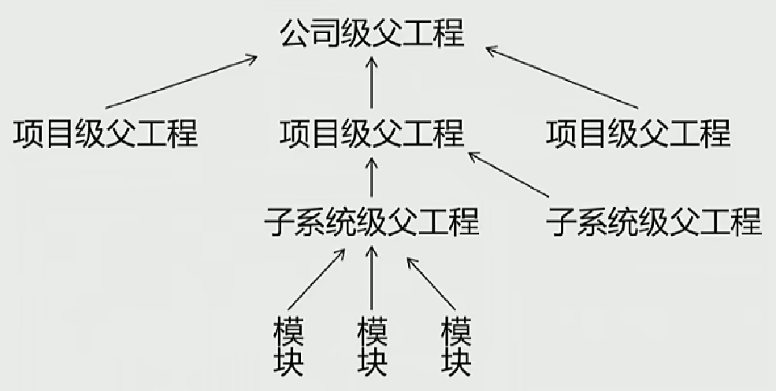

### MAVEN构建命令

要在pom文件所在目录运行

```shell
==清理操作==
mvn clean  --删除target目录

==编译操作==
mvn compile --
mvn test-compile --


==测试==
mvn test    -----测试结果会放在target/surefile-reports 目录下


==打包操作==
mvn package

==本地构建生成的jar包放入到本地仓库==
mvn install

```


### MAVEN构建web项目

```shell
mvn archetype:generate -DgroupId=com.zcz.webdemo2 -DartifactId=webdemo2 -DarchetypeArtifactId=maven-archetype-webapp 
-DarchetypeVersion=1.4  -DinteractiveMode=false
```

打包后的war包直接放在tomcat目录下的webapps下，然后启动tomcat(在bin目录下，运行startup即可)，则会自动帮我运行。

默认为localhost下


#### 查看依赖项目

mvn dependency：list


### 依赖范围

标签位置：依赖下可设置：<scope></scope>

可选值：compile/test/provided




#### compile和test对比



 m  

#### compile和provided对比




#### 依赖的传递

A依赖B，B依赖C：

- 可以传递，但B依赖C时，依赖范围为compile；
- 其余依赖范围，不可以传递


#### 依赖排除



```xml
<!--在dependency里-->
<exclusions>
    <exclusion>
    </exclusion>
</exclusions>
```


### 继承

父文件

```xml
<?xml version="1.0" encoding="UTF-8" standalone="no"?>
<project xmlns="http://maven.apache.org/POM/4.0.0" xmlns:xsi="http://www.w3.org/2001/XMLSchema-instance" xsi:schemaLocation="http://maven.apache.org/POM/4.0.0 http://maven.apache.org/xsd/maven-4.0.0.xsd">
	<modelVersion>4.0.0</modelVersion>
	
	<groupId>com.atguigu.maven</groupId>
	<artifactId>pro04-maven-parent</artifactId>
	<version>1.0-SNAPSHOT</version>
	
	<!-- 如果当前工程要作为父工程管理其他工程，那么打包方式必须是pom -->
	<packaging>pom</packaging>
	
	<name>pro04-maven-parent</name>
	<url>http://maven.apache.org</url>
	
	<properties>
		<project.build.sourceEncoding>UTF-8</project.build.sourceEncoding>
		<!-- 创建自定义标签，声明我们自己需要的属性值。例如：Spring框架版本 -->
		<!-- 使用${自定义标签名}的形式来引用自定义属性值 -->
		<atguigu.spring.version>4.3.2.RELEASE</atguigu.spring.version>
	</properties>
	<!-- 在父工程中通过dependencyManagement来统一管理依赖 -->
	<!-- dependencyManagement标签和dependencies不同 -->
	<!-- 	dependencies标签：能够把依赖的jar包真正的引入到当前工程 -->
	<!-- 	dependencyManagement标签：仅仅是管理依赖信息，并不负责真实引入依赖 -->
	<dependencyManagement>
		<dependencies>
			<dependency>
				<groupId>org.springframework</groupId>
				<artifactId>spring-core</artifactId>
				<version>${atguigu.spring.version}</version>
			</dependency>
			<dependency>
				<groupId>org.springframework</groupId>
				<artifactId>spring-beans</artifactId>
				<version>${atguigu.spring.version}</version>
			</dependency>
			<dependency>
				<groupId>org.springframework</groupId>
				<artifactId>spring-context</artifactId>
				<version>${atguigu.spring.version}</version>
			</dependency>
			<dependency>
				<groupId>org.springframework</groupId>
				<artifactId>spring-expression</artifactId>
				<version>${atguigu.spring.version}</version>
			</dependency>
			<dependency>
				<groupId>org.springframework</groupId>
				<artifactId>spring-aop</artifactId>
				<version>${atguigu.spring.version}</version>
			</dependency>
		</dependencies>
	</dependencyManagement>
    
	<!--聚合-->
	<!-- modules/module配置聚合，展示当前工程下所有模块的列表 -->
	<modules>  
		<!-- 在module标签中指定具体模块的artifactId值即可 -->
		<module>pro05-maven-module</module>
		<module>pro06-maven-module</module>
		<module>pro07-maven-module</module>
	</modules>
</project>

```


子工程

```xml
 <!-- 在子工程中通过parent标签配置继承 -->
  <parent>
	<!-- 通过父工程的坐标来指定父工程 -->
    <groupId>com.atguigu.maven</groupId>
    <artifactId>pro04-maven-parent</artifactId>
    <version>1.0-SNAPSHOT</version>
  </parent>
  
  <!-- 当前子工程自己的坐标 -->
  <!-- 子工程坐标中，groupId、version如果和父工程一样，则可以省略 -->
  <!-- <groupId>com.atguigu.maven</groupId> -->
  <artifactId>pro05-maven-module</artifactId>
  <!-- <version>1.0-SNAPSHOT</version> -->
  
  <name>pro05-maven-module</name>
  <url>http://maven.apache.org</url>
  <properties>
    <project.build.sourceEncoding>UTF-8</project.build.sourceEncoding>
  </properties>
  
  <!-- 实际开发时，子工程引用父工程中管理的依赖信息并不是直接把父工程管理的依赖全部拿过来 -->
  <!-- 而是用到哪些拿来哪些 -->
  <dependencies>
	<!-- 当5依赖6时，需要先安装6 -->
	<dependency>
		<groupId>com.atguigu.maven</groupId>
		<artifactId>pro06-maven-module</artifactId>
		<version>1.0-SNAPSHOT</version>
	</dependency>
	<dependency>
		<groupId>org.springframework</groupId>
		<artifactId>spring-core</artifactId>
		
		<!-- 在子工程的具体依赖信息中，去掉version标签，表示服从父工程统一管理 -->
		<!-- <version>4.1.0.RELEASE</version> -->
	</dependency>
	<dependency>
		<groupId>org.springframework</groupId>
		<artifactId>spring-expression</artifactId>
		
		<!-- 使用和父工程不同的版本，就会将父工程中管理的版本数据覆盖 -->
		<version>4.3.8.RELEASE</version>
		<!-- <version>4.1.0.RELEASE</version> -->
	</dependency>
	<dependency>
		<groupId>org.springframework</groupId>
		<artifactId>spring-aop</artifactId>
		<!-- <version>4.1.0.RELEASE</version> -->
	</dependency>
  </dependencies>
</project>
```


#### 实际意义

相当于功能沿用，依赖组合；==单继承==。




#### 聚合配置

在父工程的根目录下执行install命令，按依赖先后顺序下载导入，如果依赖形成循环，会报错。
