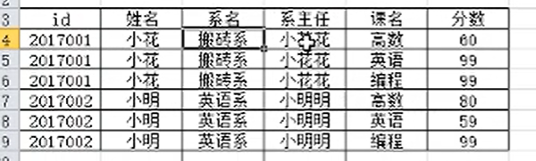
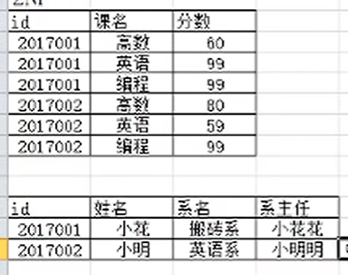
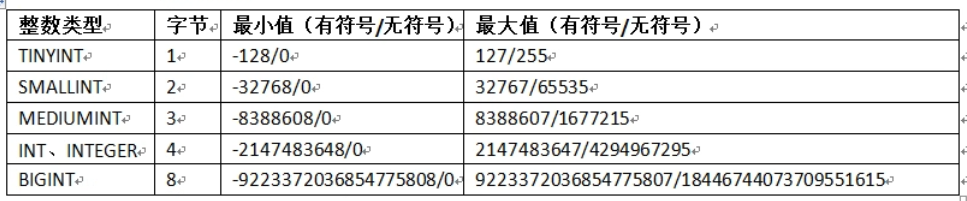
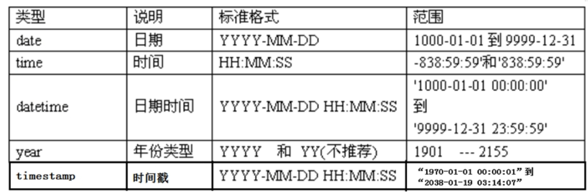
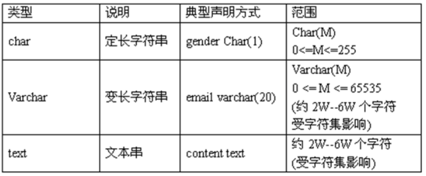

## MySQL 1

什么是数据库？

- 数据库的主要作用用于数据存储
- 存储数据按照一定规范进行存储，方便进行数据操作


##### 三范式

**1NF**：列唯一，不可再分

<!--不包含类似于数组等可拆分属性，即原子性。-->


**2NF**：属性完全依赖于主码（通过主码可以确定其他属性）

==不存在部分依赖的情况。==



因为id和课名确定了分数，所以id和课名共同作为主码；但姓名等又单独依赖于id，所以存在部分依赖，不符合第二范式。

可以拆分成




**3NF**：非主属性不得传递依赖于主属性（一张表的非主属性和主属性不能同时出现在另一张表中）

因为系主任是依赖于系的，而系名在该表中又依赖于id，所以存在传递依赖，可以进一步拆分成个人表+系表。


#### MySQL的逻辑架构

1.连接层

客户端和连接服务，包含本地sock通信和大多数基于客户端/服务端工具实现的类似tcp/ip的通信

2.服务层

核心服务功能，如SQL接口，并完成缓存的查询

3.引擎层

负责数据的存储和提取

4.存储层

存储数据


### 数据类型

- #### ==整型==

  

  

- #### 浮点型

  

- #### 定点型(DECIMAL)

  DECIMAL(M,D) :规定小数和整数部分数位（M:0~65,D:0~30）

  

- #### ==日期时间类型==

  

  

- #### ==字符串型==

  

  

- #### 位类型

- #### 二进制值类型

  存储文件

  

- #### 枚举型

- #### 集合

- #### 特殊的NULLL值

​	


### sql分类

#### DDL(Data Definition Language):数据定义语言

#### DML(Data Manipulation Language):数据操作语句

#### DCL(Data Control Language):数据控制语句


### 操作数据库sql语句

```sql
#创建数据库
create database 数据库名[charset字符集];
CREATE DATABASE db_0224;

#查看有哪些数据库
show databases；

#删除数据
drop database db_0224;

#切换数据库
use 数据库名称;

#查看当前数据库
select database();
```

