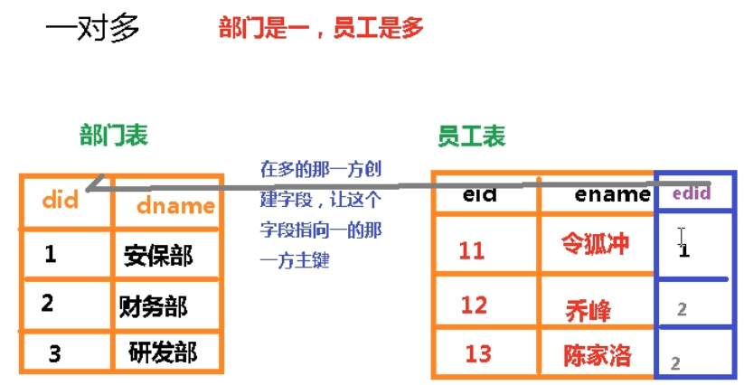
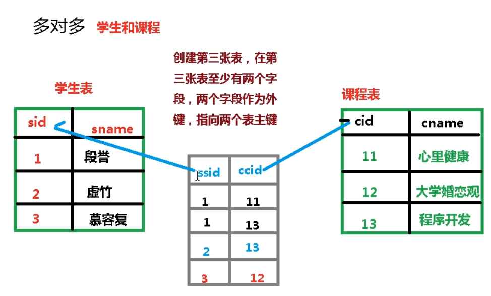
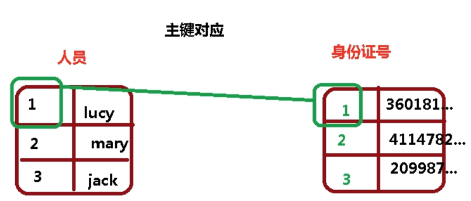

# 多表

### 多表之间的关系

外键声明

```mysql
create table emp(
eid int primary key,
ename varchar(100),
age int,
edid int, 
    #外键
FOREIGN KEY(edid) REFERENCES dept(did)
)
```

主要作用

1.数据关联

2.外键保证数据的一致性和完整性

==外键值可以为0==


### 1.一对多关系

部门和员工




### 2.多对多关系

课程和学生




### 3.一对一的关系

人和身份证

