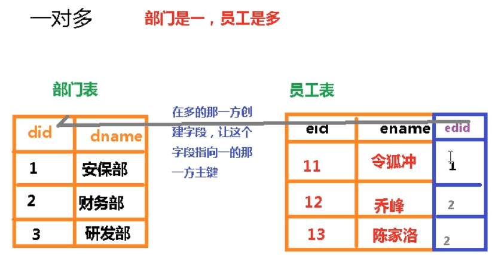
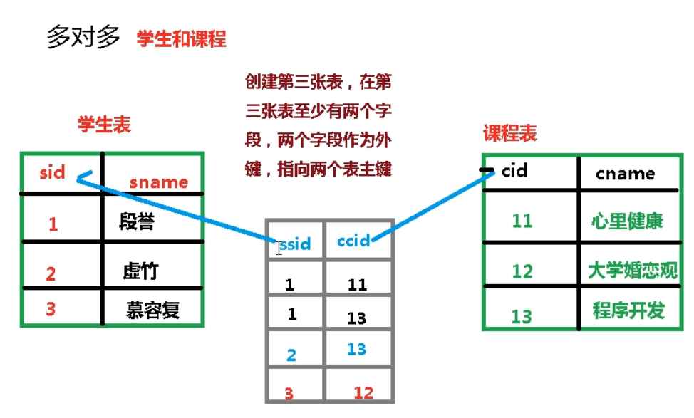
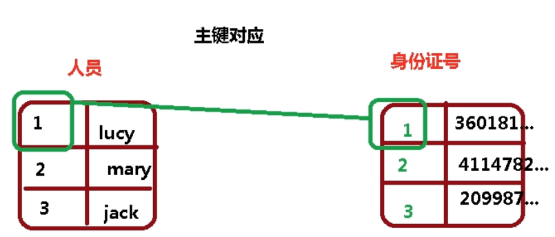
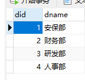
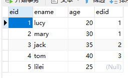
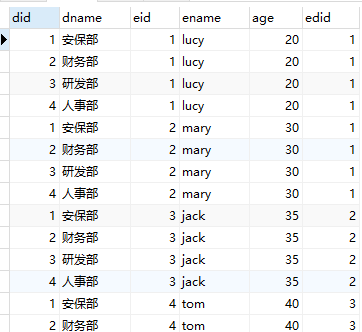
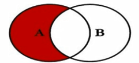
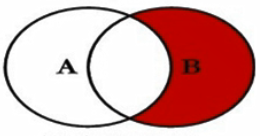

# 多表

### 多表之间的关系

外键声明

```mysql
create table emp(
eid int primary key,
ename varchar(100),
age int,
edid int, 
    #外键
FOREIGN KEY(edid) REFERENCES dept(did)
)
```

主要作用

1.数据关联

2.外键保证数据的一致性和完整性

==外键值可以为0==


### 1.一对多关系

部门和员工


### 2.多对多关系

课程和学生




### 3.一对一的关系

人和身份证




### 关联查询


dept表



emp表



#### 1.笛卡尔积

左表*右表

```mysql
select * from dept,emp;
```




#### 2.内连接查询

得到两张表有关联的数据

```mysql
select * from dept inner join emp on dept.did = emp.edid;

#where 语句会产生笛卡尔集
select * from dept,emp where dept.id = emp.id;
```


#### 3.外连接 - 左外连接

左边表所有数据，右边表的关联数据

```mysql
select * from dept left outer join emp on dept.did = emp.edid;
```


#### 4.外连接 - 右外连接

右边表所有数据，左边表的关联数据

```mysql
select * from dept right outer join emp on dept.did = emp.edid;
```


#### 5.A表独有



```mysql
select * from dept left join emp on dept.did = emp.edid where emp.eid is null
```


#### 6.B表独有



```mysql
select * from dept right join emp on dept.did = emp.eid where dept.did is null
```


#### 7.全有union

union：对两个结果集进行并集操作，不包括重复行，同时进行默认规则的排序；

union All：对两个结果集进行并集操作，包括重复行，不进行排序；

```mysql
select * from dept right outer join emp on dept.did = emp.edid
union
select * from dept left outer join emp on dept.did = emp.edid;
```


#### 8.A、B独有

```mysql
select * from dept right outer join emp on dept.did = emp.edid where dept.did is null
union
select * from dept left outer join emp on dept.did = emp.edid where emp.edid is null;
```

