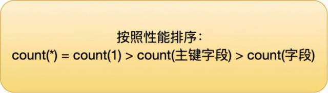

### 查询操作1

#### 语句顺序：

select 字段1，字段2... from 表名称1，表名称2....
where 条件
group by 字段 having 条件表达式(筛选条件)
order by 字段 [asc|desc]
limit m,n


#### ==加载顺序==

> 1.先加载from，确认拉取哪个表；
>
> 2.where条件限制，如果没有，where 1=1
>
> 3.group by 和having
>
> 4.聚合函数sum、avg、max等运行在group by 之后，having之前，所以不能用在where条件中
>
> 5.select语句
>
> 6.order by


#### 去重操作 distinct：

```mysql
select distinct ename from emp 
```

==mysql可以存储空格字符==


#### 模糊查询 like:

通配字符%

```mysql
#查询名字中含有a的名字，
select * from emp where ename like '%a%'
```

==%写在左边，索引会失效？==


```mysql
#查询第一个字母是m，后面是三个字母
select * from emp where ename like 'm___'
```


#### 排序操作

order by

```mysql
#降序，如果不填写desc，默认为asc
select * from emp order by eid desc
```


#### 查询范围

##### 查询年龄大于等于20小于等于50；

where 写法

```mysql
select * from emp where age>=20 and age<=50
```

between

```mysql
select * from emp where age between 20 and 50
```


##### 查询年龄是20 40 60；

```mysql
select * from emp where age in(20,40,60)
```


### 查询操作2

#### 分页操作 limit

limit分页操作只能在mysql中，不是标准sql；

> limit 后面有两个参数
>
> 第一个参数 查询数据开始位置
>
> ​	公式：(当前页-1)*每页显示记录数
>
> 第二个参数 每页显示多少条记录

```mysql
select * from emp limit 0,3
```


### mysql聚合函数

#### 1.count()统计功能

```mysql
#查询表中有多少记录
select count(*) from emp

#查询年龄大于40的人员数量
select count(*) num from emp where age>40
```

count性能比较



count(1)、 count(*)、 count(主键字段)在执行的时候，如果表里存在二级索引，优化器就会选择二级索引进行扫描。

所以，如果要执行 count(1)、 count(*)、 count(主键字段) 时，尽量在数据表上建立二级索引，这样优化器会自动采用 key_len 最小的二级索引进行扫描，相比于扫描主键索引效率会高一些。

再来，==就是不要使用 count(字段) 来统计记录个数，因为它的效率是最差的，会采用全表扫描的方式来统计。如果你非要统计表中该字段不为 NULL 的记录个数，建议给这个字段建立一个二级索引==。


相关参考：

https://baijiahao.baidu.com/s?id=1721164805396806160&wfr=spider&for=pc


#### 2.sum()求和

```mysql
#求所有人年龄总和
select sum(age) from emp 
```


#### 3.avg()平均数

默认小数点后四位

```mysql
#平均年龄
select avg(age) from emp 

#用cast转换位数
select CAST(avg(age) as DECIMAL(10,1)) from emp 
```


#### 4.max()最大值

```mysql
#求最大值
select max(age) from emp 
```


#### 5.min()最小值

```mysql
#求最小值
select min(age) from emp 
```


### 分组查询

#### 1.group by

求每个部门中的人数

==在标准sql中，group by后出现的字段，一定要在select后出现==

```mysql
#统计各部门中有多少个员工
select edid deptid,count(*) num from emp group by edid
```

