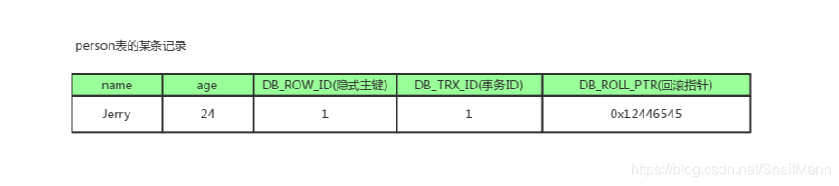
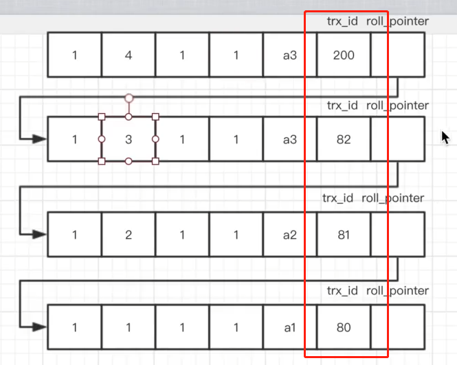

### 隔离性级别

> 读未提交(Read Uncommitted)
>
> 一个事务可以读到别的事务还没有提交的数据，脏读；
>
> 
>
> 读已提交(Read Committed)
>
> 会出现幻读和不可重复读；
>
> 不可重复读是读取到别的事务提交前后不一样的数据。==修改了的数据==
>
> 幻读是会会读取到别的事务==新增或者删除==的数据。(对于多条记录而言？)
>
> 
>
> 可重复读(Reapted read)
>
> 解决了不可重复读，但无法预防幻读。
>
> 
>
> 串行化(Serializable)
>
> 防止所有情况

#### 快照读和当前读

当前读

读取当前最新的数据，并且对读取的数据加锁，阻止其他事务同时修改相同的记录，避免出现安全问题。

快照读

一致读取意味着InnoDB使用多版本控制在某个时间点向查询提供数据库的快照。

##### 小结

- 可以简单理解需要加锁的是当前读，快照读不需要加锁。
- 快照读意味每次读取的都是快照，快照意味数据相同。
- 快照读通过MVCC实现。
- 快照读在读已提交隔离级别和可重复读隔离级别都有。

#### MVVC Multi-Version Concurrency Control

版本链：Innodb中，聚簇索引中包含两个隐藏列，trx_id和roll_pointer,每个事务只能读取到自己相同自己trx_id下的记录；

read_view：包含当前活跃的trx_id事务，即还未提交的事务；

通过上述两个，即可实现读已提交。

#### 锁

读锁(共享锁，Shared Locks)

写锁(排它锁，Exclusive Locks)

select:不加锁

