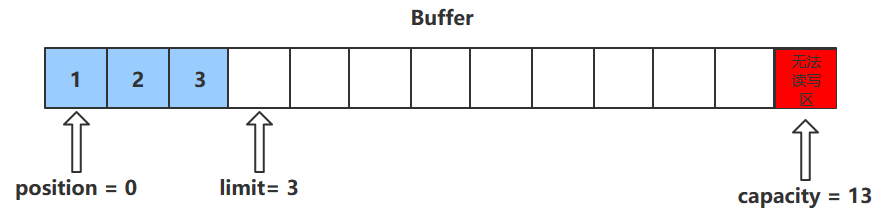
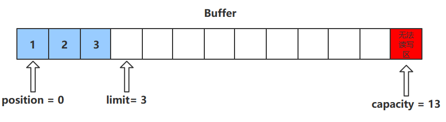

ByteBuffer的核心属性

- **capacity**：缓冲区的容量。通过构造函数赋予，一旦设置，无法更改
- **limit**：缓冲区的界限。位于limit 后的数据不可读写。缓冲区的限制不能为负，并且**不能大于其容量**
- **position**：**下一个**读写位置的索引（类似PC）。缓冲区的位置不能为负，并且**不能大于limit**
- **mark**：记录当前position的值。**position被改变后，可以通过调用reset() 方法恢复到mark的位置。**

1.flip()

切换至读模式

- **flip会使得buffer中的limit变为position，position变为0**

2.get()

#### ==如果不是读模式下，回执改变position位置但不改变值==

- get()方法会读取缓冲区中的一个值
- 进行该操作后，position会+1，如果超过了limit则会抛出异常

3.clear()

- clear()方法会将缓冲区中的各个属性恢复为最初的状态，position = 0, capacity = limit
- **此时缓冲区的数据依然存在**，处于“被遗忘”状态，下次进行写操作时会覆盖这些数据

4.put()

- put()方法可以将一个数据放入到缓冲区中。

- 进行该操作后，postition的值会+1，指向下一个可以放入的位置。capacity = limit ，为缓冲区容量的值。

  

5.rewind()

- 该方法**只能在读模式下使用**
- rewind()方法后，会恢复position、limit和capacity的值，变为进行get()前的值

6.compact()

- compact会把未读完的数据向前压缩，然后切换到写模式
- 数据前移后，原位置的值并未清零，写时会**覆盖**之前的值

7.mark()和reset()

- mark()方法会将postion的值保存到mark属性中
- reset()方法会将position的值改为mark中保存的值

### 粘包与半包

网络上有多条数据发送给服务端，数据之间使用 \n 进行分隔
但由于某种原因这些数据在接收时，被进行了重新组合，例如原始数据有3条为

- Hello,world\n
- I’m Nyima\n
- How are you?\n

变成了下面的两个 byteBuffer (粘包，半包)

- Hello,world\nI’m Nyima\nHo
- w are you?\n

#### 出现原因

**粘包**

发送方在发送数据时，并不是一条一条地发送数据，而是**将数据整合在一起**，当数据达到一定的数量后再一起发送。这就会导致多条信息被放在一个缓冲区中被一起发送出去

**半包**

接收方的缓冲区的大小是有限的，当接收方的缓冲区满了以后，就需要**将信息截断**，等缓冲区空了以后再继续放入数据。这就会发生一段完整的数据最后被截断的现象

