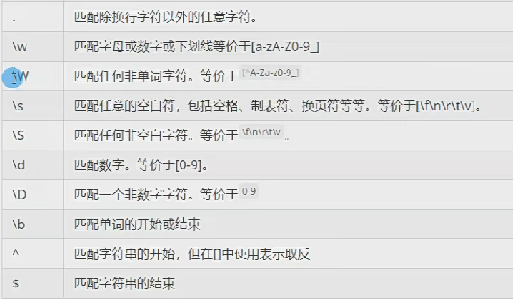

### 用途

- 模式验证：检测手机号等是否符合规范
- 匹配读取：从文本中匹配符合规范的字符串
- 匹配替换：替换符合规范的部分


### 案例

```javascript
//校验师父包含‘o’
var reg = /o/;

//忽略大小写,java是在字符前加  '(?i)'
var reg = /o/i;

//$:字符串是否以某字符串结尾
var reg = /o$/;
//^:是否以o开头
var reg = /^o/;


//是否包含是一个字幕
var reg = /[a-zA-Z]{11}/;

```



?:0或者1个

+：一个或多个

*：0或者多次

{n}：n次

{n,m}:n到m次


