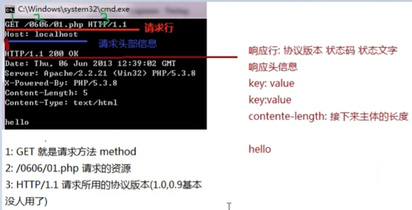
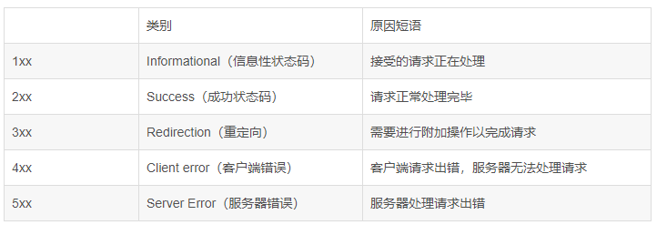
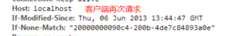

## HTTP协议

Hyper Text Transfer Protocol

HTTP最大的作用就是确定了请求和响应数据的格式。浏览器发送给服务器的数据：请求报文；服务器返回给浏览器的数据：响应报文。

### HTTP请求信息格式

> 1.请求行
>
> 2.请求头信息
>
> ==【主机地址Host:localhost】==
>
> ==【服务端通常是根据请求头（headers）中的Content-Type 字段来获知请求中的消息主体是用何种方式编码Content-type:application/x-www-form-urlencoded】==
>
> ==【可以高速服务器内容长度：Content-length:23】==
>
> ==中间需要空一行==
>
> 
>
> 3.请求主体信息(可以没有)




#### 1.请求行

- 请求方法：GET(检索并获取) POST(创建/更新) HEAD DELETE PUT TRACE OPTIONS


> GET:显示在URL中，会做缓存，==从服务器端获取数据==
>
> POST：显示在主体里，==将数据保存到服务器端==
>
> PUT：命令服务器对数据执行更新
>
> DELETE：命令服务器删除数据
>
> ...

- 请求路径：


- 请求协议版本：


#### 1.1 Post和GET方法异同

###### GET请求

- 特征1：没有请求体
- 特征2：请求参数附着在URL地址后面
- 特征3：请求参数在浏览器地址栏能够直接被看到，存在安全隐患
- 特征4：在URL地址后面携带请求参数，数据容量非常有限。如果数据量大，那么超出容量的数据会丢失
- 特征5：从报文角度分析，请求参数是在请求行中携带的，因为访问地址在请求行

###### POST请求

- 特征1：有请求体
- 特征2：请求参数放在请求体中
- 特征3：请求体发送数据的大小没有限制
- 特征4：可以发送各种不同类型的数据
- 特征5：从报文角度分析，请求参数是在请求体中携带的
- 特征6：由于请求参数是放在请求体中，所以浏览器地址栏看不到


#### 2.请求头信息

作用: 通过具体的参数对本次请求进行详细的说明

格式: 键值对，键和值之间使用冒号隔开

相对比较重要的请求消息头：

| 名称           | 功能                                                 |
| -------------- | ---------------------------------------------------- |
| Host           | 服务器的主机地址                                     |
| Accept         | 声明当前请求能够接受的『媒体类型』                   |
| Referer        | 当前请求来源页面的地址                               |
| Content-Length | 请求体内容的长度                                     |
| Content-Type   | 请求体的内容类型，这一项的具体值是媒体类型中的某一种 |
| Cookie         | 浏览器访问服务器时携带的Cookie数据                   |


#### 3.请求主体

作用：作为请求的主体，发送数据给服务器。具体来说其实就是POST请求方式下的请求参数。

格式：

**1. form data**

含义：当前请求体是一个表单提交的请求参数。


查看源码后，发现格式如下：

> username=tom&password=123456

- 每一组请求参数是一个键值对
- 键和值中间是等号
- 键值对之间是&号

**2.Request Payload**

含义：整个请求体以某种特定格式来组织数据，例如JSON格式。


### 2 响应报文


#### 2.1响应状态行

> HTTP/1.1 200 OK

- HTTP协议版本
- <span style="color:blue;font-weight:bold;">响应状态码</span>
- 响应状态的说明文字


#### 状态码



##### 1xx-信息性状态码


##### 2xx-成功状态码

200 - 服务器成功返回网页

204 - 成功处理，但没有资源返回


##### 3xx-重定向

301/302：永久重定向/临时重定向

303：请求的资源被分配了新的URL，应使用GET方法重定向请求的资源


304：Not Modified - 未修改(因为未修改，可以去缓存，减轻服务器压力)



307：重定向后保留原有信息


##### 4xx-客户端错误

400 - 请求报文中存在语法错误

401 - 未经许可，需要HTTP认证

403 - 服务器拒绝盖茨访问

404 - 无法找到请求资源


##### 5xx-服务端错误

500 - 服务器执行请求时发生了错误

503 - 服务器暂时处于超负载或者停机维护，无法处理请求


### 媒体类型

#### 1.HTTP协议中的MIME类型

Multipurpose Internet Mail Extensions

#### 2.用途

为了让用户通过浏览器和服务器端交互的过程中有更好、更丰富的体验，HTTP协议需要支持丰富的数据类型

#### 3.MIME类型定义参考

我们可以通过查看Tomcat解压目录下conf/web.xml配置文件，了解HTTP协议中定义的MIME类型。

```xml
<mime-mapping>
	<extension>mp4</extension>
	<mime-type>video/mp4</mime-type>
</mime-mapping>
<mime-mapping>
	<extension>doc</extension>
	<mime-type>application/msword</mime-type>
</mime-mapping>
<mime-mapping>
	<extension>json</extension>
	<mime-type>application/json</mime-type>
</mime-mapping>
<mime-mapping>
	<extension>html</extension>
	<mime-type>text/html</mime-type>
</mime-mapping>
```

从上面的例子中可以看出：MIME的基本格式是

> 大类/具体类型

MIME类型在HTTP报文中对应的是内容类型：Content-type

