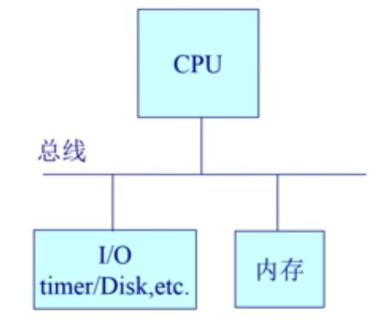

# 操作系统

### 基础

#### 概述

Disk：存放OS

BIOS：基本I/O处理系统(预先放在内存)

​	==POST(加电自检)、寻找显卡、加载Bootloader(Bootloader再加载os)==

#### 1.1什么是操作系统

1. **操作系统（Operating System，简称 OS）是管理计算机硬件与软件资源的程序，是计算机的基石。**
2. **操作系统本质上是一个运行在计算机上的软件程序 ，用于管理计算机硬件和软件资源。** 举例：运行在你电脑上的所有应用程序都通过操作系统来调用系统内存以及磁盘等等硬件。
3. **操作系统存在屏蔽了硬件层的复杂性。** 操作系统就像是硬件使用的负责人，统筹着各种相关事项。
4. **操作系统的内核（Kernel）是操作系统的核心部分，它负责系统的内存管理，硬件设备的管理，文件系统的管理以及应用程序的管理**。 内核是连接应用程序和硬件的桥梁，决定着系统的性能和稳定性。

#### 1.2什么是系统调用

应用程序主动向操作系统发出服务请求

==进程在系统上的运行分为两个级别==

1. 用户态(user mode) : 用户态运行的进程可以直接读取用户程序的数据。
2. 系统态(kernel mode):可以简单的理解系统态运行的进程或程序几乎可以访问计算机的任何资源，不受限制。

我们运行的用户程序中，凡是与系统态级别的资源有关的操作（如文件管理、进程控制、内存管理等)，都必须通过系统调用方式向操作系统提出服务请求，并由操作系统代为完成。

这些系统调用按功能大致可分为如下几类：

- 设备管理。完成设备的请求或释放，以及设备启动等功能。
- 文件管理。完成文件的读、写、创建及删除等功能。
- 进程控制。完成进程的创建、撤销、阻塞及唤醒等功能。
- 进程通信。完成进程之间的消息传递或信号传递等功能。
- 内存管理。完成内存的分配、回收以及获取作业占用内存区大小及地址等功能。

### 进程和线程

#### 1进程和线程区别

一个进程中可以有多个线程，多个线程共享进程的**堆**和**方法区 (JDK1.8 之后的元空间)\**资源，但是每个线程有自己的\**程序计数器**、**虚拟机栈** 和 **本地方法栈**。

**总结：** 线程是进程划分成的更小的运行单位,一个进程在其执行的过程中可以产生多个线程。线程和进程最大的不同在于基本上各进程是独立的，而各线程则不一定，因为同一进程中的线程极有可能会相互影响。线程执行开销小，但不利于资源的管理和保护；而进程正相反。

#### 2线程状态

- **创建状态(new)** ：进程正在被创建，尚未到就绪状态。
- **就绪状态(ready)** ：进程已处于准备运行状态，即进程获得了除了处理器之外的一切所需资源，一旦得到处理器资源(处理器分配的时间片)即可运行。
- **运行状态(running)** ：进程正在处理器上上运行(单核 CPU 下任意时刻只有一个进程处于运行状态)。
- **阻塞状态(waiting)** ：又称为等待状态，进程正在等待某一事件而暂停运行如等待某资源为可用或等待 IO 操作完成。即使处理器空闲，该进程也不能运行。
- **结束状态(terminated)** ：进程正在从系统中消失。可能是进程正常结束或其他原因中断退出运行。

#### 3线程同步方式

**互斥量(Mutex)**：采用互斥对象机制，只有拥有互斥对象的线程才有访问公共资源的权限。因为互斥对象只有一个，所以可以保证公共资源不会被多个线程同时访问。比如 Java 中的 synchronized 关键词和各种 Lock 都是这种机制。

**信号量(Semphares)** ：它允许同一时刻多个线程访问同一资源，但是需要控制同一时刻访问此资源的最大线程数量

**事件(Event)** :Wait/Notify：通过通知操作的方式来保持多线程同步，还可以方便的实现多线程优先级的比较操

#### 4调度算法

先到先服务FCFS、短作业优先SJF、时间片轮转调度算法、多级反馈、

#### 5死锁及其原因

多个进程可以竞争有限数量的资源。当一个进程申请资源时，如果这时没有可用资源，那么这个进程进入等待状态。有时，如果所申请的资源被其他等待进程占有，那么该等待进程有可能再也无法改变状态。这种情况成为**死锁**。

==条件==

- **互斥**：资源必须处于非共享模式，即一次只有一个进程可以使用。如果另一进程申请该资源，那么必须等待直到该资源被释放为止。
- **占有并等待**：一个进程至少应该占有一个资源，并等待另一资源，而该资源被其他进程所占有。
- **非抢占**：资源不能被抢占。只能在持有资源的进程完成任务后，该资源才会被释放。
- **循环等待**：有一组等待进程 `{P0, P1,..., Pn}`， `P0` 等待的资源被 `P1` 占有，`P1` 等待的资源被 `P2` 占有，......，`Pn-1` 等待的资源被 `Pn` 占有，`Pn` 等待的资源被 `P0` 占有。

